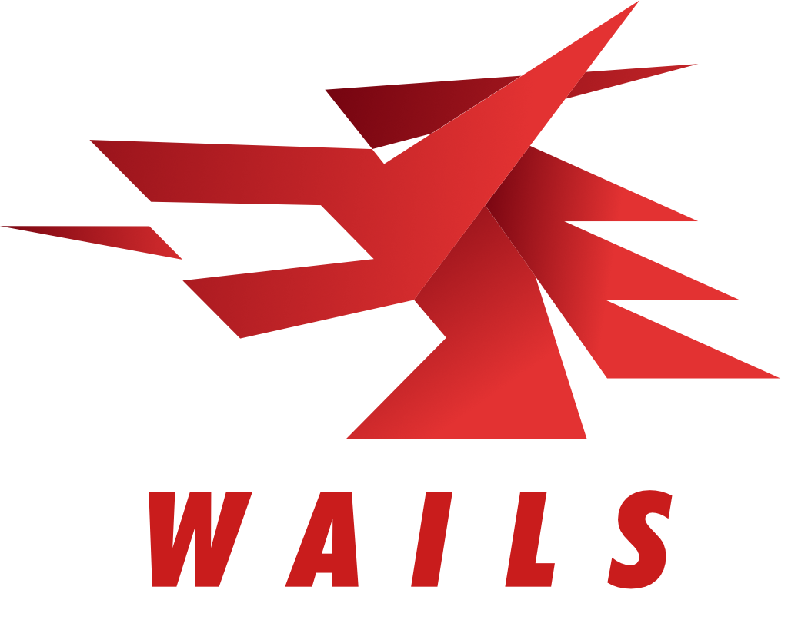

   

Erschaffe Desktop Anwendungen mit Go & Web Technologien.
   
   
  
  
  
  
  
  
  
   
  
  

<strong>
<samp>

[English](README.md) · [简体中文](README.zh-Hans.md) · [日本語](README.ja.md) ·
[한국어](README.ko.md) · [Español](README.es.md) · [Português](README.pt-br.md) ·
[Русский](README.ru.md) · [Francais](README.fr.md) · [Uzbek](README.uz.md) · [Deutsch](README.de.md)

</samp>
</strong>

## Inhaltsverzeichnis

- [Inhaltsverzeichnis](#inhaltsverzeichnis)
- [Einführung](#einführung)
- [Funktionen](#funktionen)
  - [Roadmap](#roadmap)
- [Loslegen](#loslegen)
- [Sponsoren](#sponsoren)
- [FAQ](#faq)
- [Sterne Überblick](#sterne-überblick)
- [Mitwirkende](#mitwirkende)
- [Lizenz](#lizenz)
- [Inspiration](#inspiration)

## Einführung

Die herkömmliche Methode zur Bereitstellung von Web-Interfaces für Go ist über einen eingebauten Webserver. 
Wails nutzt einen anderen Weg. Es kann sowohl Go-Code als auch ein Web-Frontend in eine einzige Datei bauen.
Beigelieferte Werkzeuge übernehmen die Projekterstellung, den Kompilierungsprozess und das bauen.
Du musst nur kreativ werden.

## Funktionen

- Nutze Standard Go für das Backend
- Nutze eine Frontend Technologie mit der du dich bereits auskennst um dein UI zu bauen.
- Erschaffe schnell und einfach Frontends mit vorgefertigten Vorlagen für deine Go-Programme
- Nutze Javascript um Go Methoden aufzurufen
- Automatisch generierte Typescript Definitionen für deine Go Strukturen und Methoden
- Native Dialoge und Menüs
- Native Dark-/Lightmode Unterstützung
- Unterstützt moderne Transluzenz- und Milchglaseffekte
- Vereinheitlichtes Eventsystem zwischen Go und Javascript
- Leistungsstarkes CLI-Tool zum einfachen erstellen und bauen von Projekten
- Multiplattformen
- Nutze native Render-Engines - _keine eingebetteten Browser_!

### Roadmap

Die Projekt Roadmap kann [hier](https://github.com/wailsapp/wails/discussions/1484) gefunden werden. Bitte lies diese
durch bevor du eine Idee vorschlägst

## Loslegen

Die Installationsinstruktionen sind auf der [offiziellen Website](https://wails.io/docs/gettingstarted/installation).

## Sponsoren

Dieses Projekt wird von diesen freundlichen Leuten und Firmen unterstützt:

## FAQ

- Ist das eine Alternative zu Electron?

  Hängt von deinen Anforderungen ab. Wails wurde entwickelt um das Go-Programmieren leicht zu machen und effiziente
  Desktop-Anwendungen zu erstellen oder ein Frontend zu einer bestehenden Anwendung hinzuzufügen.
  Wails bietet native Elemente wie Dialoge und Menüs und könnte somit als eine leichte effiziente Electron-Alternative
  betrachtet werden.

- Für wen ist dieses projekt geeignet?

  Go Entwickler, die ein HTML/CSS/JS-Frontend in ihre Anwendung integrieren möchten, ohne einen Webserver zu erstellen und
  einen Browser öffnen zu müssen, um dieses zu sehen

- Wie kam es zu diesem Namen?

  Als ich WebView sah dachte ich "Was ich wirklich will, ist ein Werkzeug für die Erstellung von WebView Anwendungen so wie Rails für Ruby".
  Also war es zunächst ein Wortspiel (Webview on Rails). Zufälligerweise ist es auch ein Homophon des englischen Namens des [Landes](https://en.wikipedia.org/wiki/Wales), aus dem ich komme. 
  Also ist es dabei geblieben.

## Sterne Überblick

<a href="https://star-history.com/#wailsapp/wails&Date">
  <picture>
    <source media="(prefers-color-scheme: dark)" srcset="https://api.star-history.com/svg?repos=wailsapp/wails&type=Date&theme=dark" />
    <source media="(prefers-color-scheme: light)" srcset="https://api.star-history.com/svg?repos=wailsapp/wails&type=Date" />
    
  </picture>
</a>

## Mitwirkende

Die Liste der Mitwirkenden wird zu groß für diese Readme. All die fantastischen Menschen, die zu diesem 
Projekt beigetragen haben, haben [hier](https://wails.io/credits#contributors) ihre eigene Seite.

## Lizenz

## Inspiration

Dieses Projekt wurde hauptsächlich zu den folgenden Alben entwickelt

- [Manic Street Preachers - Resistance Is Futile](https://open.spotify.com/album/1R2rsEUqXjIvAbzM0yHrxA)
- [Manic Street Preachers - This Is My Truth, Tell Me Yours](https://open.spotify.com/album/4VzCL9kjhgGQeKCiojK1YN)
- [The Midnight - Endless Summer](https://open.spotify.com/album/4Krg8zvprquh7TVn9OxZn8)
- [Gary Newman - Savage (Songs from a Broken World)](https://open.spotify.com/album/3kMfsD07Q32HRWKRrpcexr)
- [Steve Vai - Passion & Warfare](https://open.spotify.com/album/0oL0OhrE2rYVns4IGj8h2m)
- [Ben Howard - Every Kingdom](https://open.spotify.com/album/1nJsbWm3Yy2DW1KIc1OKle)
- [Ben Howard - Noonday Dream](https://open.spotify.com/album/6astw05cTiXEc2OvyByaPs)
- [Adwaith - Melyn](https://open.spotify.com/album/2vBE40Rp60tl7rNqIZjaXM)
- [Gwidaith Hen Fran - Cedors Hen Wrach](https://open.spotify.com/album/3v2hrfNGINPLuDP0YDTOjm)
- [Metallica - Metallica](https://open.spotify.com/album/2Kh43m04B1UkVcpcRa1Zug)
- [Bloc Party - Silent Alarm](https://open.spotify.com/album/6SsIdN05HQg2GwYLfXuzLB)
- [Maxthor - Another World](https://open.spotify.com/album/3tklE2Fgw1hCIUstIwPBJF)
- [Alun Tan Lan - Y Distawrwydd](https://open.spotify.com/album/0c32OywcLpdJCWWMC6vB8v)
