   

  ساخت برنامه‌های دسکتاپ با استفاده از Go و فناوری‌های وب

## فهرست مطالب

- [مقدمه](#مقدمه)
- [ویژگی‌ها](#ویژگیها)
- [نقشه راه](#نقشه-راه)
- [شروع کار](#شروع-کار)
- [حامیان مالی](#حامیان-مالی)
- [پرسش‌های متداول](#پرسشهای-متداول)
- [ستاره‌های GitHub در طول زمان](#ستارههای-github-در-طول-زمان)
- [مشارکت‌کنندگان](#مشارکتکنندگان)
- [مجوز](#مجوز)
- [منابع الهام](#منابع-الهام)

## مقدمه

روش سنتی ارائه رابط‌های وب برای برنامه‌های Go، استفاده از یک وب‌سرور داخلی است. **Wails** رویکرد متفاوتی دارد: این فریم‌ورک امکان بسته‌بندی کد Go و رابط کاربری وب را در قالب **یک فایل اجرایی واحد** فراهم می‌کند.

فریم‌ ورک ویِلز یکی از بهترین ابزارهایی ارائه می‌دهد که ایجاد پروژه، کامپایل و بسته‌بندی برنامه را ساده می‌کنند. تنها چیزی که باقی می‌ماند، خلاقیت شماست!

## ویژگی‌ها

- استفاده از Go استاندارد برای بخش Backend
- امکان استفاده از هر فناوری Frontend که با آن آشنا هستید
- ساخت سریع رابط‌های کاربری غنی برای برنامه‌های Go با استفاده از قالب‌های آماده
- فراخوانی آسان متدهای Go از JavaScript
- تولید خودکار تعریف‌های TypeScript برای Structها و متدهای Go
- پشتیبانی از دیالوگ‌ها و منوهای Native
- پشتیبانی Native از حالت تاریک و روشن
- پشتیبانی از شفافیت مدرن و افکت‌های پنجره‌ای Frosted
- سیستم یکپارچه مدیریت رویداد بین Go و JavaScript
- ابزار خط فرمان قدرتمند برای ایجاد و Build سریع پروژه‌ها
- پشتیبانی از چندین سیستم‌عامل
- استفاده از موتورهای رندر Native و **بدون مرورگر Embedded**

### نقشه راه

نقشه راه پروژه در [اینجا](https://github.com/wailsapp/wails/discussions/1484) قرار دارد.

قابلیت‌های جدید و تغییرات عمومی در رفتار Wails از طریق **WEP (Wails Enhancement Proposal)** پیشنهاد می‌شوند. این پیشنهادها به‌صورت Pull Request پیش‌نویس ارائه می‌شوند، نه به شکل Issue مربوط به درخواست قابلیت.

## شروع کار

Wails در حال حاضر دو نسخه فعال دارد:

| نسخه | وضعیت | نصب | مستندات |
|---|---|---|---|
| **v2** | پایدار | `go install github.com/wailsapp/wails/v2/cmd/wails@latest` | [wails.io](https://wails.io/) |
| **v3** | بتا | `go install github.com/wailsapp/wails/v3/cmd/wails3@latest` | [v3.wails.io](https://v3.wails.io/) |

دستورالعمل کامل نصب برای [نسخه v2](https://wails.io/docs/gettingstarted/installation) و [نسخه v3](https://v3.wails.io) در مستندات رسمی موجود است.

## حامیان مالی

این پروژه توسط افراد و شرکت‌هایی که از آن حمایت می‌کنند توسعه می‌یابد.

## Powered By

## پرسش‌های متداول

### آیا Wails جایگزینی برای Electron است؟

بستگی به نیاز شما دارد. Wails با هدف ساده‌کردن ساخت برنامه‌های دسکتاپ سبک برای برنامه‌نویسان Go طراحی شده است و همچنین می‌تواند برای افزودن یک رابط کاربری Frontend به برنامه‌های موجود Go استفاده شود.

Wails امکاناتی مانند منوها و دیالوگ‌های Native را نیز ارائه می‌دهد؛ بنابراین می‌توان آن را یک **جایگزین سبک‌تر برای Electron** در نظر گرفت.

### Wails برای چه کسانی ساخته شده است؟

برای برنامه‌نویسان Go که می‌خواهند یک رابط HTML/JS/CSS را همراه با برنامه خود بسته‌بندی کنند، بدون اینکه مجبور باشند یک سرور ایجاد کرده و برای نمایش رابط کاربری، مرورگر جداگانه‌ای باز کنند.

### نام Wails از کجا آمده است؟

زمانی که سازنده پروژه با مفهوم WebView مواجه شد، به این فکر کرد که چیزی شبیه Rails برای Ruby، اما برای ساخت برنامه‌های WebView ایجاد کند.

به همین دلیل نام اولیه آن بازی با عبارت **Webview on Rails** بود. این نام از نظر تلفظ با نام انگلیسی کشور [Wales](https://en.wikipedia.org/wiki/Wales) نیز مشابه است؛ کشوری که سازنده پروژه اهل آن است. در نهایت همین نام باقی ماند.

## ستاره‌های گیت هاب در طول زمان

## مشارکت‌کنندگان

تعداد مشارکت‌کنندگان پروژه آن‌قدر زیاد شده است که دیگر امکان قرار دادن فهرست همه آن‌ها در README وجود ندارد.

همه افرادی که در توسعه پروژه مشارکت داشته‌اند، در [صفحه مشارکت‌کنندگان](https://wails.io/credits#contributors) معرفی شده‌اند.

## مجوز

## منابع الهام

این پروژه عمدتاً با الهام از آلبوم‌های زیر توسعه داده شده است:

- [Manic Street Preachers - Resistance Is Futile](https://open.spotify.com/album/1R2rsEUqXjIvAbzM0yHrxA)
- [Manic Street Preachers - This Is My Truth, Tell Me Yours](https://open.spotify.com/album/4VzCL9kjhgGQeKCiojK1YN)
- [The Midnight - Endless Summer](https://open.spotify.com/album/4Krg8zvprquh7TVn9OxZn8)
- [Gary Numan - Savage (Songs from a Broken World)](https://open.spotify.com/album/3kMfsD07Q32HRWKRrpcexr)
- [Steve Vai - Passion & Warfare](https://open.spotify.com/album/0oL0OhrE2rYVns4IGj8h2m)
- [Ben Howard - Every Kingdom](https://open.spotify.com/album/1nJsbWm3Yy2DW1KIc1OKle)
- [Ben Howard - Noonday Dream](https://open.spotify.com/album/6astw05cTiXEc2OvyByaPs)
- [Adwaith - Melyn](https://open.spotify.com/album/2vBE40Rp60tl7rNqIZjaXM)
- [Gwidaith Hen Fran - Cedors Hen Wrach](https://open.spotify.com/album/3v2hrfNGINPLuDP0YDTOjm)
- [Metallica - Metallica](https://open.spotify.com/album/2Kh43m04B1UkVcpcRa1Zug)
- [Bloc Party - Silent Alarm](https://open.spotify.com/album/6SsIdN05HQg2GwYLfXuzLB)
- [Maxthor - Another World](https://open.spotify.com/album/3tklE2Fgw1hCIUstIwPBJF)
- [Alun Tan Lan - Y Distawrwydd](https://open.spotify.com/album/0c32OywcLpdJCWWMC6vB8v)
