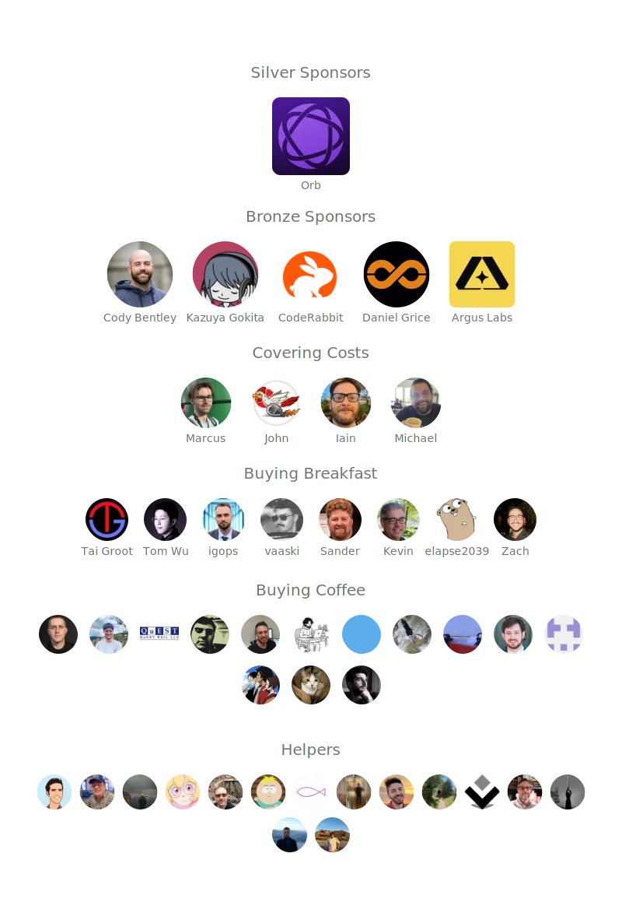

   

  Build desktop applications using Go & Web Technologies.
   
   
  
  
  
  
  
  
  
   
  
  

<strong>
<samp>

[英語](README.md)·[簡体字中国語](README.zh-Hans.md)·[日本語](README.ja.md)

</samp>
</strong>

## 目次

-   [目次](#table-of-contents)
-   [序章](#introduction)
-   [特徴](#features)
    -   [ロードマップ](#roadmap)
-   [入門](#getting-started)
-   [スポンサー](#sponsors)
-   [よくある質問](#faq)
-   [寄稿者](#contributors)
-   [ライセンス](#license)
-   [インスピレーション](#inspiration)

## 序章

Go プログラムに Web インターフェイスを提供する従来の方法は、組み込みの Web サーバーを介するものです。ウェイズは別のものを提供しています
アプローチ: Go コードと Web フロントエンドの両方を単一のバイナリにラップする機能を提供します。ツールが提供されます
プロジェクトの作成、コンパイル、およびバンドルを処理することで、これを簡単に行うことができます。あなたがしなければならないのは、創造性を発揮することだけです！

## 特徴

-   バックエンドに標準の Go を使用する
-   使い慣れたフロントエンド テクノロジを使用して UI を構築する
-   事前に構築されたテンプレートを使用して、Go プログラム用の豊富なフロントエンドをすばやく作成します
-   Javascript から Go メソッドを簡単に呼び出す
-   Go 構造体とメソッドの自動生成された Typescript 定義
-   ネイティブ ダイアログとメニュー
-   ネイティブ ダーク/ライト モードのサポート
-   最新の半透明性と「すりガラスの窓」効果をサポート
-   Go と Javascript 間の統合イベント システム
-   プロジェクトをすばやく生成してビルドするための強力な cli ツール
-   マルチプラットフォーム
-   ネイティブ レンダリング エンジンを使用 -_組み込みブラウザなし_！

### ロードマップ

プロジェクトのロードマップを見つけることができます[ここ](https://github.com/wailsapp/wails/discussions/1484).ご相談ください
これは、拡張要求を開く前に。

## 入門

インストール手順は、[公式ウェブサイト](https://wails.io/docs/gettingstarted/installation)。

## スポンサー

このプロジェクトは、次の親切な人々/企業によってサポートされています。

## よくある質問

-   これは Electron に代わるものですか?

    要件によって異なります。 Go プログラマーが軽量デスクトップを簡単に作成できるように設計されています
    アプリケーションまたは既存のアプリケーションにフロントエンドを追加します。ウェイルズはメニューなどのネイティブ要素を提供します
    とダイアログがあるため、軽量の電子の代替と見なすことができます。

-   このプロジェクトは誰を対象としていますか?

    HTML/JS/CSS フロントエンドを自分のアプリケーションにバンドルしたいプログラマーに行きます。
    サーバーを開き、ブラウザを開いて表示します。

-   名前は何ですか？

    WebView を見たとき、「私が本当に欲しいのは WebView アプリを構築するためのツールであり、Rails が
    Ruby」。つまり、最初は言葉遊びでした (Webview on Rails)。それはたまたま、
    の英語名[国](https://en.wikipedia.org/wiki/Wales)私は\_\_\_出身です。それでくっついた。

## 時間の経過とともにスターゲイザー

## 寄稿者

貢献者リストが readme に対して大きくなりすぎています!これに貢献してくれたすべての素晴らしい人々
プロジェクトには独自のページがあります[ここ](https://wails.io/credits#contributors)。

## ライセンス

## インスピレーション

このプロジェクトは、主に次のアルバムにコーディングされました。

-   [マニック・ストリート・プリーチャーズ - レジスタンスは無益](https://open.spotify.com/album/1R2rsEUqXjIvAbzM0yHrxA)
-   [マニック・ストリート・プリーチャーズ - This Is My Truth, Tell Me Yours](https://open.spotify.com/album/4VzCL9kjhgGQeKCiojK1YN)
-   [The Midnight - エンドレス・サマー](https://open.spotify.com/album/4Krg8zvprquh7TVn9OxZn8)
-   [ゲイリー・ニューマン - サヴェージ (Songs from a Broken World)](https://open.spotify.com/album/3kMfsD07Q32HRWKRrpcexr)
-   [スティーヴ・ヴァイ - パッション＆ウォーフェア](https://open.spotify.com/album/0oL0OhrE2rYVns4IGj8h2m)
-   [ベン・ハワード - すべての王国](https://open.spotify.com/album/1nJsbWm3Yy2DW1KIc1OKle)
-   [ベン・ハワード - 真昼の夢](https://open.spotify.com/album/6astw05cTiXEc2OvyByaPs)
-   [反応 - 黄](https://open.spotify.com/album/2vBE40Rp60tl7rNqIZjaXM)
-   [ヘン・フラン・ガイド - Cedors Hen Wrach](https://open.spotify.com/album/3v2hrfNGINPLuDP0YDTOjm)
-   [メタリカ - メタリカ](https://open.spotify.com/album/2Kh43m04B1UkVcpcRa1Zug)
-   [ブロックパーティー - サイレントアラーム](https://open.spotify.com/album/6SsIdN05HQg2GwYLfXuzLB)
-   [マックストール - 別の世界](https://open.spotify.com/album/3tklE2Fgw1hCIUstIwPBJF)
-   [アルン・タン・ラン - ザ・サイレンス](https://open.spotify.com/album/0c32OywcLpdJCWWMC6vB8v)
