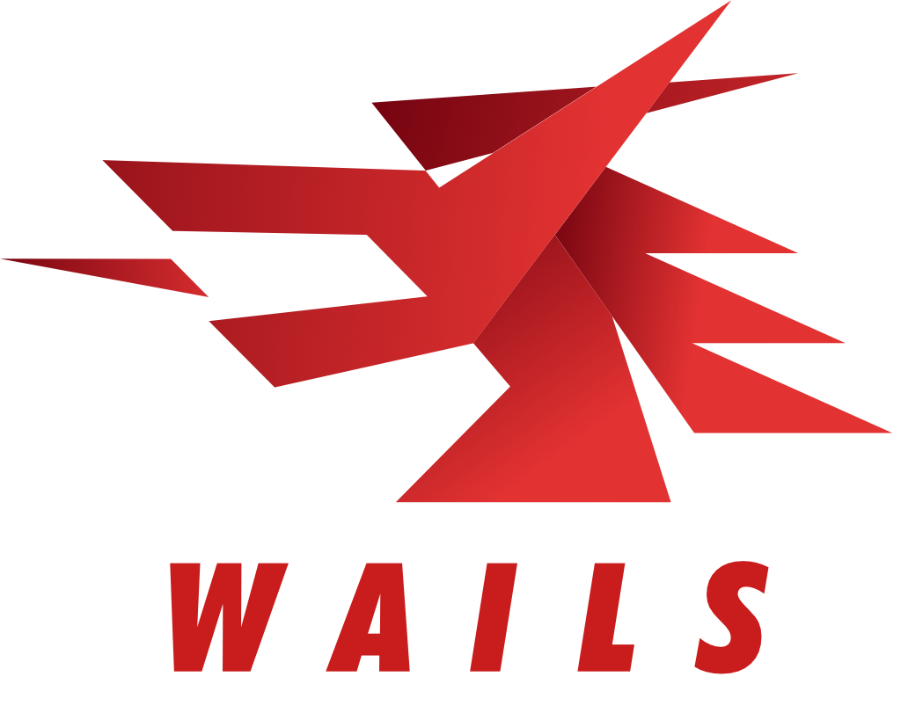

   

  Build desktop applications using Go & Web Technologies.
   
   
  
  
  
  
  
  
  
   
  
  

<strong>
<samp>

[English](README.md) · [简体中文](README.zh-Hans.md) · [日本語](README.ja.md) ·
[한국어](README.ko.md)

</samp>
</strong>

## Table of Contents

- [Table of Contents](#table-of-contents)
- [Introduction](#introduction)
- [Features](#features)
  - [Roadmap](#roadmap)
- [Getting Started](#getting-started)
- [Sponsors](#sponsors)
- [FAQ](#faq)
- [Stargazers over time](#stargazers-over-time)
- [Contributors](#contributors)
- [License](#license)
- [Inspiration](#inspiration)

## Introduction

The traditional method of providing web interfaces to Go programs is via a
built-in web server. Wails offers a different approach: it provides the ability
to wrap both Go code and a web frontend into a single binary. Tools are provided
to make this easy for you by handling project creation, compilation and
bundling. All you have to do is get creative!

## Features

- Use standard Go for the backend
- Use any frontend technology you are already familiar with to build your UI
- Quickly create rich frontends for your Go programs using pre-built templates
- Easily call Go methods from Javascript
- Auto-generated Typescript definitions for your Go structs and methods
- Native Dialogs & Menus
- Native Dark / Light mode support
- Supports modern translucency and "frosted window" effects
- Unified eventing system between Go and Javascript
- Powerful cli tool to quickly generate and build your projects
- Multiplatform
- Uses native rendering engines - _no embedded browser_!

### Roadmap

The project roadmap may be found
[here](https://github.com/wailsapp/wails/discussions/1484). Please consult this
before open up an enhancement request.

## Getting Started

The installation instructions are on the
[official website](https://wails.io/docs/gettingstarted/installation).

## Sponsors

This project is supported by these kind people / companies:

## FAQ

- Is this an alternative to Electron?

  Depends on your requirements. It's designed to make it easy for Go programmers
  to make lightweight desktop applications or add a frontend to their existing
  applications. Wails does offer native elements such as menus and dialogs, so
  it could be considered a lightweight electron alternative.

- Who is this project aimed at?

  Go programmers who want to bundle an HTML/JS/CSS frontend with their
  applications, without resorting to creating a server and opening a browser to
  view it.

- What's with the name?

  When I saw WebView, I thought "What I really want is tooling around building a
  WebView app, a bit like Rails is to Ruby". So initially it was a play on words
  (Webview on Rails). It just so happened to also be a homophone of the English
  name for the [Country](https://en.wikipedia.org/wiki/Wales) I am from. So it
  stuck.

## Stargazers over time

## Contributors

The contributors list is getting too big for the readme! All the amazing people
who have contributed to this project have their own page
[here](https://wails.io/credits#contributors).

## License

## Inspiration

This project was mainly coded to the following albums:

- [Manic Street Preachers - Resistance Is Futile](https://open.spotify.com/album/1R2rsEUqXjIvAbzM0yHrxA)
- [Manic Street Preachers - This Is My Truth, Tell Me Yours](https://open.spotify.com/album/4VzCL9kjhgGQeKCiojK1YN)
- [The Midnight - Endless Summer](https://open.spotify.com/album/4Krg8zvprquh7TVn9OxZn8)
- [Gary Newman - Savage (Songs from a Broken World)](https://open.spotify.com/album/3kMfsD07Q32HRWKRrpcexr)
- [Steve Vai - Passion & Warfare](https://open.spotify.com/album/0oL0OhrE2rYVns4IGj8h2m)
- [Ben Howard - Every Kingdom](https://open.spotify.com/album/1nJsbWm3Yy2DW1KIc1OKle)
- [Ben Howard - Noonday Dream](https://open.spotify.com/album/6astw05cTiXEc2OvyByaPs)
- [Adwaith - Melyn](https://open.spotify.com/album/2vBE40Rp60tl7rNqIZjaXM)
- [Gwidaith Hen Fran - Cedors Hen Wrach](https://open.spotify.com/album/3v2hrfNGINPLuDP0YDTOjm)
- [Metallica - Metallica](https://open.spotify.com/album/2Kh43m04B1UkVcpcRa1Zug)
- [Bloc Party - Silent Alarm](https://open.spotify.com/album/6SsIdN05HQg2GwYLfXuzLB)
- [Maxthor - Another World](https://open.spotify.com/album/3tklE2Fgw1hCIUstIwPBJF)
- [Alun Tan Lan - Y Distawrwydd](https://open.spotify.com/album/0c32OywcLpdJCWWMC6vB8v)
