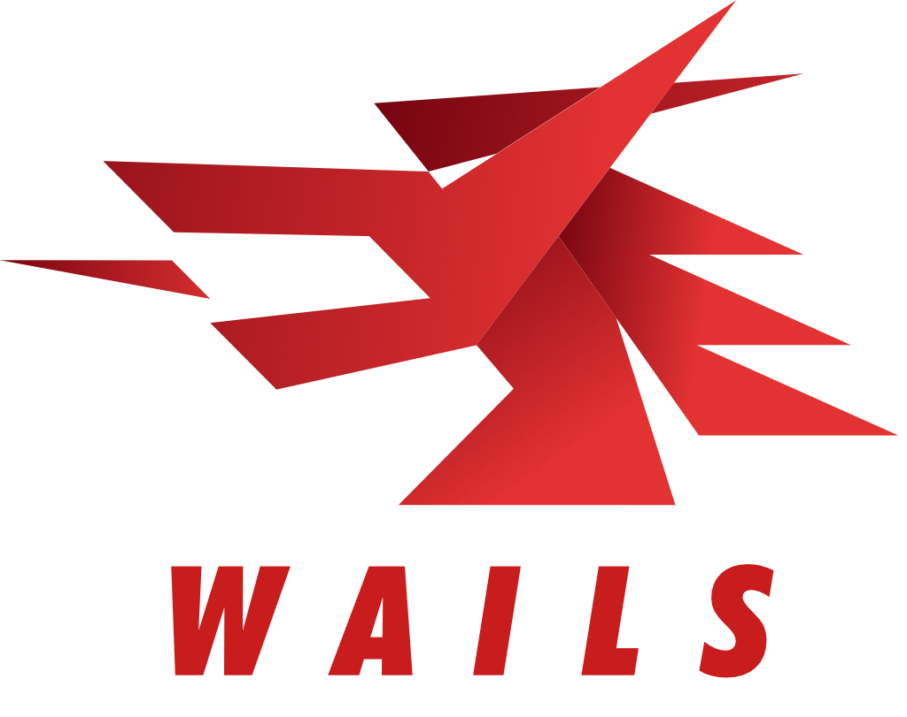
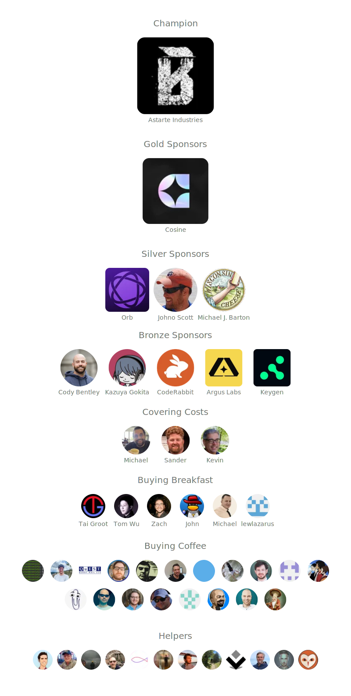

<!--@nrg.languages=en,de,es,fr,ja,ko,pt-br,ru,tr,uz-->
<!--@nrg.defaultLanguage=en-->

<!--en-->
   <!--en-->

<!--en-->
<!--en-->

<!--en-->
  Build desktop applications using Go & Web Technologies.<!--en-->
   <!--en-->
   <!--en-->
  <a href="https://github.com/wailsapp/wails/blob/master/LICENSE"><!--en-->
    <!--en-->
  </a><!--en-->
  <a href="https://goreportcard.com/report/github.com/wailsapp/wails"><!--en-->
    <!--en-->
  </a><!--en-->
  <a href="https://pkg.go.dev/github.com/wailsapp/wails"><!--en-->
    <!--en-->
  </a><!--en-->
  <a href="https://github.com/wailsapp/wails/issues"><!--en-->
    <!--en-->
  </a><!--en-->
  <a href="https://app.fossa.com/projects/git%2Bgithub.com%2Fwailsapp%2Fwails?ref=badge_shield" alt="FOSSA Status"><!--en-->
    <!--en-->
  </a><!--en-->
  <a href="https://github.com/avelino/awesome-go" rel="nofollow"><!--en-->
    <!--en-->
  </a><!--en-->
  <a href="https://discord.gg/BrRSWTaxVK"><!--en-->
    <!--en-->
  </a><!--en-->
   <!--en-->
  <a href="https://github.com/wailsapp/wails/actions/workflows/build-and-test.yml" rel="nofollow"><!--en-->
    <!--en-->
  </a><!--en-->
  <a href="https://github.com/wailsapp/wails/tags" rel="nofollow"><!--en-->
    <!--en-->
  </a><!--en-->

<!--en-->
<!--en-->

<!--en-->
<strong><!--en-->
<samp><!--en-->
<!--en-->
[English](README.md) · [简体中文](README.zh-Hans.md) · [日本語](README.ja.md) ·<!--en-->
[한국어](README.ko.md) · [Español](README.es.md) · [Português](README.pt-br.md) ·<!--en-->
[Русский](README.ru.md) · [Francais](README.fr.md) · [Uzbek](README.uz.md) · [Deutsch](README.de.md) ·<!--en-->
[Türkçe](README.tr.md)<!--en-->
<!--en-->
</samp><!--en-->
</strong><!--en-->

<!--en-->
<!--en-->
## Table of Contents<!--en-->
<!--en-->
- [Table of Contents](#table-of-contents)<!--en-->
- [Introduction](#introduction)<!--en-->
- [Features](#features)<!--en-->
  - [Roadmap](#roadmap)<!--en-->
- [Getting Started](#getting-started)<!--en-->
- [Sponsors](#sponsors)<!--en-->
- [FAQ](#faq)<!--en-->
- [Stargazers over time](#stargazers-over-time)<!--en-->
- [Contributors](#contributors)<!--en-->
- [License](#license)<!--en-->
- [Inspiration](#inspiration)<!--en-->
<!--en-->
## Introduction<!--en-->
<!--en-->
The traditional method of providing web interfaces to Go programs is via a built-in web server. Wails offers a different<!--en-->
approach: it provides the ability to wrap both Go code and a web frontend into a single binary. Tools are provided to<!--en-->
make this easy for you by handling project creation, compilation and bundling. All you have to do is get creative!<!--en-->
<!--en-->
## Features<!--en-->
<!--en-->
- Use standard Go for the backend<!--en-->
- Use any frontend technology you are already familiar with to build your UI<!--en-->
- Quickly create rich frontends for your Go programs using pre-built templates<!--en-->
- Easily call Go methods from Javascript<!--en-->
- Auto-generated Typescript definitions for your Go structs and methods<!--en-->
- Native Dialogs & Menus<!--en-->
- Native Dark / Light mode support<!--en-->
- Supports modern translucency and "frosted window" effects<!--en-->
- Unified eventing system between Go and Javascript<!--en-->
- Powerful cli tool to quickly generate and build your projects<!--en-->
- Multiplatform<!--en-->
- Uses native rendering engines - _no embedded browser_!<!--en-->
<!--en-->
### Roadmap<!--en-->
<!--en-->
The project roadmap may be found [here](https://github.com/wailsapp/wails/discussions/1484). Please consult<!--en-->
it before creating an enhancement request.<!--en-->
<!--en-->
## Getting Started<!--en-->
<!--en-->
The installation instructions are on the [official website](https://wails.io/docs/gettingstarted/installation).<!--en-->
<!--en-->
## Sponsors<!--en-->
<!--en-->
This project is supported by these kind people / companies:<!--en-->
<!--en-->
<!--en-->
## Powered By<!--en-->
<!--en-->
<!--en-->
<!--en-->
## FAQ<!--en-->
<!--en-->
- Is this an alternative to Electron?<!--en-->
<!--en-->
  Depends on your requirements. It's designed to make it easy for Go programmers to make lightweight desktop<!--en-->
  applications or add a frontend to their existing applications. Wails does offer native elements such as menus<!--en-->
  and dialogs, so it could be considered a lightweight electron alternative.<!--en-->
<!--en-->
- Who is this project aimed at?<!--en-->
<!--en-->
  Go programmers who want to bundle an HTML/JS/CSS frontend with their applications, without resorting to creating a<!--en-->
  server and opening a browser to view it.<!--en-->
<!--en-->
- What's with the name?<!--en-->
<!--en-->
  When I saw WebView, I thought "What I really want is tooling around building a WebView app, a bit like Rails is to<!--en-->
  Ruby". So initially it was a play on words (Webview on Rails). It just so happened to also be a homophone of the<!--en-->
  English name for the [Country](https://en.wikipedia.org/wiki/Wales) I am from. So it stuck.<!--en-->
<!--en-->
## Stargazers over time<!--en-->
<!--en-->
<a href="https://star-history.com/#wailsapp/wails&Date"><!--en-->
  <picture><!--en-->
    <source media="(prefers-color-scheme: dark)" srcset="https://api.star-history.com/svg?repos=wailsapp/wails&type=Date&theme=dark" /><!--en-->
    <source media="(prefers-color-scheme: light)" srcset="https://api.star-history.com/svg?repos=wailsapp/wails&type=Date" /><!--en-->
    <!--en-->
  </picture><!--en-->
</a><!--en-->
<!--en-->
## Contributors<!--en-->
<!--en-->
The contributors list is getting too big for the readme! All the amazing people who have contributed to this<!--en-->
project have their own page [here](https://wails.io/credits#contributors).<!--en-->
<!--en-->
## License<!--en-->
<!--en-->
<!--en-->
<!--en-->
## Inspiration<!--en-->
<!--en-->
This project was mainly coded to the following albums:<!--en-->
<!--en-->
- [Manic Street Preachers - Resistance Is Futile](https://open.spotify.com/album/1R2rsEUqXjIvAbzM0yHrxA)<!--en-->
- [Manic Street Preachers - This Is My Truth, Tell Me Yours](https://open.spotify.com/album/4VzCL9kjhgGQeKCiojK1YN)<!--en-->
- [The Midnight - Endless Summer](https://open.spotify.com/album/4Krg8zvprquh7TVn9OxZn8)<!--en-->
- [Gary Newman - Savage (Songs from a Broken World)](https://open.spotify.com/album/3kMfsD07Q32HRWKRrpcexr)<!--en-->
- [Steve Vai - Passion & Warfare](https://open.spotify.com/album/0oL0OhrE2rYVns4IGj8h2m)<!--en-->
- [Ben Howard - Every Kingdom](https://open.spotify.com/album/1nJsbWm3Yy2DW1KIc1OKle)<!--en-->
- [Ben Howard - Noonday Dream](https://open.spotify.com/album/6astw05cTiXEc2OvyByaPs)<!--en-->
- [Adwaith - Melyn](https://open.spotify.com/album/2vBE40Rp60tl7rNqIZjaXM)<!--en-->
- [Gwidaith Hen Fran - Cedors Hen Wrach](https://open.spotify.com/album/3v2hrfNGINPLuDP0YDTOjm)<!--en-->
- [Metallica - Metallica](https://open.spotify.com/album/2Kh43m04B1UkVcpcRa1Zug)<!--en-->
- [Bloc Party - Silent Alarm](https://open.spotify.com/album/6SsIdN05HQg2GwYLfXuzLB)<!--en-->
- [Maxthor - Another World](https://open.spotify.com/album/3tklE2Fgw1hCIUstIwPBJF)<!--en-->
- [Alun Tan Lan - Y Distawrwydd](https://open.spotify.com/album/0c32OywcLpdJCWWMC6vB8v)<!--en-->

<!--de-->
   <!--de-->

<!--de-->
<!--de-->

<!--de-->
Erschaffe Desktop Anwendungen mit Go & Web Technologien.<!--de-->
   <!--de-->
   <!--de-->
  <a href="https://github.com/wailsapp/wails/blob/master/LICENSE"><!--de-->
    <!--de-->
  </a><!--de-->
  <a href="https://goreportcard.com/report/github.com/wailsapp/wails"><!--de-->
    <!--de-->
  </a><!--de-->
  <a href="https://pkg.go.dev/github.com/wailsapp/wails"><!--de-->
    <!--de-->
  </a><!--de-->
  <a href="https://github.com/wailsapp/wails/issues"><!--de-->
    <!--de-->
  </a><!--de-->
  <a href="https://app.fossa.com/projects/git%2Bgithub.com%2Fwailsapp%2Fwails?ref=badge_shield" alt="FOSSA Status"><!--de-->
    <!--de-->
  </a><!--de-->
  <a href="https://github.com/avelino/awesome-go" rel="nofollow"><!--de-->
    <!--de-->
  </a><!--de-->
  <a href="https://discord.gg/BrRSWTaxVK"><!--de-->
    <!--de-->
  </a><!--de-->
   <!--de-->
  <a href="https://github.com/wailsapp/wails/actions/workflows/build-and-test.yml" rel="nofollow"><!--de-->
    <!--de-->
  </a><!--de-->
  <a href="https://github.com/wailsapp/wails/tags" rel="nofollow"><!--de-->
    <!--de-->
  </a><!--de-->

<!--de-->
<!--de-->

<!--de-->
<strong><!--de-->
<samp><!--de-->
<!--de-->
[English](README.md) · [简体中文](README.zh-Hans.md) · [日本語](README.ja.md) ·<!--de-->
[한국어](README.ko.md) · [Español](README.es.md) · [Português](README.pt-br.md) ·<!--de-->
[Русский](README.ru.md) · [Francais](README.fr.md) · [Uzbek](README.uz.md) · [Deutsch](README.de.md)<!--de-->
<!--de-->
</samp><!--de-->
</strong><!--de-->

<!--de-->
<!--de-->
## Inhaltsverzeichnis<!--de-->
<!--de-->
- [Inhaltsverzeichnis](#inhaltsverzeichnis)<!--de-->
- [Einführung](#einführung)<!--de-->
- [Funktionen](#funktionen)<!--de-->
  - [Roadmap](#roadmap)<!--de-->
- [Loslegen](#loslegen)<!--de-->
- [Sponsoren](#sponsoren)<!--de-->
- [FAQ](#faq)<!--de-->
- [Sterne Überblick](#sterne-überblick)<!--de-->
- [Mitwirkende](#mitwirkende)<!--de-->
- [Lizenz](#lizenz)<!--de-->
- [Inspiration](#inspiration)<!--de-->
<!--de-->
## Einführung<!--de-->
<!--de-->
Die herkömmliche Methode zur Bereitstellung von Web-Interfaces für Go ist über einen eingebauten Webserver. <!--de-->
Wails nutzt einen anderen Weg. Es kann sowohl Go-Code als auch ein Web-Frontend in eine einzige Datei bauen.<!--de-->
Beigelieferte Werkzeuge übernehmen die Projekterstellung, den Kompilierungsprozess und das bauen.<!--de-->
Du musst nur kreativ werden.<!--de-->
<!--de-->
## Funktionen<!--de-->
<!--de-->
- Nutze Standard Go für das Backend<!--de-->
- Nutze eine Frontend Technologie mit der du dich bereits auskennst um dein UI zu bauen.<!--de-->
- Erschaffe schnell und einfach Frontends mit vorgefertigten Vorlagen für deine Go-Programme<!--de-->
- Nutze Javascript um Go Methoden aufzurufen<!--de-->
- Automatisch generierte Typescript Definitionen für deine Go Strukturen und Methoden<!--de-->
- Native Dialoge und Menüs<!--de-->
- Native Dark-/Lightmode Unterstützung<!--de-->
- Unterstützt moderne Transluzenz- und Milchglaseffekte<!--de-->
- Vereinheitlichtes Eventsystem zwischen Go und Javascript<!--de-->
- Leistungsstarkes CLI-Tool zum einfachen erstellen und bauen von Projekten<!--de-->
- Multiplattformen<!--de-->
- Nutze native Render-Engines - _keine eingebetteten Browser_!<!--de-->
<!--de-->
### Roadmap<!--de-->
<!--de-->
Die Projekt Roadmap kann [hier](https://github.com/wailsapp/wails/discussions/1484) gefunden werden. Bitte lies diese<!--de-->
durch bevor du eine Idee vorschlägst<!--de-->
<!--de-->
## Loslegen<!--de-->
<!--de-->
Die Installationsinstruktionen sind auf der [offiziellen Website](https://wails.io/docs/gettingstarted/installation).<!--de-->
<!--de-->
## Sponsoren<!--de-->
<!--de-->
Dieses Projekt wird von diesen freundlichen Leuten und Firmen unterstützt:<!--de-->
<!--de-->
<!--de-->

<!--de-->
<!--de-->

<!--de-->
<!--de-->
## FAQ<!--de-->
<!--de-->
- Ist das eine Alternative zu Electron?<!--de-->
<!--de-->
  Hängt von deinen Anforderungen ab. Wails wurde entwickelt um das Go-Programmieren leicht zu machen und effiziente<!--de-->
  Desktop-Anwendungen zu erstellen oder ein Frontend zu einer bestehenden Anwendung hinzuzufügen.<!--de-->
  Wails bietet native Elemente wie Dialoge und Menüs und könnte somit als eine leichte effiziente Electron-Alternative<!--de-->
  betrachtet werden.<!--de-->
<!--de-->
- Für wen ist dieses projekt geeignet?<!--de-->
<!--de-->
  Go Entwickler, die ein HTML/CSS/JS-Frontend in ihre Anwendung integrieren möchten, ohne einen Webserver zu erstellen und<!--de-->
  einen Browser öffnen zu müssen, um dieses zu sehen<!--de-->
<!--de-->
- Wie kam es zu diesem Namen?<!--de-->
<!--de-->
  Als ich WebView sah dachte ich "Was ich wirklich will, ist ein Werkzeug für die Erstellung von WebView Anwendungen so wie Rails für Ruby".<!--de-->
  Also war es zunächst ein Wortspiel (Webview on Rails). Zufälligerweise ist es auch ein Homophon des englischen Namens des [Landes](https://en.wikipedia.org/wiki/Wales), aus dem ich komme. <!--de-->
  Also ist es dabei geblieben.<!--de-->
<!--de-->
## Sterne Überblick<!--de-->
<!--de-->
<a href="https://star-history.com/#wailsapp/wails&Date"><!--de-->
  <picture><!--de-->
    <source media="(prefers-color-scheme: dark)" srcset="https://api.star-history.com/svg?repos=wailsapp/wails&type=Date&theme=dark" /><!--de-->
    <source media="(prefers-color-scheme: light)" srcset="https://api.star-history.com/svg?repos=wailsapp/wails&type=Date" /><!--de-->
    <!--de-->
  </picture><!--de-->
</a><!--de-->
<!--de-->
## Mitwirkende<!--de-->
<!--de-->
Die Liste der Mitwirkenden wird zu groß für diese Readme. All die fantastischen Menschen, die zu diesem <!--de-->
Projekt beigetragen haben, haben [hier](https://wails.io/credits#contributors) ihre eigene Seite.<!--de-->
<!--de-->
## Lizenz<!--de-->
<!--de-->
<!--de-->
<!--de-->
## Inspiration<!--de-->
<!--de-->
Dieses Projekt wurde hauptsächlich zu den folgenden Alben entwickelt<!--de-->
<!--de-->
- [Manic Street Preachers - Resistance Is Futile](https://open.spotify.com/album/1R2rsEUqXjIvAbzM0yHrxA)<!--de-->
- [Manic Street Preachers - This Is My Truth, Tell Me Yours](https://open.spotify.com/album/4VzCL9kjhgGQeKCiojK1YN)<!--de-->
- [The Midnight - Endless Summer](https://open.spotify.com/album/4Krg8zvprquh7TVn9OxZn8)<!--de-->
- [Gary Newman - Savage (Songs from a Broken World)](https://open.spotify.com/album/3kMfsD07Q32HRWKRrpcexr)<!--de-->
- [Steve Vai - Passion & Warfare](https://open.spotify.com/album/0oL0OhrE2rYVns4IGj8h2m)<!--de-->
- [Ben Howard - Every Kingdom](https://open.spotify.com/album/1nJsbWm3Yy2DW1KIc1OKle)<!--de-->
- [Ben Howard - Noonday Dream](https://open.spotify.com/album/6astw05cTiXEc2OvyByaPs)<!--de-->
- [Adwaith - Melyn](https://open.spotify.com/album/2vBE40Rp60tl7rNqIZjaXM)<!--de-->
- [Gwidaith Hen Fran - Cedors Hen Wrach](https://open.spotify.com/album/3v2hrfNGINPLuDP0YDTOjm)<!--de-->
- [Metallica - Metallica](https://open.spotify.com/album/2Kh43m04B1UkVcpcRa1Zug)<!--de-->
- [Bloc Party - Silent Alarm](https://open.spotify.com/album/6SsIdN05HQg2GwYLfXuzLB)<!--de-->
- [Maxthor - Another World](https://open.spotify.com/album/3tklE2Fgw1hCIUstIwPBJF)<!--de-->
- [Alun Tan Lan - Y Distawrwydd](https://open.spotify.com/album/0c32OywcLpdJCWWMC6vB8v)<!--de-->

<!--es-->
   <!--es-->

<!--es-->
<!--es-->

<!--es-->
  Construye aplicaciones de escritorio usando Go y tecnologías web.<!--es-->
   <!--es-->
   <!--es-->
  <a href="https://github.com/wailsapp/wails/blob/master/LICENSE"><!--es-->
    <!--es-->
  </a><!--es-->
  <a href="https://goreportcard.com/report/github.com/wailsapp/wails"><!--es-->
    <!--es-->
  </a><!--es-->
  <a href="https://pkg.go.dev/github.com/wailsapp/wails"><!--es-->
    <!--es-->
  </a><!--es-->
  <a href="https://github.com/wailsapp/wails/issues"><!--es-->
    <!--es-->
  </a><!--es-->
  <a href="https://app.fossa.com/projects/git%2Bgithub.com%2Fwailsapp%2Fwails?ref=badge_shield" alt="FOSSA Status"><!--es-->
    <!--es-->
  </a><!--es-->
  <a href="https://github.com/avelino/awesome-go" rel="nofollow"><!--es-->
    <!--es-->
  </a><!--es-->
  <a href="https://discord.gg/BrRSWTaxVK"><!--es-->
    <!--es-->
  </a><!--es-->
   <!--es-->
  <a href="https://github.com/wailsapp/wails/actions/workflows/build-and-test.yml" rel="nofollow"><!--es-->
    <!--es-->
  </a><!--es-->
  <a href="https://github.com/wailsapp/wails/tags" rel="nofollow"><!--es-->
    <!--es-->
  </a><!--es-->

<!--es-->
<!--es-->

<!--es-->
<strong><!--es-->
<samp><!--es-->
<!--es-->
[English](README.md) · [简体中文](README.zh-Hans.md) · [日本語](README.ja.md) ·<!--es-->
[한국어](README.ko.md) · [Español](README.es.md) · [Português](README.pt-br.md) ·<!--es-->
[Русский](README.ru.md) · [Francais](README.fr.md) · [Uzbek](README.uz.md) · [Deutsch](README.de.md) ·<!--es-->
[Türkçe](README.tr.md)<!--es-->
<!--es-->
</samp><!--es-->
</strong><!--es-->

<!--es-->
<!--es-->
## Tabla de Contenidos<!--es-->
<!--es-->
- [Tabla de Contenidos](#tabla-de-contenidos)<!--es-->
- [Introducción](#introducción)<!--es-->
- [Funcionalidades](#funcionalidades)<!--es-->
  - [Plan de Trabajo](#plan-de-trabajo)<!--es-->
- [Empezando](#empezando)<!--es-->
- [Patrocinadores](#patrocinadores)<!--es-->
- [Preguntas Frecuentes](#preguntas-frecuentes)<!--es-->
- [Estrellas a lo Largo del Tiempo](#estrellas-a-lo-largo-del-tiempo)<!--es-->
- [Colaboradores](#colaboradores)<!--es-->
- [Licencia](#licencia)<!--es-->
- [Inspiración](#inspiración)<!--es-->
<!--es-->
## Introducción<!--es-->
<!--es-->
El método tradicional para proveer una interfaz web en programas hechos con Go<!--es-->
es a través del servidor web incorporado. Wails ofrece un enfoque diferente al<!--es-->
permitir combinar el código hecho en Go con un frontend web en un solo archivo<!--es-->
binario. Las herramientas que proporcionamos facilitan este trabajo para ti, al<!--es-->
crear, compilar y empaquetar tu proyecto. ¡Lo único que debes hacer es ponerte<!--es-->
creativo!<!--es-->
<!--es-->
## Funcionalidades<!--es-->
<!--es-->
- Utiliza Go estándar para el backend<!--es-->
- Utiliza cualquier tecnología frontend con la que ya estés familiarizado para<!--es-->
  construir tu interfaz de usuario<!--es-->
- Crea rápidamente interfaces de usuario enriquecidas para tus programas en Go<!--es-->
  utilizando plantillas predefinidas<!--es-->
- Invoca fácilmente métodos de Go desde Javascript<!--es-->
- Definiciones de Typescript generadas automáticamente para tus structs y<!--es-->
  métodos de Go<!--es-->
- Diálogos y menús nativos<!--es-->
- Soporte nativo de modo oscuro / claro<!--es-->
- Soporte de translucidez y efectos de ventana esmerilada<!--es-->
- Sistema de eventos unificado entre Go y Javascript<!--es-->
- Herramienta CLI potente para generar y construir tus proyectos rápidamente<!--es-->
- Multiplataforma<!--es-->
- Usa motores de renderizado nativos - ¡_sin navegador integrado_!<!--es-->
<!--es-->
### Plan de Trabajo<!--es-->
<!--es-->
El plan de trabajo se puede encontrar<!--es-->
[aqui](https://github.com/wailsapp/wails/discussions/1484). Por favor,<!--es-->
consúltalo antes de abrir una solicitud de mejora.<!--es-->
<!--es-->
## Empezando<!--es-->
<!--es-->
Las instrucciones de instalacion se encuentran en nuestra<!--es-->
[pagina web oficial](https://wails.io/docs/gettingstarted/installation).<!--es-->
<!--es-->
## Patrocinadores<!--es-->
<!--es-->
Este Proyecto cuenta con el apoyo de estas amables personas/ compañías:<!--es-->
<!--es-->
<!--es-->

<!--es-->
<!--es-->

<!--es-->
<!--es-->
## Preguntas Frecuentes<!--es-->
<!--es-->
- ¿Es esta una alternativa a Electron?<!--es-->
<!--es-->
  Depende de tus requisitos. Está diseñado para facilitar a los programadores de<!--es-->
  Go la creación de aplicaciones de escritorio livianas o agregar una interfaz<!--es-->
  gráfica a sus aplicaciones existentes. Wails ofrece elementos nativos como<!--es-->
  menús y diálogos, por lo que podría considerarse una alternativa liviana a<!--es-->
  Electron.<!--es-->
<!--es-->
- ¿A quien esta dirigido este proyecto?<!--es-->
<!--es-->
  El proyecto esta dirigido a programadores de Go que desean integrar una<!--es-->
  interfaz HMTL/JS/CSS en sus aplicaciones, sin tener que recurrir a la creación<!--es-->
  de un servidor y abrir el navegador para visualizarla.<!--es-->
<!--es-->
- ¿Cual es el significado del nombre?<!--es-->
<!--es-->
  Cuando vi WebView, pensé: "Lo que realmente quiero es una herramienta para<!--es-->
  construir una aplicación WebView, algo similar a lo que Rails es para Ruby".<!--es-->
  Así que inicialmente fue un juego de palabras (WebView en Rails). Además, por<!--es-->
  casualidad, también es homófono del nombre en inglés del<!--es-->
  [país](https://en.wikipedia.org/wiki/Wales) del que provengo. Así que se quedó<!--es-->
  con ese nombre.<!--es-->
<!--es-->
## Estrellas a lo Largo del Tiempo<!--es-->
<!--es-->
<!--es-->
<!--es-->
## Colaboradores<!--es-->
<!--es-->
¡La lista de colaboradores se está volviendo demasiado grande para el archivo<!--es-->
readme! Todas las personas increíbles que han contribuido a este proyecto tienen<!--es-->
su propia página [aqui](https://wails.io/credits#contributors).<!--es-->
<!--es-->
## Licencia<!--es-->
<!--es-->
<!--es-->
<!--es-->
## Inspiración<!--es-->
<!--es-->
Este proyecto fue construido mientras se escuchaban estos álbumes:<!--es-->
<!--es-->
- [Manic Street Preachers - Resistance Is Futile](https://open.spotify.com/album/1R2rsEUqXjIvAbzM0yHrxA)<!--es-->
- [Manic Street Preachers - This Is My Truth, Tell Me Yours](https://open.spotify.com/album/4VzCL9kjhgGQeKCiojK1YN)<!--es-->
- [The Midnight - Endless Summer](https://open.spotify.com/album/4Krg8zvprquh7TVn9OxZn8)<!--es-->
- [Gary Newman - Savage (Songs from a Broken World)](https://open.spotify.com/album/3kMfsD07Q32HRWKRrpcexr)<!--es-->
- [Steve Vai - Passion & Warfare](https://open.spotify.com/album/0oL0OhrE2rYVns4IGj8h2m)<!--es-->
- [Ben Howard - Every Kingdom](https://open.spotify.com/album/1nJsbWm3Yy2DW1KIc1OKle)<!--es-->
- [Ben Howard - Noonday Dream](https://open.spotify.com/album/6astw05cTiXEc2OvyByaPs)<!--es-->
- [Adwaith - Melyn](https://open.spotify.com/album/2vBE40Rp60tl7rNqIZjaXM)<!--es-->
- [Gwidaith Hen Fran - Cedors Hen Wrach](https://open.spotify.com/album/3v2hrfNGINPLuDP0YDTOjm)<!--es-->
- [Metallica - Metallica](https://open.spotify.com/album/2Kh43m04B1UkVcpcRa1Zug)<!--es-->
- [Bloc Party - Silent Alarm](https://open.spotify.com/album/6SsIdN05HQg2GwYLfXuzLB)<!--es-->
- [Maxthor - Another World](https://open.spotify.com/album/3tklE2Fgw1hCIUstIwPBJF)<!--es-->
- [Alun Tan Lan - Y Distawrwydd](https://open.spotify.com/album/0c32OywcLpdJCWWMC6vB8v)<!--es-->
  [Alun Tan Lan - Y Distawrwydd](https://open.spotify.com/album/0c32OywcLpdJCWWMC6vB8v)<!--es-->

<!--fr-->
   <!--fr-->

<!--fr-->
<!--fr-->

<!--fr-->
  Créer des applications de bureau avec Go et les technologies Web.<!--fr-->
   <!--fr-->
   <!--fr-->
  <a href="https://github.com/wailsapp/wails/blob/master/LICENSE"><!--fr-->
    <!--fr-->
  </a><!--fr-->
  <a href="https://goreportcard.com/report/github.com/wailsapp/wails"><!--fr-->
    <!--fr-->
  </a><!--fr-->
  <a href="https://pkg.go.dev/github.com/wailsapp/wails"><!--fr-->
    <!--fr-->
  </a><!--fr-->
  <a href="https://github.com/wailsapp/wails/issues"><!--fr-->
    <!--fr-->
  </a><!--fr-->
  <a href="https://app.fossa.com/projects/git%2Bgithub.com%2Fwailsapp%2Fwails?ref=badge_shield" alt="FOSSA Status"><!--fr-->
    <!--fr-->
  </a><!--fr-->
  <a href="https://github.com/avelino/awesome-go" rel="nofollow"><!--fr-->
    <!--fr-->
  </a><!--fr-->
  <a href="https://discord.gg/BrRSWTaxVK"><!--fr-->
    <!--fr-->
  </a><!--fr-->
   <!--fr-->
  <a href="https://github.com/wailsapp/wails/actions/workflows/build-and-test.yml" rel="nofollow"><!--fr-->
    <!--fr-->
  </a><!--fr-->
  <a href="https://github.com/wailsapp/wails/tags" rel="nofollow"><!--fr-->
    <!--fr-->
  </a><!--fr-->

<!--fr-->
<!--fr-->

<!--fr-->
<strong><!--fr-->
<samp><!--fr-->
<!--fr-->
[English](README.md) · [简体中文](README.zh-Hans.md) · [日本語](README.ja.md) ·<!--fr-->
[한국어](README.ko.md) · [Español](README.es.md) · [Português](README.pt-br.md) ·<!--fr-->
[Русский](README.ru.md) · [Francais](README.fr.md) · [Uzbek](README.uz.md) · [Deutsch](README.de.md) ·<!--fr-->
[Türkçe](README.tr.md)<!--fr-->
<!--fr-->
</samp><!--fr-->
</strong><!--fr-->

<!--fr-->
<!--fr-->
## Sommaire<!--fr-->
<!--fr-->
- [Sommaire](#sommaire)<!--fr-->
- [Introduction](#introduction)<!--fr-->
- [Fonctionnalités](#fonctionnalités)<!--fr-->
  - [Feuille de route](#feuille-de-route)<!--fr-->
- [Démarrage](#démarrage)<!--fr-->
- [Les sponsors](#les-sponsors)<!--fr-->
- [Foire aux questions](#foire-aux-questions)<!--fr-->
- [Les étoiles au fil du temps](#les-étoiles-au-fil-du-temps)<!--fr-->
- [Les contributeurs](#les-contributeurs)<!--fr-->
- [License](#license)<!--fr-->
- [Inspiration](#inspiration)<!--fr-->
<!--fr-->
## Introduction<!--fr-->
<!--fr-->
La méthode traditionnelle pour fournir des interfaces web aux programmes Go consiste à utiliser un serveur web intégré. Wails propose une approche différente : il offre la possibilité d'intégrer à la fois le code Go et une interface web dans un seul binaire. Des outils sont fournis pour vous faciliter la tâche en gérant la création, la compilation et le regroupement des projets. Il ne vous reste plus qu'à faire preuve de créativité!<!--fr-->
<!--fr-->
## Fonctionnalités<!--fr-->
<!--fr-->
- Utiliser Go pour le backend<!--fr-->
- Utilisez n'importe quelle technologie frontend avec laquelle vous êtes déjà familier pour construire votre interface utilisateur.<!--fr-->
- Créez rapidement des interfaces riches pour vos programmes Go à l'aide de modèles prédéfinis.<!--fr-->
- Appeler facilement des méthodes Go à partir de Javascript<!--fr-->
- Définitions Typescript auto-générées pour vos structures et méthodes Go<!--fr-->
- Dialogues et menus natifs<!--fr-->
- Prise en charge native des modes sombre et clair<!--fr-->
- Prise en charge des effets modernes de translucidité et de "frosted window".<!--fr-->
- Système d'événements unifié entre Go et Javascript<!--fr-->
- Outil puissant pour générer et construire rapidement vos projets<!--fr-->
- Multiplateforme<!--fr-->
- Utilise des moteurs de rendu natifs - _pas de navigateur intégré_ !<!--fr-->
<!--fr-->
### Feuille de route<!--fr-->
<!--fr-->
La feuille de route du projet peut être consultée [ici](https://github.com/wailsapp/wails/discussions/1484). Veuillez consulter avant d'ouvrir une demande d'amélioration.<!--fr-->
<!--fr-->
## Démarrage<!--fr-->
<!--fr-->
Les instructions d'installation se trouvent sur le site [site officiel](https://wails.io/docs/gettingstarted/installation).<!--fr-->
<!--fr-->
## Les sponsors<!--fr-->
<!--fr-->
Ce projet est soutenu par ces personnes aimables et entreprises:<!--fr-->
<!--fr-->
<!--fr-->

<!--fr-->
<!--fr-->

<!--fr-->
<!--fr-->
## Foire aux questions<!--fr-->
<!--fr-->
- S'agit-il d'une alternative à Electron ?<!--fr-->
<!--fr-->
  Cela dépend de vos besoins. Il est conçu pour permettre aux programmeurs Go de créer facilement des applications de bureau légères ou d'ajouter une interface à leurs applications existantes. Wails offre des éléments natifs tels que des menus et des boîtes de dialogue, il peut donc être considéré comme une alternative légère à electron.<!--fr-->
<!--fr-->
- À qui s'adresse ce projet ?<!--fr-->
<!--fr-->
  Les programmeurs Go qui souhaitent intégrer une interface HTML/JS/CSS à leurs applications, sans avoir à créer un serveur et à ouvrir un navigateur pour l'afficher.<!--fr-->
<!--fr-->
- Pourquoi ce nom ??<!--fr-->
<!--fr-->
  Lorsque j'ai vu WebView, je me suis dit : "Ce que je veux vraiment, c'est un outil pour construire une application WebView, un peu comme Rails l'est pour Ruby". Au départ, il s'agissait donc d'un jeu de mots (Webview on Rails). Il se trouve que c'est aussi un homophone du nom anglais du [Pays](https://en.wikipedia.org/wiki/Wales) d'où je viens. Il s'est donc imposé.<!--fr-->
<!--fr-->
## Les étoiles au fil du temps<!--fr-->
<!--fr-->
<!--fr-->
<!--fr-->
## Les contributeurs<!--fr-->
<!--fr-->
La liste des contributeurs devient trop importante pour le readme ! Toutes les personnes extraordinaires qui ont contribué à ce projet ont leur propre page [ici](https://wails.io/credits#contributors).<!--fr-->
<!--fr-->
## License<!--fr-->
<!--fr-->
<!--fr-->
<!--fr-->
## Inspiration<!--fr-->
<!--fr-->
Ce projet a été principalement codé sur les albums suivants :<!--fr-->
<!--fr-->
- [Manic Street Preachers - Resistance Is Futile](https://open.spotify.com/album/1R2rsEUqXjIvAbzM0yHrxA)<!--fr-->
- [Manic Street Preachers - This Is My Truth, Tell Me Yours](https://open.spotify.com/album/4VzCL9kjhgGQeKCiojK1YN)<!--fr-->
- [The Midnight - Endless Summer](https://open.spotify.com/album/4Krg8zvprquh7TVn9OxZn8)<!--fr-->
- [Gary Newman - Savage (Songs from a Broken World)](https://open.spotify.com/album/3kMfsD07Q32HRWKRrpcexr)<!--fr-->
- [Steve Vai - Passion & Warfare](https://open.spotify.com/album/0oL0OhrE2rYVns4IGj8h2m)<!--fr-->
- [Ben Howard - Every Kingdom](https://open.spotify.com/album/1nJsbWm3Yy2DW1KIc1OKle)<!--fr-->
- [Ben Howard - Noonday Dream](https://open.spotify.com/album/6astw05cTiXEc2OvyByaPs)<!--fr-->
- [Adwaith - Melyn](https://open.spotify.com/album/2vBE40Rp60tl7rNqIZjaXM)<!--fr-->
- [Gwidaith Hen Fran - Cedors Hen Wrach](https://open.spotify.com/album/3v2hrfNGINPLuDP0YDTOjm)<!--fr-->
- [Metallica - Metallica](https://open.spotify.com/album/2Kh43m04B1UkVcpcRa1Zug)<!--fr-->
- [Bloc Party - Silent Alarm](https://open.spotify.com/album/6SsIdN05HQg2GwYLfXuzLB)<!--fr-->
- [Maxthor - Another World](https://open.spotify.com/album/3tklE2Fgw1hCIUstIwPBJF)<!--fr-->
- [Alun Tan Lan - Y Distawrwydd](https://open.spotify.com/album/0c32OywcLpdJCWWMC6vB8v)<!--fr-->
<h1 align="center">Wails</h1><!--ja-->
<!--ja-->

<!--ja-->
   <!--ja-->

<!--ja-->
<!--ja-->

<!--ja-->
  GoとWebの技術を用いてデスクトップアプリケーションを構築します。<!--ja-->
   <!--ja-->
   <!--ja-->
  <a href="https://github.com/wailsapp/wails/blob/master/LICENSE"><!--ja-->
    <!--ja-->
  </a><!--ja-->
  <a href="https://goreportcard.com/report/github.com/wailsapp/wails"><!--ja-->
    <!--ja-->
  </a><!--ja-->
  <a href="https://pkg.go.dev/github.com/wailsapp/wails"><!--ja-->
    <!--ja-->
  </a><!--ja-->
  <a href="https://github.com/wailsapp/wails/issues"><!--ja-->
    <!--ja-->
  </a><!--ja-->
  <a href="https://app.fossa.com/projects/git%2Bgithub.com%2Fwailsapp%2Fwails?ref=badge_shield" alt="FOSSA Status"><!--ja-->
    <!--ja-->
  </a><!--ja-->
  <a href="https://github.com/avelino/awesome-go" rel="nofollow"><!--ja-->
    <!--ja-->
  </a><!--ja-->
  <a href="https://discord.gg/BrRSWTaxVK"><!--ja-->
    <!--ja-->
  </a><!--ja-->
   <!--ja-->
  <a href="https://github.com/wailsapp/wails/actions/workflows/build-and-test.yml" rel="nofollow"><!--ja-->
    <!--ja-->
  </a><!--ja-->
  <a href="https://github.com/wailsapp/wails/tags" rel="nofollow"><!--ja-->
    <!--ja-->
  </a><!--ja-->

<!--ja-->
<!--ja-->

<!--ja-->
<strong><!--ja-->
<samp><!--ja-->
<!--ja-->
[English](README.md) · [简体中文](README.zh-Hans.md) · [日本語](README.ja.md) ·<!--ja-->
[한국어](README.ko.md) · [Español](README.es.md) · [Português](README.pt-br.md) ·<!--ja-->
[Русский](README.ru.md) · [Francais](README.fr.md) · [Uzbek](README.uz.md) · [Deutsch](README.de.md) ·<!--ja-->
[Türkçe](README.tr.md)<!--ja-->
<!--ja-->
</samp><!--ja-->
</strong><!--ja-->

<!--ja-->
<!--ja-->
## 目次<!--ja-->
<!--ja-->
- [目次](#目次)<!--ja-->
- [はじめに](#はじめに)<!--ja-->
- [特徴](#特徴)<!--ja-->
  - [ロードマップ](#ロードマップ)<!--ja-->
- [始め方](#始め方)<!--ja-->
- [スポンサー](#スポンサー)<!--ja-->
- [FAQ](#faq)<!--ja-->
- [スター数の推移](#スター数の推移)<!--ja-->
- [コントリビューター](#コントリビューター)<!--ja-->
- [ライセンス](#ライセンス)<!--ja-->
- [インスピレーション](#インスピレーション)<!--ja-->
<!--ja-->
<!--ja-->
## はじめに<!--ja-->
<!--ja-->
Go プログラムにウェブインタフェースを提供する従来の方法は内蔵のウェブサーバを経由するものですが、 Wails では異なるアプローチを提供します。<!--ja-->
Wails では Go のコードとウェブフロントエンドを単一のバイナリにまとめる機能を提供します。<!--ja-->
また、プロジェクトの作成、コンパイル、ビルドを行うためのツールが提供されています。あなたがすべきことは創造性を発揮することです！<!--ja-->
<!--ja-->
## 特徴<!--ja-->
<!--ja-->
- バックエンドには Go を利用しています<!--ja-->
- 使い慣れたフロントエンド技術を利用して UI を構築できます<!--ja-->
- あらかじめ用意されたテンプレートを利用することで、リッチなフロントエンドを備えた Go プログラムを素早く作成できます<!--ja-->
- JavaScript から Go のメソッドを簡単に呼び出すことができます<!--ja-->
- あなたの書いた Go の構造体やメソットに応じた TypeScript の定義が自動生成されます<!--ja-->
- ネイティブのダイアログとメニューが利用できます<!--ja-->
- ネイティブなダーク/ライトモードをサポートします<!--ja-->
- モダンな半透明や「frosted window」エフェクトをサポートしています<!--ja-->
- Go と JavaScript 間で統一されたイベント・システムを備えています<!--ja-->
- プロジェクトを素早く生成して構築する強力な cli ツールを用意しています<!--ja-->
- マルチプラットフォームに対応しています<!--ja-->
- ネイティブなレンダリングエンジンを使用しています - _つまりブラウザを埋め込んでいるわけではありません！_<!--ja-->
<!--ja-->
### ロードマップ<!--ja-->
<!--ja-->
プロジェクトのロードマップは[こちら](https://github.com/wailsapp/wails/discussions/1484)になります。  <!--ja-->
機能拡張のリクエストを出す前にご覧ください。<!--ja-->
<!--ja-->
## 始め方<!--ja-->
<!--ja-->
インストール方法は[公式サイト](https://wails.io/docs/gettingstarted/installation)に掲載されています。<!--ja-->
<!--ja-->
## スポンサー<!--ja-->
<!--ja-->
このプロジェクトは、以下の方々・企業によって支えられています。<!--ja-->
<!--ja-->
<!--ja-->
## FAQ<!--ja-->
<!--ja-->
- Electron の代替品になりますか？<!--ja-->
<!--ja-->
  それはあなたの求める要件によります。Wails は Go プログラマーが簡単に軽量のデスクトップアプリケーションを作成したり、既存のアプリケーションにフロントエンドを追加できるように設計されています。<!--ja-->
  Wails v2 ではメニューやダイアログといったネイティブな要素を提供するようになったため、軽量な Electron の代替となりつつあります。<!--ja-->
<!--ja-->
- このプロジェクトは誰に向けたものですか？<!--ja-->
<!--ja-->
  HTML/JS/CSS のフロントエンド技術をアプリケーションにバンドルさせることで、サーバーを作成してブラウザ経由で表示させることなくアプリケーションを利用したい Go プログラマにおすすめです。<!--ja-->
<!--ja-->
- 名前の由来を教えて下さい<!--ja-->
<!--ja-->
  WebView を見たとき、私はこう思いました。  <!--ja-->
  「私が本当に欲しいのは、WebView アプリを構築するためのツールであり、Ruby に対する Rails のようなものである」と。  <!--ja-->
  そのため、最初は言葉遊びのつもりでした（Webview on Rails）。  <!--ja-->
  また、私の[出身国](https://en.wikipedia.org/wiki/Wales)の英語名と同音異義語でもあります。そしてこの名前が定着しました。<!--ja-->
<!--ja-->
## スター数の推移<!--ja-->
<!--ja-->
<!--ja-->
<!--ja-->
## コントリビューター<!--ja-->
<!--ja-->
貢献してくれた方のリストが大きくなりすぎて、readme に入りきらなくなりました！  <!--ja-->
このプロジェクトに貢献してくれた素晴らしい方々のページは[こちら](https://wails.io/credits#contributors)です。<!--ja-->
<!--ja-->
## ライセンス<!--ja-->
<!--ja-->
<!--ja-->
<!--ja-->
## インスピレーション<!--ja-->
<!--ja-->
プロジェクトを進める際に、以下のアルバムたちも支えてくれています。<!--ja-->
<!--ja-->
- [Manic Street Preachers - Resistance Is Futile](https://open.spotify.com/album/1R2rsEUqXjIvAbzM0yHrxA)<!--ja-->
- [Manic Street Preachers - This Is My Truth, Tell Me Yours](https://open.spotify.com/album/4VzCL9kjhgGQeKCiojK1YN)<!--ja-->
- [The Midnight - Endless Summer](https://open.spotify.com/album/4Krg8zvprquh7TVn9OxZn8)<!--ja-->
- [Gary Newman - Savage (Songs from a Broken World)](https://open.spotify.com/album/3kMfsD07Q32HRWKRrpcexr)<!--ja-->
- [Steve Vai - Passion & Warfare](https://open.spotify.com/album/0oL0OhrE2rYVns4IGj8h2m)<!--ja-->
- [Ben Howard - Every Kingdom](https://open.spotify.com/album/1nJsbWm3Yy2DW1KIc1OKle)<!--ja-->
- [Ben Howard - Noonday Dream](https://open.spotify.com/album/6astw05cTiXEc2OvyByaPs)<!--ja-->
- [Adwaith - Melyn](https://open.spotify.com/album/2vBE40Rp60tl7rNqIZjaXM)<!--ja-->
- [Gwidaith Hen Fran - Cedors Hen Wrach](https://open.spotify.com/album/3v2hrfNGINPLuDP0YDTOjm)<!--ja-->
- [Metallica - Metallica](https://open.spotify.com/album/2Kh43m04B1UkVcpcRa1Zug)<!--ja-->
- [Bloc Party - Silent Alarm](https://open.spotify.com/album/6SsIdN05HQg2GwYLfXuzLB)<!--ja-->
- [Maxthor - Another World](https://open.spotify.com/album/3tklE2Fgw1hCIUstIwPBJF)<!--ja-->
- [Alun Tan Lan - Y Distawrwydd](https://open.spotify.com/album/0c32OywcLpdJCWWMC6vB8v)<!--ja-->
<!--ja-->
<h1 align="center">Wails</h1><!--ko-->
<!--ko-->

<!--ko-->
   <!--ko-->

<!--ko-->
<!--ko-->

<!--ko-->
  Go & Web 기술을 사용하여 데스크탑 애플리케이션을 빌드하세요.<!--ko-->
   <!--ko-->
   <!--ko-->
  <a href="https://github.com/wailsapp/wails/blob/master/LICENSE"><!--ko-->
    <!--ko-->
  </a><!--ko-->
  <a href="https://goreportcard.com/report/github.com/wailsapp/wails"><!--ko-->
    <!--ko-->
  </a><!--ko-->
  <a href="https://pkg.go.dev/github.com/wailsapp/wails"><!--ko-->
    <!--ko-->
  </a><!--ko-->
  <a href="https://github.com/wailsapp/wails/issues"><!--ko-->
    <!--ko-->
  </a><!--ko-->
  <a href="https://app.fossa.com/projects/git%2Bgithub.com%2Fwailsapp%2Fwails?ref=badge_shield" alt="FOSSA Status"><!--ko-->
    <!--ko-->
  </a><!--ko-->
  <a href="https://github.com/avelino/awesome-go" rel="nofollow"><!--ko-->
    <!--ko-->
  </a><!--ko-->
  <a href="https://discord.gg/BrRSWTaxVK"><!--ko-->
    <!--ko-->
  </a><!--ko-->
   <!--ko-->
  <a href="https://github.com/wailsapp/wails/actions/workflows/build-and-test.yml" rel="nofollow"><!--ko-->
    <!--ko-->
  </a><!--ko-->
  <a href="https://github.com/wailsapp/wails/tags" rel="nofollow"><!--ko-->
    <!--ko-->
  </a><!--ko-->

<!--ko-->
<!--ko-->

<!--ko-->
<strong><!--ko-->
<samp><!--ko-->
<!--ko-->
[English](README.md) · [简体中文](README.zh-Hans.md) · [日本語](README.ja.md) ·<!--ko-->
[한국어](README.ko.md) · [Español](README.es.md) · [Português](README.pt-br.md) ·<!--ko-->
[Русский](README.ru.md) · [Francais](README.fr.md) · [Uzbek](README.uz.md) · [Deutsch](README.de.md) ·<!--ko-->
[Türkçe](README.tr.md)<!--ko-->
<!--ko-->
</samp><!--ko-->
</strong><!--ko-->

<!--ko-->
<!--ko-->
## 목차<!--ko-->
<!--ko-->
- [목차](#목차)<!--ko-->
- [소개](#소개)<!--ko-->
- [기능](#기능)<!--ko-->
  - [로드맵](#로드맵)<!--ko-->
- [시작하기](#시작하기)<!--ko-->
- [스폰서](#스폰서)<!--ko-->
- [FAQ](#faq)<!--ko-->
- [Stargazers 성장 추세](#stargazers-성장-추세)<!--ko-->
- [기여자](#기여자)<!--ko-->
- [라이센스](#라이센스)<!--ko-->
- [영감](#영감)<!--ko-->
<!--ko-->
## 소개<!--ko-->
<!--ko-->
Go 프로그램에 웹 인터페이스를 제공하는 전통적인 방법은 내장 웹 서버를 이용하는 것입니다. <!--ko-->
Wails는 다르게 접근합니다: Go 코드와 웹 프론트엔드를 단일 바이너리로 래핑하는 기능을 제공합니다.<!--ko-->
프로젝트 생성, 컴파일 및 번들링을 처리하여 이를 쉽게 수행할 수 있도록 도구가 제공됩니다. <!--ko-->
창의력을 발휘하기만 하면 됩니다!<!--ko-->
<!--ko-->
## 기능<!--ko-->
<!--ko-->
- 백엔드에 표준 Go 사용<!--ko-->
- 이미 익숙한 프론트엔드 기술을 사용하여 UI 구축<!--ko-->
- 사전 구축된 템플릿을 사용하여 Go 프로그램을 위한 풍부한 프론트엔드를 빠르게 생성<!--ko-->
- Javascript에서 Go 메서드를 쉽게 호출<!--ko-->
- Go 구조체 및 메서드에 대한 자동 생성된 Typescript 정의<!--ko-->
- 기본 대화 및 메뉴<!--ko-->
- 네이티브 다크/라이트 모드 지원<!--ko-->
- 최신 반투명도 및 "반투명 창" 효과 지원<!--ko-->
- Go와 Javascript 간의 통합 이벤트 시스템<!--ko-->
- 프로젝트를 빠르게 생성하고 구축하는 강력한 CLI 도구<!--ko-->
- 멀티플랫폼<!--ko-->
- 기본 렌더링 엔진 사용 - _내장 브라우저 없음_!<!--ko-->
<!--ko-->
### 로드맵<!--ko-->
<!--ko-->
프로젝트 로드맵은 [여기](https://github.com/wailsapp/wails/discussions/1484)에서 <!--ko-->
확인할 수 있습니다. 개선 요청을 하기 전에 이것을 참조하십시오.<!--ko-->
<!--ko-->
## 시작하기<!--ko-->
<!--ko-->
설치 지침은 <!--ko-->
[공식 웹사이트](https://wails.io/docs/gettingstarted/installation)에 있습니다.<!--ko-->
<!--ko-->
## 스폰서<!--ko-->
<!--ko-->
이 프로젝트는 친절한 사람들 / 회사들이 지원합니다.<!--ko-->
<!--ko-->
<!--ko-->
## FAQ<!--ko-->
<!--ko-->
- 이것은 Electron의 대안인가요?<!--ko-->
<!--ko-->
  요구 사항에 따라 다릅니다. Go 프로그래머가 쉽게 가벼운 데스크톱 애플리케이션을 <!--ko-->
  만들거나 기존 애플리케이션에 프론트엔드를 추가할 수 있도록 설계되었습니다. <!--ko-->
  Wails는 메뉴 및 대화 상자와 같은 기본 요소를 제공하므로 가벼운 Electron 대안으로 <!--ko-->
  간주될 수 있습니다.<!--ko-->
<!--ko-->
- 이 프로젝트는 누구를 대상으로 하나요?<!--ko-->
<!--ko-->
  서버를 생성하고 이를 보기 위해 브라우저를 열 필요 없이 HTML/JS/CSS 프런트엔드를 <!--ko-->
  애플리케이션과 함께 묶고자 하는 프로그래머를 대상으로 합니다.<!--ko-->
<!--ko-->
- Wails 이름의 의미는 무엇인가요?<!--ko-->
<!--ko-->
  WebView를 보았을 때 저는 "내가 정말로 원하는 것은 WebView 앱을 구축하기 위한 <!--ko-->
  도구를 사용하는거야. 마치 Ruby on Rails 처럼 말이야."라고 생각했습니다. <!--ko-->
  그래서 처음에는 말장난(Webview on Rails)이었습니다. <!--ko-->
  [국가](https://en.wikipedia.org/wiki/Wales)에 대한 영어 이름의 동음이의어이기도 하여 정했습니다.<!--ko-->
<!--ko-->
## Stargazers 성장 추세<!--ko-->
<!--ko-->
<!--ko-->
<!--ko-->
## 기여자<!--ko-->
<!--ko-->
기여자 목록이 추가 정보에 비해 너무 커지고 있습니다! 이 프로젝트에 기여한 모든 놀라운 사람들은 <!--ko-->
[여기](https://wails.io/credits#contributors)에 자신의 페이지를 가지고 있습니다.<!--ko-->
<!--ko-->
## 라이센스<!--ko-->
<!--ko-->
<!--ko-->
<!--ko-->
## 영감<!--ko-->
<!--ko-->
이 프로젝트는 주로 다음 앨범을 들으며 코딩되었습니다.<!--ko-->
<!--ko-->
- [Manic Street Preachers - Resistance Is Futile](https://open.spotify.com/album/1R2rsEUqXjIvAbzM0yHrxA)<!--ko-->
- [Manic Street Preachers - This Is My Truth, Tell Me Yours](https://open.spotify.com/album/4VzCL9kjhgGQeKCiojK1YN)<!--ko-->
- [The Midnight - Endless Summer](https://open.spotify.com/album/4Krg8zvprquh7TVn9OxZn8)<!--ko-->
- [Gary Newman - Savage (Songs from a Broken World)](https://open.spotify.com/album/3kMfsD07Q32HRWKRrpcexr)<!--ko-->
- [Steve Vai - Passion & Warfare](https://open.spotify.com/album/0oL0OhrE2rYVns4IGj8h2m)<!--ko-->
- [Ben Howard - Every Kingdom](https://open.spotify.com/album/1nJsbWm3Yy2DW1KIc1OKle)<!--ko-->
- [Ben Howard - Noonday Dream](https://open.spotify.com/album/6astw05cTiXEc2OvyByaPs)<!--ko-->
- [Adwaith - Melyn](https://open.spotify.com/album/2vBE40Rp60tl7rNqIZjaXM)<!--ko-->
- [Gwidaith Hen Fran - Cedors Hen Wrach](https://open.spotify.com/album/3v2hrfNGINPLuDP0YDTOjm)<!--ko-->
- [Metallica - Metallica](https://open.spotify.com/album/2Kh43m04B1UkVcpcRa1Zug)<!--ko-->
- [Bloc Party - Silent Alarm](https://open.spotify.com/album/6SsIdN05HQg2GwYLfXuzLB)<!--ko-->
- [Maxthor - Another World](https://open.spotify.com/album/3tklE2Fgw1hCIUstIwPBJF)<!--ko-->
- [Alun Tan Lan - Y Distawrwydd](https://open.spotify.com/album/0c32OywcLpdJCWWMC6vB8v)<!--ko-->

<!--pt-br-->
   <!--pt-br-->

<!--pt-br-->
<!--pt-br-->

<!--pt-br-->
  Crie aplicativos de desktop usando Go e tecnologias Web.<!--pt-br-->
   <!--pt-br-->
   <!--pt-br-->
  <a href="https://github.com/wailsapp/wails/blob/master/LICENSE"><!--pt-br-->
    <!--pt-br-->
  </a><!--pt-br-->
  <a href="https://goreportcard.com/report/github.com/wailsapp/wails"><!--pt-br-->
    <!--pt-br-->
  </a><!--pt-br-->
  <a href="https://pkg.go.dev/github.com/wailsapp/wails"><!--pt-br-->
    <!--pt-br-->
  </a><!--pt-br-->
  <a href="https://github.com/wailsapp/wails/issues"><!--pt-br-->
    <!--pt-br-->
  </a><!--pt-br-->
  <a href="https://app.fossa.com/projects/git%2Bgithub.com%2Fwailsapp%2Fwails?ref=badge_shield" alt="FOSSA Status"><!--pt-br-->
    <!--pt-br-->
  </a><!--pt-br-->
  <a href="https://github.com/avelino/awesome-go" rel="nofollow"><!--pt-br-->
    <!--pt-br-->
  </a><!--pt-br-->
  <a href="https://discord.gg/BrRSWTaxVK"><!--pt-br-->
    <!--pt-br-->
  </a><!--pt-br-->
   <!--pt-br-->
  <a href="https://github.com/wailsapp/wails/actions/workflows/build-and-test.yml" rel="nofollow"><!--pt-br-->
    <!--pt-br-->
  </a><!--pt-br-->
  <a href="https://github.com/wailsapp/wails/tags" rel="nofollow"><!--pt-br-->
    <!--pt-br-->
  </a><!--pt-br-->

<!--pt-br-->
<!--pt-br-->

<!--pt-br-->
<strong><!--pt-br-->
<samp><!--pt-br-->
<!--pt-br-->
[English](README.md) · [简体中文](README.zh-Hans.md) · [日本語](README.ja.md) ·<!--pt-br-->
[한국어](README.ko.md) · [Español](README.es.md) · [Português](README.pt-br.md) · [Francais](README.fr.md) · [Uzbek](README.uz.md) · [Deutsch](README.de.md) ·<!--pt-br-->
[Türkçe](README.tr.md)<!--pt-br-->
<!--pt-br-->
</samp><!--pt-br-->
</strong><!--pt-br-->

<!--pt-br-->
<!--pt-br-->
## Índice<!--pt-br-->
<!--pt-br-->
- [Índice](#índice)<!--pt-br-->
- [Introdução](#introdução)<!--pt-br-->
- [Recursos e funcionalidades](#recursos-e-funcionalidades)<!--pt-br-->
  - [Plano de trabalho](#plano-de-trabalho)<!--pt-br-->
- [Iniciando](#iniciando)<!--pt-br-->
- [Patrocinadores](#patrocinadores)<!--pt-br-->
- [Perguntas frequentes](#perguntas-frequentes)<!--pt-br-->
- [Estrelas ao longo do tempo](#estrelas-ao-longo-do-tempo)<!--pt-br-->
- [Colaboradores](#colaboradores)<!--pt-br-->
- [Licença](#licença)<!--pt-br-->
- [Inspiração](#inspiração)<!--pt-br-->
<!--pt-br-->
## Introdução<!--pt-br-->
<!--pt-br-->
O método tradicional de fornecer interfaces da Web para programas Go é por meio de um servidor da Web integrado. Wails oferece uma<!--pt-br-->
abordagem: fornece a capacidade de agrupar o código Go e um front-end da Web em um único binário. As ferramentas são fornecidas para<!--pt-br-->
que torne isso mais fácil para você lidando com a criação, compilação e agrupamento de projetos. Tudo o que você precisa fazer é ser criativo!<!--pt-br-->
<!--pt-br-->
## Recursos e funcionalidades<!--pt-br-->
<!--pt-br-->
- Use Go padrão para o back-end<!--pt-br-->
- Use qualquer tecnologia de front-end com a qual você já esteja familiarizado para criar sua interface do usuário<!--pt-br-->
- Crie rapidamente um front-end avançado para seus programas Go usando modelos pré-construídos<!--pt-br-->
- Chame facilmente métodos Go com JavaScript<!--pt-br-->
- Definições TypeScript geradas automaticamente para suas estruturas e métodos Go<!--pt-br-->
- Diálogos e menus nativos<!--pt-br-->
- Suporte nativo ao modo escuro/claro<!--pt-br-->
- Suporta translucidez moderna e efeitos de "janela fosca"<!--pt-br-->
- Sistema de eventos unificado entre Go e JavaScript<!--pt-br-->
- Poderosa ferramenta cli para gerar e construir rapidamente seus projetos<!--pt-br-->
- Multiplataforma<!--pt-br-->
- Usa mecanismos de renderização nativos - _sem navegador incorporado_!<!--pt-br-->
<!--pt-br-->
### Plano de trabalho<!--pt-br-->
<!--pt-br-->
O plano de trabalho do projeto pode ser encontrado [aqui](https://github.com/wailsapp/wails/discussions/1484). Por favor consulte<!--pt-br-->
isso antes de abrir um pedido de melhoria.<!--pt-br-->
<!--pt-br-->
## Iniciando<!--pt-br-->
<!--pt-br-->
As instruções de instalação estão no [site oficial](https://wails.io/docs/gettingstarted/installation).<!--pt-br-->
<!--pt-br-->
## Patrocinadores<!--pt-br-->
<!--pt-br-->
Este projeto é apoiado por estas simpáticas pessoas/empresas:<!--pt-br-->
<!--pt-br-->
<!--pt-br-->

<!--pt-br-->
<!--pt-br-->

<!--pt-br-->
<!--pt-br-->
## Perguntas frequentes<!--pt-br-->
<!--pt-br-->
- Esta é uma alternativa ao Electron?<!--pt-br-->
<!--pt-br-->
  Depende de seus requisitos. Ele foi projetado para tornar mais fácil para os programadores Go criar aplicações desktop<!--pt-br-->
  e adicionar um front-end aos seus aplicativos existentes. O Wails oferece elementos nativos, como menus<!--pt-br-->
  e diálogos, por isso pode ser considerada uma alternativa leve, se comparado ao Electron.<!--pt-br-->
<!--pt-br-->
- A quem se destina este projeto?<!--pt-br-->
<!--pt-br-->
  Programadores Go que desejam agrupar um front-end HTML/JS/CSS com seus aplicativos, sem recorrer à criação de um<!--pt-br-->
  servidor e abrir um navegador para visualizá-lo.<!--pt-br-->
<!--pt-br-->
- Qual é o significado do nome?<!--pt-br-->
<!--pt-br-->
  Quando vi o WebView, pensei "O que eu realmente quero é ferramentas para construir um aplicativo WebView, algo semelhante ao que Rails é para Ruby". Portanto, inicialmente era um jogo de palavras (WebView on Rails). Por acaso, também era um homófono do<!--pt-br-->
  Nome em inglês para o [país](https://en.wikipedia.org/wiki/Wales) de onde eu sou. Então ficou com esse nome.<!--pt-br-->
<!--pt-br-->
## Estrelas ao longo do tempo<!--pt-br-->
<!--pt-br-->
<!--pt-br-->
<!--pt-br-->
## Colaboradores<!--pt-br-->
<!--pt-br-->
A lista de colaboradores está ficando grande demais para o arquivo readme! Todas as pessoas incríveis que contribuíram para o<!--pt-br-->
projeto tem sua própria página [aqui](https://wails.io/credits#contributors).<!--pt-br-->
<!--pt-br-->
## Licença<!--pt-br-->
<!--pt-br-->
<!--pt-br-->
<!--pt-br-->
## Inspiração<!--pt-br-->
<!--pt-br-->
Este projeto foi construído ouvindo esses álbuns:<!--pt-br-->
<!--pt-br-->
- [Manic Street Preachers - Resistance Is Futile](https://open.spotify.com/album/1R2rsEUqXjIvAbzM0yHrxA)<!--pt-br-->
- [Manic Street Preachers - This Is My Truth, Tell Me Yours](https://open.spotify.com/album/4VzCL9kjhgGQeKCiojK1YN)<!--pt-br-->
- [The Midnight - Endless Summer](https://open.spotify.com/album/4Krg8zvprquh7TVn9OxZn8)<!--pt-br-->
- [Gary Newman - Savage (Songs from a Broken World)](https://open.spotify.com/album/3kMfsD07Q32HRWKRrpcexr)<!--pt-br-->
- [Steve Vai - Passion & Warfare](https://open.spotify.com/album/0oL0OhrE2rYVns4IGj8h2m)<!--pt-br-->
- [Ben Howard - Every Kingdom](https://open.spotify.com/album/1nJsbWm3Yy2DW1KIc1OKle)<!--pt-br-->
- [Ben Howard - Noonday Dream](https://open.spotify.com/album/6astw05cTiXEc2OvyByaPs)<!--pt-br-->
- [Adwaith - Melyn](https://open.spotify.com/album/2vBE40Rp60tl7rNqIZjaXM)<!--pt-br-->
- [Gwidaith Hen Fran - Cedors Hen Wrach](https://open.spotify.com/album/3v2hrfNGINPLuDP0YDTOjm)<!--pt-br-->
- [Metallica - Metallica](https://open.spotify.com/album/2Kh43m04B1UkVcpcRa1Zug)<!--pt-br-->
- [Bloc Party - Silent Alarm](https://open.spotify.com/album/6SsIdN05HQg2GwYLfXuzLB)<!--pt-br-->
- [Maxthor - Another World](https://open.spotify.com/album/3tklE2Fgw1hCIUstIwPBJF)<!--pt-br-->
- [Alun Tan Lan - Y Distawrwydd](https://open.spotify.com/album/0c32OywcLpdJCWWMC6vB8v)<!--pt-br-->

<!--ru-->
   <!--ru-->

<!--ru-->
<!--ru-->

<!--ru-->
  Собирайте Desktop приложения используя Go и Web технологии<!--ru-->
   <!--ru-->
   <!--ru-->
  <a href="https://github.com/wailsapp/wails/blob/master/LICENSE"><!--ru-->
    <!--ru-->
  </a><!--ru-->
  <a href="https://goreportcard.com/report/github.com/wailsapp/wails"><!--ru-->
    <!--ru-->
  </a><!--ru-->
  <a href="https://pkg.go.dev/github.com/wailsapp/wails"><!--ru-->
    <!--ru-->
  </a><!--ru-->
  <a href="https://github.com/wailsapp/wails/issues"><!--ru-->
    <!--ru-->
  </a><!--ru-->
  <a href="https://app.fossa.com/projects/git%2Bgithub.com%2Fwailsapp%2Fwails?ref=badge_shield" alt="FOSSA Status"><!--ru-->
    <!--ru-->
  </a><!--ru-->
  <a href="https://github.com/avelino/awesome-go" rel="nofollow"><!--ru-->
    <!--ru-->
  </a><!--ru-->
  <a href="https://discord.gg/BrRSWTaxVK"><!--ru-->
    <!--ru-->
  </a><!--ru-->
   <!--ru-->
  <a href="https://github.com/wailsapp/wails/actions/workflows/build-and-test.yml" rel="nofollow"><!--ru-->
    <!--ru-->
  </a><!--ru-->
  <a href="https://github.com/wailsapp/wails/tags" rel="nofollow"><!--ru-->
    <!--ru-->
  </a><!--ru-->

<!--ru-->
<!--ru-->

<!--ru-->
<strong><!--ru-->
<samp><!--ru-->
<!--ru-->
[English](README.md) · [简体中文](README.zh-Hans.md) · [日本語](README.ja.md) ·<!--ru-->
[한국어](README.ko.md) · [Español](README.es.md) · [Русский](README.ru.md) · [Francais](README.fr.md) · [Uzbek](README.uz.md) · [Deutsch](README.de.md) ·<!--ru-->
[Türkçe](README.tr.md)<!--ru-->
<!--ru-->
</samp><!--ru-->
</strong><!--ru-->

<!--ru-->
<!--ru-->
## Содержание<!--ru-->
<!--ru-->
- [Содержание](#содержание)<!--ru-->
- [Вступление](#вступление)<!--ru-->
- [Особенности](#особенности)<!--ru-->
  - [Roadmap](#roadmap)<!--ru-->
- [Быстрый старт](#быстрый-старт)<!--ru-->
- [Спонсоры](#спонсоры)<!--ru-->
- [FAQ](#faq)<!--ru-->
- [График звёздочек](#график-звёздочек-репозитория-относительно-времени)<!--ru-->
- [Контребьюторы](#контребьюторы)<!--ru-->
- [Лицензия](#лицензия)<!--ru-->
- [Вдохновение](#вдохновение)<!--ru-->
<!--ru-->
## Вступление<!--ru-->
<!--ru-->
Обычно, веб-интерфейсы для программ Go - это встроенный веб-сервер и веб-браузер.<!--ru-->
У Walls другой подход: он оборачивает как код Go, так и веб-интерфейс в один бинарник (EXE файл).<!--ru-->
Облегчает вам создание вашего приложения, управляя созданием, компиляцией и объединением проектов.<!--ru-->
Все ограничивается лишь вашей фантазией!<!--ru-->
<!--ru-->
## Особенности<!--ru-->
<!--ru-->
- Использование Go для backend<!--ru-->
- Поддержка любой frontend технологии, с которой вы уже знакомы для создания вашего UI<!--ru-->
- Быстрое создание frontend для ваших программ, используя готовые шаблоны<!--ru-->
- Очень лёгкий вызов функций Go из JavaScript<!--ru-->
- Автогенерация TypeScript типов для Go структур и функций<!--ru-->
- Нативные диалоги и меню<!--ru-->
- Нативная поддержка тёмной и светлой темы<!--ru-->
- Поддержка современных эффектов прозрачности и "матового окна"<!--ru-->
- Единая система эвентов для Go и JavaScript<!--ru-->
- Мощный CLI для быстрого создания ваших проектов<!--ru-->
- Мультиплатформенность<!--ru-->
- Использование нативного движка рендеринга - нет встроенному браузеру!<!--ru-->
<!--ru-->
### Roadmap<!--ru-->
<!--ru-->
Roadmap проекта вы можете найти [здесь](https://github.com/wailsapp/wails/discussions/1484).<!--ru-->
Пожалуйста, проконсультируйтесь перед предложением улучшения.<!--ru-->
<!--ru-->
## Быстрый старт<!--ru-->
<!--ru-->
Инструкции по установке находятся на [официальном сайте](https://wails.io/docs/gettingstarted/installation).<!--ru-->
<!--ru-->
## Спонсоры<!--ru-->
<!--ru-->
Проект поддерживается этими добрыми людьми / компаниями:<!--ru-->
<!--ru-->
<!--ru-->

<!--ru-->
<!--ru-->

<!--ru-->
<!--ru-->
## FAQ<!--ru-->
<!--ru-->
- Это альтернатива Electron?<!--ru-->
<!--ru-->
  Зависит от ваших требований. Wails разработан для легкого создания Desktop приложений или<!--ru-->
  расширения интерфейсной части существующих приложений для программистов на Go. Wails действительно<!--ru-->
  предлагает встроенные элементы, такие как меню и диалоги, так что его можно считать облегченной альтернативой Electron.<!--ru-->
<!--ru-->
- Для кого предназначен этот проект?<!--ru-->
<!--ru-->
  Для Golang программистов, которые хотят создавать приложения, используя HTML, JS и CSS,<!--ru-->
  без создания веб-сервера и открытия браузера для их просмотра.<!--ru-->
<!--ru-->
- Что это за название?<!--ru-->
<!--ru-->
  Когда я увидел WebView, я подумал: "Что мне действительно нужно, так это инструменты для создания приложения WebView,<!--ru-->
  немного похожие на Rails для Ruby". Изначально это была игра слов (Webview on Rails). Просто так получилось, что это<!--ru-->
  также омофон английского названия для [Страны](https://en.wikipedia.org/wiki/Wales) от куда я родом. Так что это прижилось.<!--ru-->
<!--ru-->
## График звёздочек репозитория по времени<!--ru-->
<!--ru-->
<!--ru-->
<!--ru-->
## Контрибьюторы<!--ru-->
<!--ru-->
Список участников слишком велик для README! У всех замечательных людей, которые внесли свой вклад в этот<!--ru-->
проект, есть своя [страничка](https://wails.io/credits#contributors).<!--ru-->
<!--ru-->
## Лицензия<!--ru-->
<!--ru-->
<!--ru-->
<!--ru-->
## Вдохновение<!--ru-->
<!--ru-->
Этот проект был создан, в основном, под эти альбомы:<!--ru-->
<!--ru-->
- [Manic Street Preachers - Resistance Is Futile](https://open.spotify.com/album/1R2rsEUqXjIvAbzM0yHrxA)<!--ru-->
- [Manic Street Preachers - This Is My Truth, Tell Me Yours](https://open.spotify.com/album/4VzCL9kjhgGQeKCiojK1YN)<!--ru-->
- [The Midnight - Endless Summer](https://open.spotify.com/album/4Krg8zvprquh7TVn9OxZn8)<!--ru-->
- [Gary Newman - Savage (Songs from a Broken World)](https://open.spotify.com/album/3kMfsD07Q32HRWKRrpcexr)<!--ru-->
- [Steve Vai - Passion & Warfare](https://open.spotify.com/album/0oL0OhrE2rYVns4IGj8h2m)<!--ru-->
- [Ben Howard - Every Kingdom](https://open.spotify.com/album/1nJsbWm3Yy2DW1KIc1OKle)<!--ru-->
- [Ben Howard - Noonday Dream](https://open.spotify.com/album/6astw05cTiXEc2OvyByaPs)<!--ru-->
- [Adwaith - Melyn](https://open.spotify.com/album/2vBE40Rp60tl7rNqIZjaXM)<!--ru-->
- [Gwidaith Hen Fran - Cedors Hen Wrach](https://open.spotify.com/album/3v2hrfNGINPLuDP0YDTOjm)<!--ru-->
- [Metallica - Metallica](https://open.spotify.com/album/2Kh43m04B1UkVcpcRa1Zug)<!--ru-->
- [Bloc Party - Silent Alarm](https://open.spotify.com/album/6SsIdN05HQg2GwYLfXuzLB)<!--ru-->
- [Maxthor - Another World](https://open.spotify.com/album/3tklE2Fgw1hCIUstIwPBJF)<!--ru-->
- [Alun Tan Lan - Y Distawrwydd](https://open.spotify.com/album/0c32OywcLpdJCWWMC6vB8v)<!--ru-->

<!--tr-->
   <!--tr-->

<!--tr-->
<!--tr-->

<!--tr-->
  Go ve Web Teknolojilerini kullanarak masaüstü uygulamaları oluşturun.<!--tr-->
   <!--tr-->
   <!--tr-->
  <a href="https://github.com/wailsapp/wails/blob/master/LICENSE"><!--tr-->
    <!--tr-->
  </a><!--tr-->
  <a href="https://goreportcard.com/report/github.com/wailsapp/wails"><!--tr-->
    <!--tr-->
  </a><!--tr-->
  <a href="https://pkg.go.dev/github.com/wailsapp/wails"><!--tr-->
    <!--tr-->
  </a><!--tr-->
  <a href="https://github.com/wailsapp/wails/issues"><!--tr-->
    <!--tr-->
  </a><!--tr-->
  <a href="https://app.fossa.com/projects/git%2Bgithub.com%2Fwailsapp%2Fwails?ref=badge_shield" alt="FOSSA Status"><!--tr-->
    <!--tr-->
  </a><!--tr-->
  <a href="https://github.com/avelino/awesome-go" rel="nofollow"><!--tr-->
    <!--tr-->
  </a><!--tr-->
  <a href="https://discord.gg/BrRSWTaxVK"><!--tr-->
    <!--tr-->
  </a><!--tr-->
   <!--tr-->
  <a href="https://github.com/wailsapp/wails/actions/workflows/build-and-test.yml" rel="nofollow"><!--tr-->
    <!--tr-->
  </a><!--tr-->
  <a href="https://github.com/wailsapp/wails/tags" rel="nofollow"><!--tr-->
    <!--tr-->
  </a><!--tr-->

<!--tr-->
<!--tr-->

<!--tr-->
<strong><!--tr-->
<samp><!--tr-->
<!--tr-->
[English](README.md) · [简体中文](README.zh-Hans.md) · [日本語](README.ja.md) ·<!--tr-->
[한국어](README.ko.md) · [Español](README.es.md) · [Português](README.pt-br.md) ·<!--tr-->
[Русский](README.ru.md) · [Francais](README.fr.md) · [Uzbek](README.uz.md) ·<!--tr-->
[Türkçe](README.tr.md)<!--tr-->
<!--tr-->
</samp><!--tr-->
</strong><!--tr-->

<!--tr-->
<!--tr-->
## İçerik<!--tr-->
<!--tr-->
- [İçerik](#içerik)<!--tr-->
- [Giriş](#giriş)<!--tr-->
- [Özellikler](#özellikler)<!--tr-->
  - [Yol Haritası](#yol-haritası)<!--tr-->
- [Başlarken](#başlarken)<!--tr-->
- [Sponsorlar](#sponsorlar)<!--tr-->
- [Sıkça sorulan sorular](#sıkça-sorulan-sorular)<!--tr-->
- [Zaman içinda yıldızlayanlar](#zaman-içinde-yıldızlayanlar)<!--tr-->
- [Katkıda bulunanlar](#katkıda-bulunanlar)<!--tr-->
- [Lisans](#lisans)<!--tr-->
- [İlham](#ilham)<!--tr-->
<!--tr-->
## Giriş<!--tr-->
<!--tr-->
Go programlarına web arayüzleri sağlamak için geleneksel yöntem, yerleşik bir web sunucusu kullanmaktır. Wails, farklı bir yaklaşım sunar: Hem Go kodunu hem de bir web ön yüzünü tek bir ikili dosyada paketleme yeteneği sağlar. Proje oluşturma, derleme ve paketleme işlemlerini kolaylaştıran araçlar sunar. Tek yapmanız gereken yaratıcı olmaktır!<!--tr-->
<!--tr-->
## Özellikler<!--tr-->
<!--tr-->
- Backend için standart Go kullanın<!--tr-->
- Kullanıcı arayüzünüzü oluşturmak için zaten aşina olduğunuz herhangi bir frontend teknolojisini kullanın<!--tr-->
- Hazır şablonlar kullanarak Go programlarınız için hızlıca zengin ön yüzler oluşturun<!--tr-->
- Javascript'ten Go metodlarını kolayca çağırın<!--tr-->
- Go yapı ve metodlarınız için otomatik oluşturulan Typescript tanımları<!--tr-->
- Yerel Diyaloglar ve Menüler<!--tr-->
- Yerel Karanlık / Aydınlık mod desteği<!--tr-->
- Modern saydamlık ve "buzlu cam" efektlerini destekler<!--tr-->
- Go ve Javascript arasında birleşik olay sistemi<!--tr-->
- Projelerinizi hızlıca oluşturmak ve derlemek için güçlü bir komut satırı aracı<!--tr-->
- Çoklu platform desteği<!--tr-->
- Yerel render motorlarını kullanır - _gömülü tarayıcı yok_!<!--tr-->
<!--tr-->
<!--tr-->
### Yol Haritesı<!--tr-->
<!--tr-->
Proje yol haritasına [buradan](https://github.com/wailsapp/wails/discussions/1484) ulaşabilirsiniz. Lütfen bir iyileştirme talebi oluşturmadan önce danışın.<!--tr-->
<!--tr-->
<!--tr-->
## Başlarken<!--tr-->
<!--tr-->
Kurulum talimatları [resmi web sitesinde](https://wails.io/docs/gettingstarted/installation) bulunmaktadır.<!--tr-->
<!--tr-->
<!--tr-->
## Sponsorlar<!--tr-->
<!--tr-->
Bu proje, aşağıdaki nazik insanlar / şirketler tarafından desteklenmektedir:<!--tr-->
<!--tr-->
<!--tr-->

<!--tr-->
<!--tr-->

<!--tr-->
<!--tr-->
## Sıkça Sorulan Sorular<!--tr-->
<!--tr-->
- Bu Electron'a alternatif mi?<!--tr-->
<!--tr-->
  Gereksinimlerinize bağlıdır. Go programcılarının hafif masaüstü uygulamaları yapmasını veya mevcut uygulamalarına bir ön yüz eklemelerini kolaylaştırmak için tasarlanmıştır. Wails, menüler ve diyaloglar gibi yerel öğeler sunduğundan, hafif bir Electron alternatifi olarak kabul edilebilir.<!--tr-->
<!--tr-->
- Bu proje kimlere yöneliktir?<!--tr-->
<!--tr-->
  HTML/JS/CSS ön yüzünü uygulamalarıyla birlikte paketlemek isteyen, ancak bir sunucu oluşturup bir tarayıcı açmaya başvurmadan bunu yapmak isteyen Go programcıları için.<!--tr-->
<!--tr-->
- İsmin anlamı nedir?<!--tr-->
<!--tr-->
  WebView'i gördüğümde, "Aslında istediğim şey, WebView uygulaması oluşturmak için araçlar, biraz Rails'in Ruby için olduğu gibi" diye düşündüm. Bu nedenle başlangıçta kelime oyunu (Rails üzerinde Webview) olarak ortaya çıktı. Ayrıca, benim geldiğim [ülkenin](https://en.wikipedia.org/wiki/Wales) İngilizce adıyla homofon olması tesadüf oldu. Bu yüzden bu isim kaldı.<!--tr-->
<!--tr-->
<!--tr-->
## Zaman içinda yıldızlayanlar<!--tr-->
<!--tr-->
<a href="https://star-history.com/#wailsapp/wails&Date"><!--tr-->
  <picture><!--tr-->
    <source media="(prefers-color-scheme: dark)" srcset="https://api.star-history.com/svg?repos=wailsapp/wails&type=Date&theme=dark" /><!--tr-->
    <source media="(prefers-color-scheme: light)" srcset="https://api.star-history.com/svg?repos=wailsapp/wails&type=Date" /><!--tr-->
    <!--tr-->
  </picture><!--tr-->
</a><!--tr-->
<!--tr-->
## Katkıda Bulunanlar<!--tr-->
<!--tr-->
Katkıda bulunanların listesi, README için çok büyük hale geldi! Bu projeye katkıda bulunan tüm harika insanların kendi sayfaları [burada](https://wails.io/credits#contributors) bulunmaktadır.<!--tr-->
<!--tr-->
<!--tr-->
## Lisans<!--tr-->
<!--tr-->
<!--tr-->
<!--tr-->
## İlham<!--tr-->
<!--tr-->
Bu proje esas olarak aşağıdaki albümler dinlenilerek kodlandı:<!--tr-->
<!--tr-->
- [Manic Street Preachers - Resistance Is Futile](https://open.spotify.com/album/1R2rsEUqXjIvAbzM0yHrxA)<!--tr-->
- [Manic Street Preachers - This Is My Truth, Tell Me Yours](https://open.spotify.com/album/4VzCL9kjhgGQeKCiojK1YN)<!--tr-->
- [The Midnight - Endless Summer](https://open.spotify.com/album/4Krg8zvprquh7TVn9OxZn8)<!--tr-->
- [Gary Newman - Savage (Songs from a Broken World)](https://open.spotify.com/album/3kMfsD07Q32HRWKRrpcexr)<!--tr-->
- [Steve Vai - Passion & Warfare](https://open.spotify.com/album/0oL0OhrE2rYVns4IGj8h2m)<!--tr-->
- [Ben Howard - Every Kingdom](https://open.spotify.com/album/1nJsbWm3Yy2DW1KIc1OKle)<!--tr-->
- [Ben Howard - Noonday Dream](https://open.spotify.com/album/6astw05cTiXEc2OvyByaPs)<!--tr-->
- [Adwaith - Melyn](https://open.spotify.com/album/2vBE40Rp60tl7rNqIZjaXM)<!--tr-->
- [Gwidaith Hen Fran - Cedors Hen Wrach](https://open.spotify.com/album/3v2hrfNGINPLuDP0YDTOjm)<!--tr-->
- [Metallica - Metallica](https://open.spotify.com/album/2Kh43m04B1UkVcpcRa1Zug)<!--tr-->
- [Bloc Party - Silent Alarm](https://open.spotify.com/album/6SsIdN05HQg2GwYLfXuzLB)<!--tr-->
- [Maxthor - Another World](https://open.spotify.com/album/3tklE2Fgw1hCIUstIwPBJF)<!--tr-->
- [Alun Tan Lan - Y Distawrwydd](https://open.spotify.com/album/0c32OywcLpdJCWWMC6vB8v)<!--tr-->
<!--tr-->

<!--uz-->
   <!--uz-->

<!--uz-->
<!--uz-->

<!--uz-->
  Go va Web texnologiyalaridan foydalangan holda ish stoli ilovalarini yarating<!--uz-->
   <!--uz-->
   <!--uz-->
  <a href="https://github.com/wailsapp/wails/blob/master/LICENSE"><!--uz-->
    <!--uz-->
  </a><!--uz-->
  <a href="https://goreportcard.com/report/github.com/wailsapp/wails"><!--uz-->
    <!--uz-->
  </a><!--uz-->
  <a href="https://pkg.go.dev/github.com/wailsapp/wails"><!--uz-->
    <!--uz-->
  </a><!--uz-->
  <a href="https://github.com/wailsapp/wails/issues"><!--uz-->
    <!--uz-->
  </a><!--uz-->
  <a href="https://app.fossa.com/projects/git%2Bgithub.com%2Fwailsapp%2Fwails?ref=badge_shield" alt="FOSSA Status"><!--uz-->
    <!--uz-->
  </a><!--uz-->
  <a href="https://github.com/avelino/awesome-go" rel="nofollow"><!--uz-->
    <!--uz-->
  </a><!--uz-->
  <a href="https://discord.gg/BrRSWTaxVK"><!--uz-->
    <!--uz-->
  </a><!--uz-->
   <!--uz-->
  <a href="https://github.com/wailsapp/wails/actions/workflows/build-and-test.yml" rel="nofollow"><!--uz-->
    <!--uz-->
  </a><!--uz-->
  <a href="https://github.com/wailsapp/wails/tags" rel="nofollow"><!--uz-->
    <!--uz-->
  </a><!--uz-->

<!--uz-->
<!--uz-->

<!--uz-->
<strong><!--uz-->
<samp><!--uz-->
<!--uz-->
[English](README.md) · [简体中文](README.zh-Hans.md) · [日本語](README.ja.md) ·<!--uz-->
[한국어](README.ko.md) · [Español](README.es.md) · [Português](README.pt-br.md) ·<!--uz-->
[Русский](README.ru.md) · [Francais](README.fr.md) · [Uzbek](README.uz) · [Deutsch](README.de.md) ·<!--uz-->
[Türkçe](README.tr.md)<!--uz-->
<!--uz-->
</samp><!--uz-->
</strong><!--uz-->

<!--uz-->
<!--uz-->
## Tarkib<!--uz-->
<!--uz-->
- [Tarkib](#tarkib)<!--uz-->
- [Kirish](#kirish)<!--uz-->
- [Xususiyatlari](#xususiyatlari)<!--uz-->
  - [Yo'l xaritasi](#yol-xaritasi)<!--uz-->
- [Ishni boshlash](#ishni-boshlash)<!--uz-->
- [Homiylar](#homiylar)<!--uz-->
- [FAQ](#faq)<!--uz-->
- [Vaqt o'tishi bilan yulduzlar](#vaqt-otishi-bilan-yulduzlar)<!--uz-->
- [Ishtirokchilar](#homiylar)<!--uz-->
- [Litsenziya](#litsenziya)<!--uz-->
- [Ilhomlanish](#ilhomlanish)<!--uz-->
<!--uz-->
## Kirish<!--uz-->
<!--uz-->
Odatda, Go dasturlari uchun veb-interfeyslar o'rnatilgan veb-server va veb-brauzerdir.<!--uz-->
Walls boshqacha yondashuvni qo'llaydi: u Go kodini ham, veb-interfeysni ham bitta ikkilik (e.g: EXE)fayliga o'raydi.<!--uz-->
Loyihalarni yaratish, kompilyatsiya qilish va birlashtirishni boshqarish orqali ilovangizni yaratishni osonlashtiradi.<!--uz-->
Hamma narsa faqat sizning tasavvuringiz bilan cheklangan!<!--uz-->
<!--uz-->
## Xususiyatlari<!--uz-->
<!--uz-->
- Backend uchun standart Go dan foydalaning<!--uz-->
- UI yaratish uchun siz allaqachon tanish bo'lgan har qanday frontend texnologiyasidan foydalaning<!--uz-->
- Oldindan tayyorlangan shablonlardan foydalanib, Go dasturlaringiz uchun tezda boy frontendlarni yarating<!--uz-->
- Javascriptdan Go methodlarini osongina chaqiring<!--uz-->
- Go struktura va methodlari uchun avtomatik yaratilgan Typescript ta'riflari<!--uz-->
- Mahalliy Dialoglar va Menyular<!--uz-->
- Mahalliy Dark / Light rejimini qo'llab-quvvatlash<!--uz-->
- Zamonaviy shaffoflik va "muzli oyna" effektlarini qo'llab-quvvatlaydi<!--uz-->
- Go va Javascript o'rtasidagi yagona hodisa tizimi<!--uz-->
- Loyihalaringizni tezda yaratish va qurish uchun kuchli cli vositasi<!--uz-->
- Ko'p platformali<!--uz-->
- Mahalliy renderlash mexanizmlaridan foydalanadi - _o'rnatilgan brauzer yo'q_!<!--uz-->
<!--uz-->
### Yo'l xaritasi<!--uz-->
<!--uz-->
Loyihaning yoʻl xaritasini [bu yerdan](https://github.com/wailsapp/wails/discussions/1484) topish mumkin. Iltimos, maslahatlashing<!--uz-->
Buni yaxshilash so'rovini ochishdan oldin.<!--uz-->
<!--uz-->
## Ishni boshlash<!--uz-->
<!--uz-->
O'rnatish bo'yicha ko'rsatmalar [Rasmiy veb saytda](https://wails.io/docs/gettingstarted/installation) mavjud.<!--uz-->
<!--uz-->
## Homiylar<!--uz-->
<!--uz-->
Ushbu loyiha quyidagi mehribon odamlar / kompaniyalar tomonidan qo'llab-quvvatlanadi:<!--uz-->
<!--uz-->
<!--uz-->

<!--uz-->
<!--uz-->

<!--uz-->
<!--uz-->
## FAQ<!--uz-->
<!--uz-->
- Bu Elektronga muqobilmi?<!--uz-->
<!--uz-->
  Sizning talablaringizga bog'liq. Bu Go dasturchilariga yengil ish stoli yaratishni osonlashtirish uchun yaratilgan<!--uz-->
  ilovalar yoki ularning mavjud ilovalariga frontend qo'shing. Wails menyular kabi mahalliy elementlarni taklif qiladi<!--uz-->
  va dialoglar, shuning uchun uni yengil elektron muqobili deb hisoblash mumkin.<!--uz-->
<!--uz-->
- Ushbu loyiha kimlar uchun?<!--uz-->
<!--uz-->
  Server yaratmasdan va uni ko'rish uchun brauzerni ochmasdan, o'z ilovalari bilan HTML/JS/CSS orqali frontendini birlashtirmoqchi bo'lgan dasturchilar uchun.<!--uz-->
<!--uz-->
- Bu qanday nom?<!--uz-->
<!--uz-->
  Men WebViewni ko'rganimda, men shunday deb o'yladim: "Menga WebView ilovasini yaratish uchun vositalar kerak.<!--uz-->
  biroz Rails for Rubyga o'xshaydi." Demak, dastlab bu so'zlar ustida o'yin edi (Railsda Webview). Shunday bo'ldi.<!--uz-->
  u men kelgan [Mamlakat](https://en.wikipedia.org/wiki/Wales)ning inglizcha nomining omofonidir.<!--uz-->
<!--uz-->
## Vaqt o'tishi bilan yulduzlar<!--uz-->
<!--uz-->
<a href="https://star-history.com/#wailsapp/wails&Date"><!--uz-->
  <picture><!--uz-->
    <source media="(prefers-color-scheme: dark)" srcset="https://api.star-history.com/svg?repos=wailsapp/wails&type=Date&theme=dark" /><!--uz-->
    <source media="(prefers-color-scheme: light)" srcset="https://api.star-history.com/svg?repos=wailsapp/wails&type=Date" /><!--uz-->
    <!--uz-->
  </picture><!--uz-->
</a><!--uz-->
<!--uz-->
## Ishtirokchilar<!--uz-->
<!--uz-->
Ishtirokchilar roʻyxati oʻqish uchun juda kattalashib bormoqda! Bunga hissa qo'shgan barcha ajoyib odamlarning<!--uz-->
loyihada o'z sahifasi bor [bu yerga](https://wails.io/credits#contributors).<!--uz-->
<!--uz-->
## Litsenziya<!--uz-->
<!--uz-->
<!--uz-->
<!--uz-->
## Ilhomlanish<!--uz-->
<!--uz-->
Ushbu loyiha asosan quyidagi albomlar uchun kodlangan:<!--uz-->
<!--uz-->
- [Manic Street Preachers - Resistance Is Futile](https://open.spotify.com/album/1R2rsEUqXjIvAbzM0yHrxA)<!--uz-->
- [Manic Street Preachers - This Is My Truth, Tell Me Yours](https://open.spotify.com/album/4VzCL9kjhgGQeKCiojK1YN)<!--uz-->
- [The Midnight - Endless Summer](https://open.spotify.com/album/4Krg8zvprquh7TVn9OxZn8)<!--uz-->
- [Gary Newman - Savage (Songs from a Broken World)](https://open.spotify.com/album/3kMfsD07Q32HRWKRrpcexr)<!--uz-->
- [Steve Vai - Passion & Warfare](https://open.spotify.com/album/0oL0OhrE2rYVns4IGj8h2m)<!--uz-->
- [Ben Howard - Every Kingdom](https://open.spotify.com/album/1nJsbWm3Yy2DW1KIc1OKle)<!--uz-->
- [Ben Howard - Noonday Dream](https://open.spotify.com/album/6astw05cTiXEc2OvyByaPs)<!--uz-->
- [Adwaith - Melyn](https://open.spotify.com/album/2vBE40Rp60tl7rNqIZjaXM)<!--uz-->
- [Gwidaith Hen Fran - Cedors Hen Wrach](https://open.spotify.com/album/3v2hrfNGINPLuDP0YDTOjm)<!--uz-->
- [Metallica - Metallica](https://open.spotify.com/album/2Kh43m04B1UkVcpcRa1Zug)<!--uz-->
- [Bloc Party - Silent Alarm](https://open.spotify.com/album/6SsIdN05HQg2GwYLfXuzLB)<!--uz-->
- [Maxthor - Another World](https://open.spotify.com/album/3tklE2Fgw1hCIUstIwPBJF)<!--uz-->
- [Alun Tan Lan - Y Distawrwydd](https://open.spotify.com/album/0c32OywcLpdJCWWMC6vB8v)<!--uz-->
