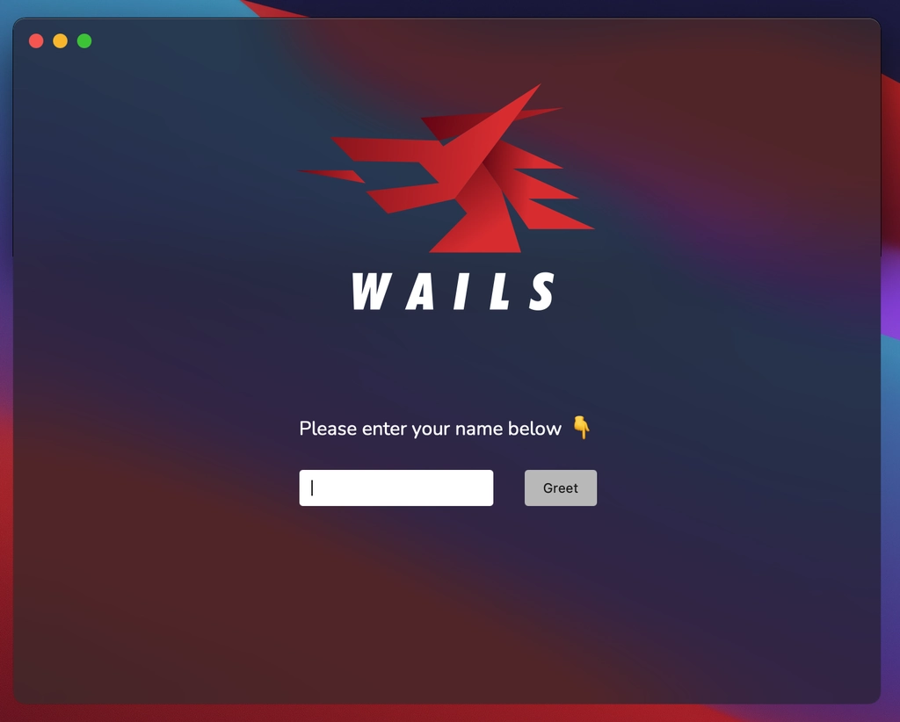
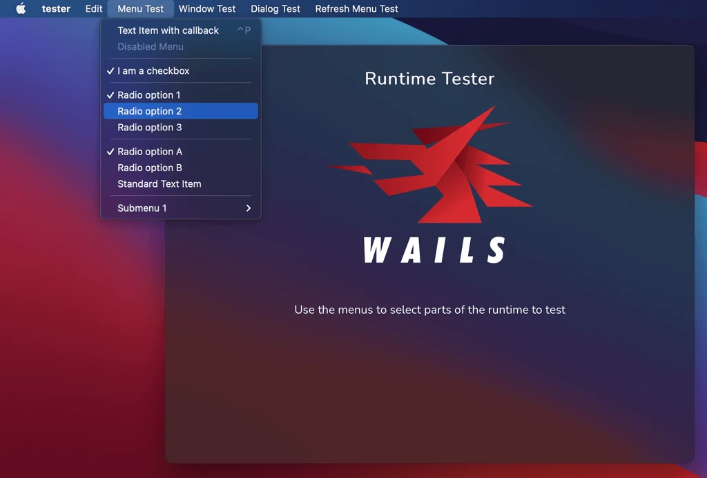
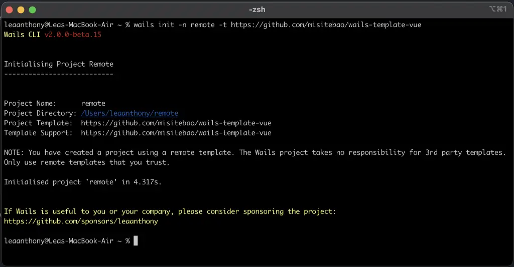
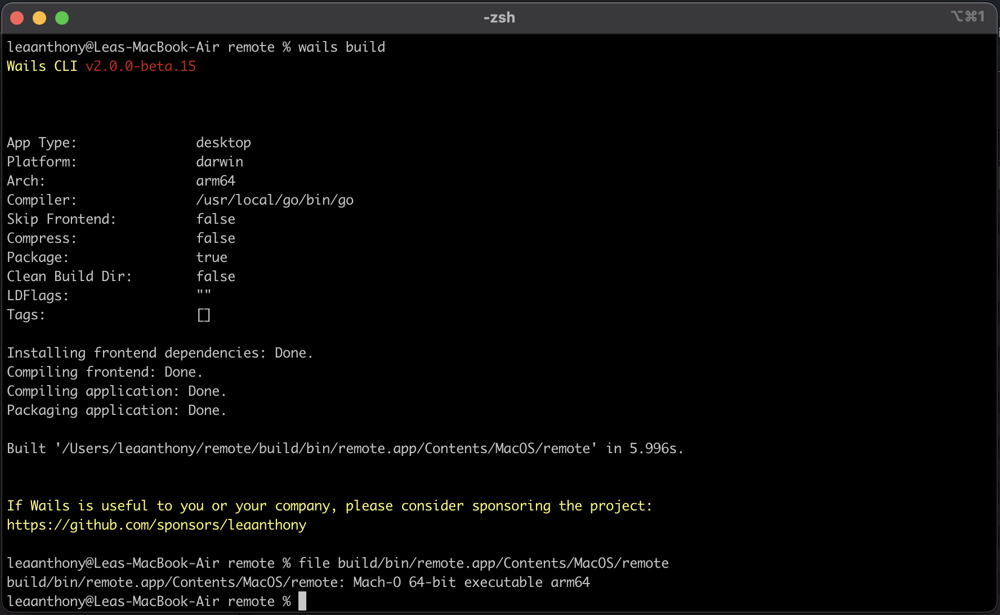
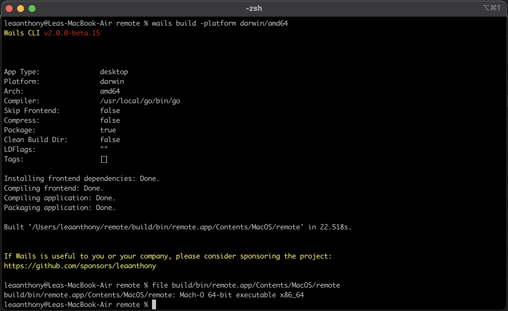
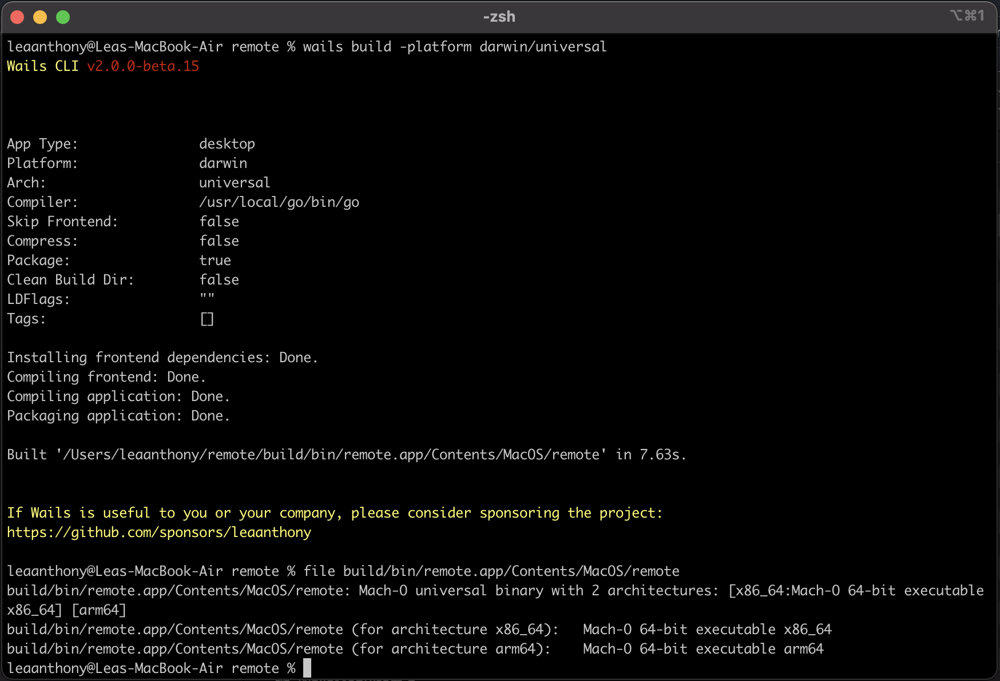
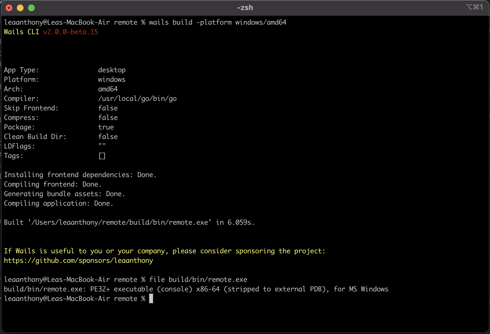

Today marks the first beta release of Wails v2 for Mac! It's taken quite a while
to get to this point and I'm hoping that today's release will give you something
that's reasonably useful. There have been a number of twists and turns to get to
this point and I'm hoping, with your help, to iron out the crinkles and get the
Mac port polished for the final v2 release.

You mean this isn't ready for production? For your use case, it may well be
ready, but there are still a number of known issues so keep your eye on
[this project board](https://github.com/wailsapp/wails/projects/7) and if you
would like to contribute, you'd be very welcome!

So what's new for Wails v2 for Mac vs v1? Hint: It's pretty similar to the
Windows Beta :wink:

### New Features

There were a lot of requests for native menu support. Wails has finally got you
covered. Application menus are now available and include support for most native
menu features. This includes standard menu items, checkboxes, radio groups,
submenus and separators.

There were a huge number of requests in v1 for the ability to have greater
control of the window itself. I'm happy to announce that there's new runtime
APIs specifically for this. It's feature-rich and supports multi-monitor
configurations. There is also an improved dialogs API: Now, you can have modern,
native dialogs with rich configuration to cater for all your dialog needs.

### Mac Specific Options

In addition to the normal application options, Wails v2 for Mac also brings some
Mac extras:

- Make your window all funky and translucent, like all the pretty swift apps!
- Highly customisable titlebar
- We support the NSAppearance options for the application
- Simple config to auto-create an "About" menu

### No requirement to bundle assets

A huge pain-point of v1 was the need to condense your entire application down to
single JS & CSS files. I'm happy to announce that for v2, there is no
requirement to bundle assets, in any way, shape or form. Want to load a local
image? Use an `` tag with a local src path. Want to use a cool font? Copy
it in and add the path to it in your CSS.

> Wow, that sounds like a webserver...

Yes, it works just like a webserver, except it isn't.

> So how do I include my assets?

You just pass a single `embed.FS` that contains all your assets into your
application configuration. They don't even need to be in the top directory -
Wails will just work it out for you.

### New Development Experience

Now that assets don't need to be bundled, it's enabled a whole new development
experience. The new `wails dev` command will build and run your application, but
instead of using the assets in the `embed.FS`, it loads them directly from disk.

It also provides the additional features:

- Hot reload - Any changes to frontend assets will trigger and auto reload of
  the application frontend
- Auto rebuild - Any changes to your Go code will rebuild and relaunch your
  application

In addition to this, a webserver will start on port 34115. This will serve your
application to any browser that connects to it. All connected web browsers will
respond to system events like hot reload on asset change.

In Go, we are used to dealing with structs in our applications. It's often
useful to send structs to our frontend and use them as state in our application.
In v1, this was a very manual process and a bit of a burden on the developer.
I'm happy to announce that in v2, any application run in dev mode will
automatically generate TypeScript models for all structs that are input or
output parameters to bound methods. This enables seamless interchange of data
models between the two worlds.

In addition to this, another JS module is dynamically generated wrapping all
your bound methods. This provides JSDoc for your methods, providing code
completion and hinting in your IDE. It's really cool when you get data models
auto-imported when hitting tab in an auto-generated module wrapping your Go
code!

### Remote Templates

Getting an application up and running quickly was always a key goal for the
Wails project. When we launched, we tried to cover a lot of the modern
frameworks at the time: react, vue and angular. The world of frontend
development is very opinionated, fast moving and hard to keep on top of! As a
result, we found our base templates getting out of date pretty quickly and this
caused a maintenance headache. It also meant that we didn't have cool modern
templates for the latest and greatest tech stacks.

With v2, I wanted to empower the community by giving you the ability to create
and host templates yourselves, rather than rely on the Wails project. So now you
can create projects using community supported templates! I hope this will
inspire developers to create a vibrant ecosystem of project templates. I'm
really quite excited about what our developer community can create!

### Native M1 Support

Thanks to the amazing support of [Mat Ryer](https://github.com/matryer/), the
Wails project now supports M1 native builds:

You can also specify `darwin/amd64` as a target too:

Oh, I almost forgot.... you can also do `darwin/universal`.... :wink:

### Cross Compilation to Windows

Because Wails v2 for Windows is pure Go, you can target Windows builds without
docker.

bu

### WKWebView Renderer

V1 relied on a (now deprecated) WebView component. V2 uses the most recent
WKWebKit component so expect the latest and greatest from Apple.

### In Conclusion

As I'd said in the Windows release notes, Wails v2 represents a new foundation
for the project. The aim of this release is to get feedback on the new approach,
and to iron out any bugs before a full release. Your input would be most
welcome! Please direct any feedback to the
[v2 Beta](https://github.com/wailsapp/wails/discussions/828) discussion board.

And finally, I'd like to give a special thank you to all the
[project sponsors](/credits#sponsors), including
[JetBrains](https://www.jetbrains.com?from=Wails), whose support drive the
project in many ways behind the scenes.

I look forward to seeing what people build with Wails in this next exciting
phase of the project!

Lea.

PS: Linux users, you're next!

PPS: If you or your company find Wails useful, please consider
[sponsoring the project](https://github.com/sponsors/leaanthony). Thanks!
