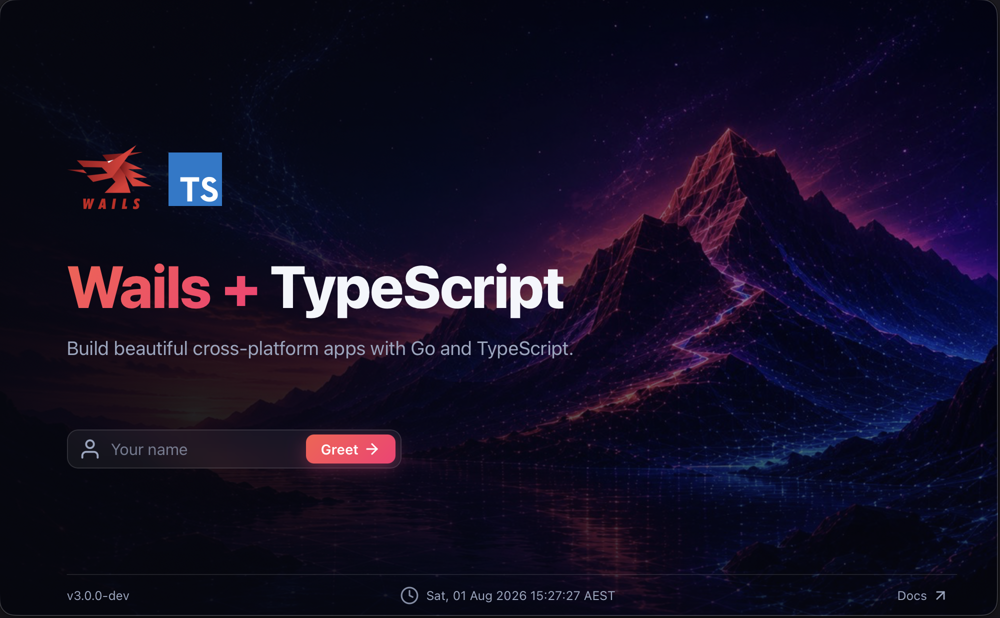
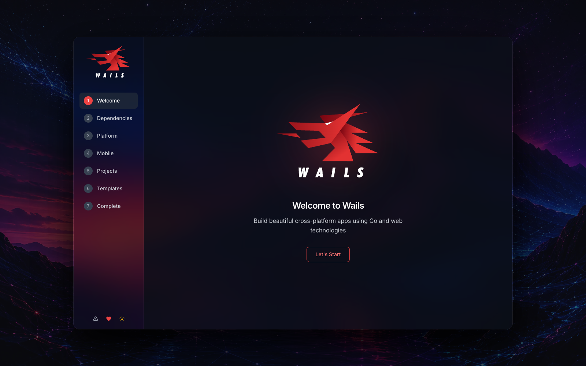

Today we are releasing Wails v3 Beta.

Wails lets Go developers build desktop applications with the web frontend tools
they already know, using the native WebView on each platform rather than an
embedded browser. v3 is a substantial step forward: it gives applications a
more direct API, a clearer build model, and a better foundation for the desktop
applications people have been asking Wails to support.

This is a beta release, not the final 3.0 release. The desktop API is stable
and teams are already using v3 in production, but you should test thoroughly
before deploying. We are using the beta period to catch the final compatibility
and workflow issues with the community. Wails v2 remains the current stable
release and will continue to receive fixes.

### Documentation during beta

During beta, we are maintaining the English documentation as the source of
truth while the API and workflows receive their final validation. We are not
accepting translation PRs at this stage. Translation work will resume before
general availability, once the documentation is stable enough for translators
to work without repeated churn.

## What is in v3

- An explicit application and window API, including first-class multi-window support
- Go services with static source analysis that generates richer TypeScript bindings, preserving comments and meaningful parameter names
- Services that can bundle frontend assets and scripts with their backend API - the foundation for installable, richer plugins
- A visible, Taskfile-based build system you can inspect, extend, and debug
- Server builds for running the same application and services without a native desktop window
- Modern desktop support for macOS, Windows, and Linux on Intel, Apple Silicon, amd64, and arm64 where supported
- Experimental mobile support for iOS and Android, available for exploration but outside the desktop beta compatibility promise

## Why v3

Wails v2 made it straightforward to build a Go application with a modern web
frontend. It has served the project - and a great many applications - well. But its
single-window, context-driven runtime and tightly managed build process made
some common desktop work harder than it should have been.

v3 starts from a different model. Applications, windows, services, events, and
platform capabilities are explicit objects. That makes the framework easier to
reason about as an application grows, and makes features such as multiple
windows a normal part of the application model rather than a workaround.

## What is new

### An application API built for real desktop software

v3 replaces the v2 `wails.Run(...)` configuration style with an explicit
application lifecycle. You create an application, register services, create
windows, and interact with the objects that own the behaviour you need.

That removes a great deal of implicit context passing. Window operations belong
to windows; application-wide operations belong to the application. It is a more
natural model for multi-window applications and a better fit for testing and
maintaining larger codebases.

The feedback from people who used v3 during alpha has been overwhelmingly
positive. In particular, developers have responded well to the explicit model:
it makes the code easier to follow, makes ownership clearer, and gives complex
desktop applications room to grow without fighting the framework.

### First-class multiple windows

Multiple windows are a core v3 capability. Windows have their own lifecycle and
can be created, managed, and closed at runtime. The result is a clearer route
to the kind of desktop software that needs editors, inspectors, preferences,
tool windows, or several independent pieces of UI.

### Services and generated bindings

Go services replace the older binding model. They keep application logic as
ordinary Go code and make the boundary to the frontend explicit. Bindings are
generated into a structure that reflects the application and its services,
making it easier to find and use the API exposed to the frontend.

v3 generates those bindings with static source analysis. That means the
generator can retain the information developers put into their code - including
comments and meaningful parameter names - rather than discovering an already
built program through reflection. The result is a richer, more useful frontend
API and a generation process that is easier to understand and maintain.

Services can also mount frontend assets and scripts alongside their Go code.
That gives a capability one coherent home: its backend API, the JavaScript or
UI it needs, and the integration point for the host application. It opens the
door to Wails plugins that deliver rich functionality out of the box - install a
plugin, mount its service, and use the feature - rather than assembling a loose
collection of bindings and frontend dependencies yourself. A general plugin
system is not part of this beta, but v3 makes that direction practical in a way
the v2 binding model did not.

### A build system you can inspect and adapt

v3 makes the project build structure visible. Rather than hiding every build
decision inside a single command, projects have a conventional layout and
Taskfile-based build configuration that can be understood, extended, and
debugged alongside the application.

### A stronger cross-platform desktop baseline

The beta supports Windows on amd64 and arm64, macOS on Intel and Apple Silicon,
and Linux on amd64 and arm64. GTK4 with WebKitGTK 6.0 is the default Linux
stack; GTK3 remains available as a legacy option throughout the v3.0 series.
Mobile support is exciting but remains experimental and is not part of the
desktop beta compatibility promise.

This release also includes the work needed to make the day-to-day experience
more dependable: improved platform behaviour, a more capable window model,
clearer diagnostics, and release artefacts with checksums and provenance.

## Moving from v2

v3 is a new major version, and migration is a real port rather than a version
number change. The main conceptual shifts are the application and window
lifecycle, services instead of context-bound bindings, direct application and
window APIs instead of the v2 runtime package, and regenerated frontend
bindings.

We have published a [v2-to-v3 migration guide](/migration/v2-to-v3/) that walks
through those changes and includes a feature mapping and testing checklist.
That manual guide is the supported migration path for this beta. Please do not
expect every v2 project to convert without review: test the result, port your
runtime calls deliberately, and keep v2 in place until the new application is
ready.

The beta CLI also includes an experimental migration assistant:
`wails3 migrate -d /path/to/v2-project -o /path/to/v3-project`. It creates a
separate V3 project and a `MIGRATION.md` checklist, but it does not promise a
zero-touch conversion. Review the generated project, port the listed V2 API
calls, and report reproducible problems in the issue tracker.

## A candid note on the journey

The first v3 alpha tag was published on 18 January 2023. That is a long time
to be in alpha, and it deserves more than a vague acknowledgement.

The project has changed enormously during that time. When the first Wails v2
beta shipped for Windows in September 2021, the repository had roughly 4,000
stars. By the v2 release in September 2022, it had roughly 10,300. Today it has
more than 35,000. That growth is a privilege, but it also changes what good
stewardship looks like: more users depend on release decisions, more
contributors need clear routes to participate, and more of the work is about
making the project predictable rather than simply adding the next feature.

I have not always adapted our processes as quickly or as clearly as that growth
required. I own that. The answer is not to make grand promises or to turn every
decision into ceremony; it is to be clearer about what is supported, what is
experimental, how decisions are made, and what we are doing next.

That work begins with this beta. We now have explicit beta, release-candidate,
and GA milestones; clearer compatibility commitments; an updated security
policy; and a WEP (Wails Enhancement Proposal) process for changes to public
behaviour and new capabilities. We will continue to improve the roadmap and
review the project’s governance as Wails grows. The aim is a project that feels
easier to rely on and easier to contribute to - not one that is harder to move.

We are also relaunching the [Wails subreddit](https://www.reddit.com/r/wails/)
and will actively maintain it as another place for practical discussion,
questions, and feedback as v3 moves toward general availability.

## Install and try the beta

Once the release is published, install the latest v3 CLI with:

```sh
go install github.com/wailsapp/wails/v3/cmd/wails3@latest
```

Before creating a project, run the guided setup wizard. It checks your local
development environment and helps configure the dependencies Wails needs:

```sh
wails3 setup
```



### Create a project

Once you are all set, create a project with:

```sh
wails3 init
```

- Documentation: <https://v3.wails.io/>
- Migration guide: <https://v3.wails.io/migration/v2-to-v3/>
- Reddit: <https://www.reddit.com/r/wails/>
- Release notes: [VERSION PLACEHOLDER](https://github.com/wailsapp/wails/releases)

If you find a reproducible bug, please report it with the output of `wails3
doctor` and a minimal example where possible. If you want to propose a new
capability or a change to public behaviour, start a draft WEP PR instead of a
feature-request issue. Both routes help us respond clearly and keep the beta
moving.

## Thank you

Wails v3 exists because of the people who tested incomplete builds, reported
hard bugs, translated documentation, answered questions, contributed code, and
kept asking the project to become better. Thank you.

And a very special, heartfelt thank you to the sponsors who have carried Wails
through this long transition. Your support did more than keep the lights on: it
gave us the opportunity to spend sustained time on the architecture, tooling,
testing, and documentation that let the project accelerate toward v3. Every
tester and contributor has helped shape this release, but the sponsors made it
possible to give that work the attention it deserved.

The beta is an invitation to help us finish v3 properly. Try it, build with it,
tell us where it breaks, and help us make the road to 3.0 a short and careful
one.
