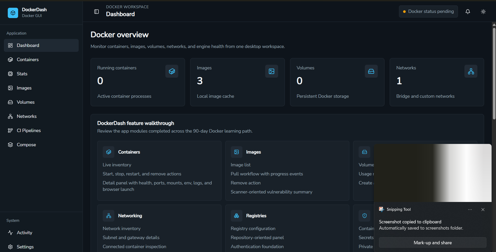
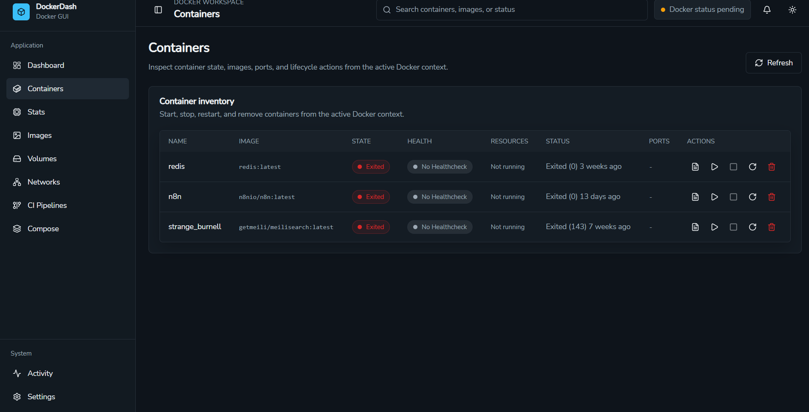
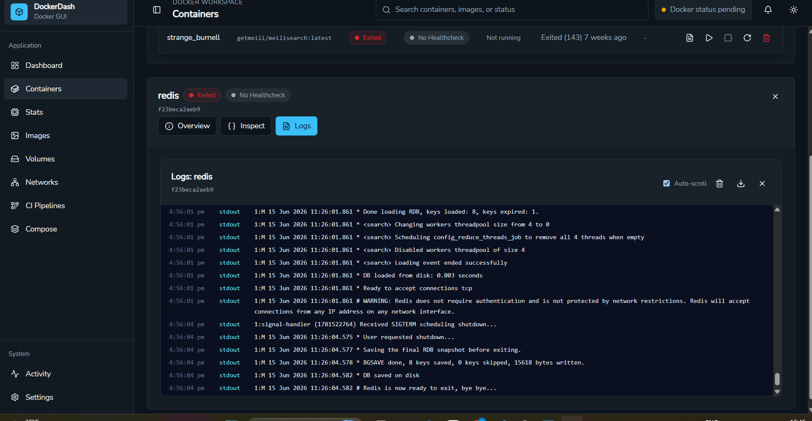

# DockerDash

DockerDash is a desktop Docker management app built with Wails, Go, React, Tailwind CSS, and shadcn-style UI components.

It is designed for developers who want a clean, focused interface for everyday Docker work without switching between multiple terminal commands. The app brings common Docker visibility and control into a native-feeling desktop experience while keeping the backend simple, typed, and maintainable with Go.

## Built With Wails

DockerDash uses Wails as the desktop application framework, combining a Go backend with a modern React frontend. Wails is a strong fit for this project because Docker operations are naturally backend-heavy, while the user experience benefits from fast frontend iteration and reusable UI components.

The app uses Wails bindings to expose backend Docker operations to the frontend in a structured way. This keeps Docker logic in Go and keeps the React layer focused on screens, state, interactions, and presentation.

## Current Features

- Docker dashboard with environment and resource metrics
- Container list with status, image, ports, and runtime details
- Container detail view for inspection-focused workflows
- Container logs panel
- Image management panel
- Volume management panel
- Network management panel
- Compose workspace for project-level workflows
- CI workflow panel for pipeline visibility
- Global search and filtering patterns
- Keyboard shortcut support
- Notification and settings providers
- Collapsible sidebar and reusable app layout

## Why It Exists

Docker is powerful, but many day-to-day tasks require remembering commands, flags, resource names, and context. DockerDash aims to make those workflows more visible and approachable while still respecting how developers already work.

The goal is not to hide Docker. The goal is to make Docker easier to inspect, understand, and operate from one place.

## Architecture

DockerDash is split into clear layers:

- Go services handle Docker operations and Wails-exposed methods.
- React feature panels render focused workspaces.
- Shared frontend services wrap Wails calls.
- Reusable UI components keep layout and controls consistent.
- Tailwind CSS provides the styling foundation.

This structure keeps the project scalable as more Docker workflows are added.

## Local Development

From the `DockerDash` directory:

```powershell
wails dev
```

For frontend-only iteration:

```powershell
cd frontend
npm install
npm run dev
```

Use the full Wails development flow when working with backend methods, generated bindings, Docker calls, or desktop behavior.

## Project Links

- Framework: Wails v2
- Backend: Go
- Frontend: React and Vite
- Styling: Tailwind CSS
- UI: shadcn-style components

## App Screenshots

Add DockerDash screenshots here to show the desktop experience, dashboard metrics, and main resource panels.





Recommended screenshots:

- Dashboard overview with Docker environment metrics
- Containers workspace with status and runtime details
- Container logs or resource detail view
- Images, volumes, networks, or Compose workspace
## Status

DockerDash is an active desktop app prototype focused on Docker visibility, resource management, and developer-friendly workflows.

[View on GitHub](https://github.com/uditrawat03/docker-dash/tree/main)