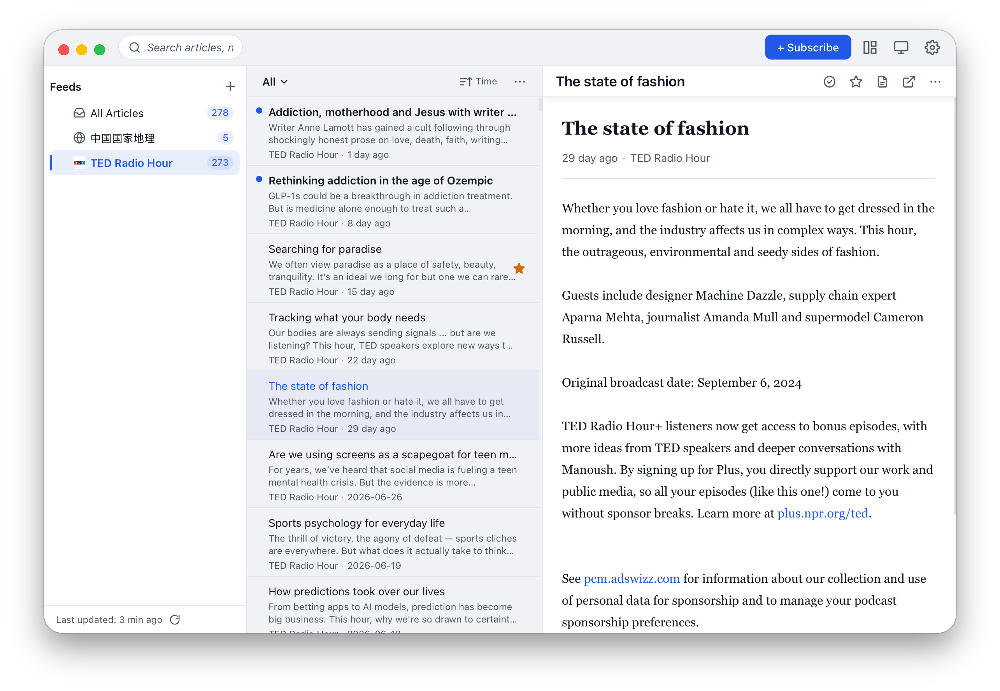

- **Three-column layout**: source/folder tree · article list · reading view
- **Subscription management**: add feeds, organize into folders, OPML import/export
- **Scheduled fetching**: RSS / Atom parsing with background auto-refresh
- **Focused reading**: full-text reading view + distraction-free focus mode
- **Fast search**: global full-text search across titles, summaries, and notes
- **Notes**: attach notes to articles for later review
- **Desktop notifications**: new-article alerts, macOS Dock / Windows taskbar badges
- **Keyboard driven**: a complete set of shortcuts
- **Theme & i18n**: light / dark / follow-system, multilingual support
- **Performance & offline**: lightweight list queries, local cache, readable offline

[View on GitHub](https://github.com/clip-rss/clip)
