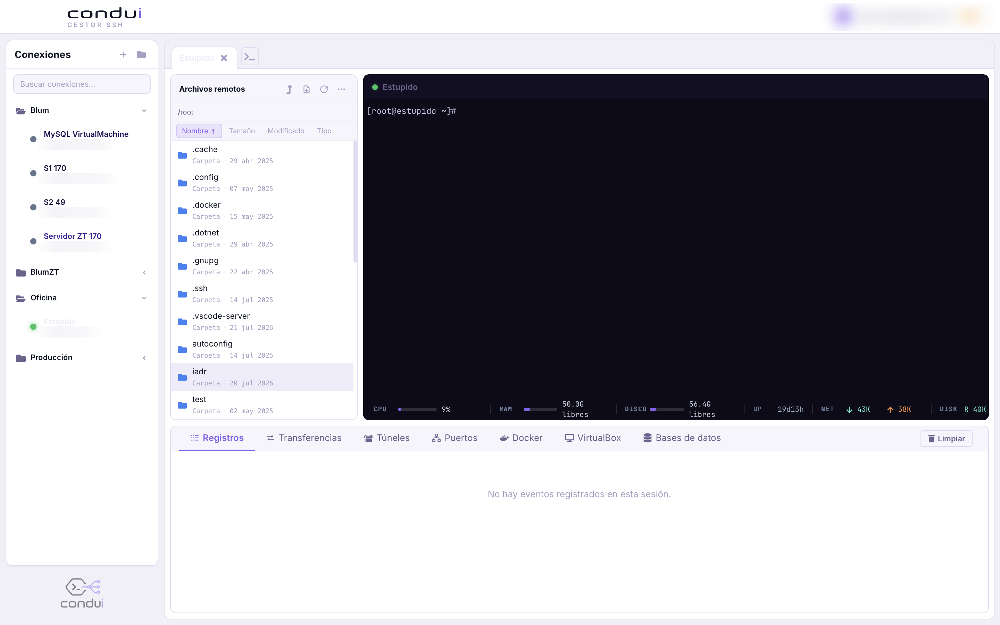

Condui is an SSH connection manager with end-to-end encrypted, multi-device
sync. It keeps your connections, SSH tunnels and vault-protected credentials
in sync across every device you use, without the sync server ever seeing
your plaintext credentials.

Key Features

- 🔐 End-to-end encrypted vault for SSH passwords and private key passphrases
- 🔄 Multi-device sync of connections, folders and SSH tunnels
- 🌐 Local port-forwarding tunnels persisted per connection
- 🖥️ Integrated terminal, SFTP, Docker and database tooling
- 💻 Available for macOS, Windows and Linux

Try Condui Today!

💻 [https://condui.codeffeine.io/](https://condui.codeffeine.io/) | [GitHub](https://github.com/mgueregath/condui)
