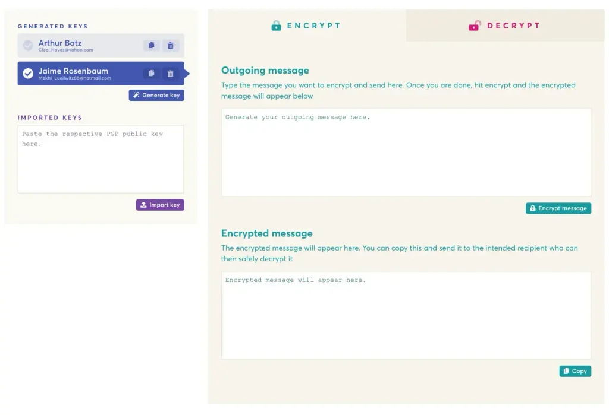

**[EncryptEasy](https://www.encrypteasy.app) is a simple and easy to use PGP
encryption tool, managing all your and your contacts keys. Encryption should be
simple. Developed with Wails.**

Encrypting messages using PGP is the industry standard. Everyone has a private
and a public key. Your private key, well, needs to be kept private so only you
can read messages. Your public key is distributed to anyone who wants to send
you secret, encrypted messages. Managing keys, encrypting messages and
decrypting messages should be a smooth experience. EncryptEasy is all about
making it easy.
