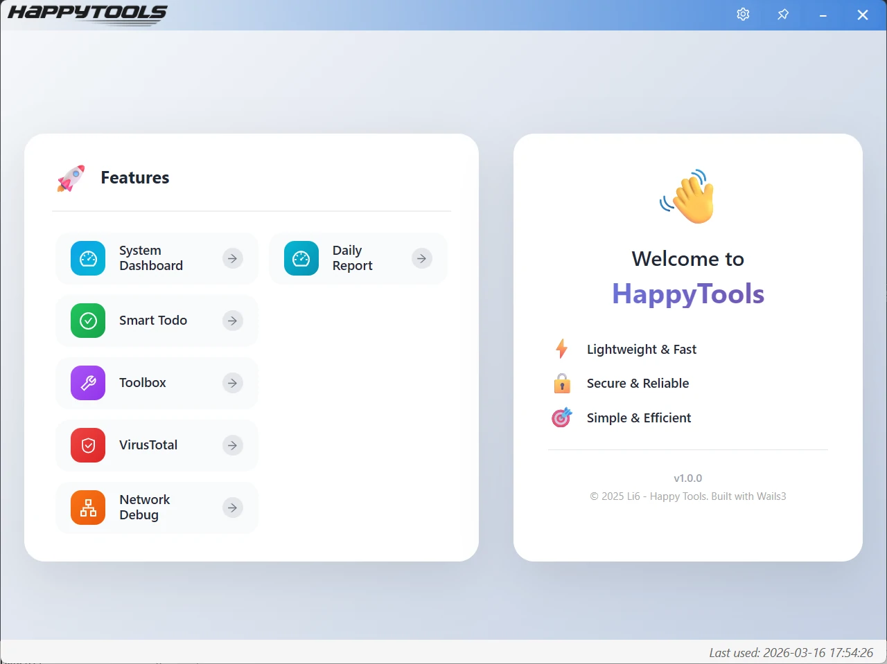

  

[HappyTools](https://github.com/Aliuyanfeng/happytools) is a feature-rich desktop application that integrates multiple practical functions such as to-do list management, categorization management, daily report management, system monitoring, and application settings. With its modern interface design and smooth user experience, it helps users better manage their daily tasks and life. It is a cross-platform desktop application developed based on Wails v3 + Vue 3, aiming to enhance users' sense of happiness and work efficiency.

⚡ Lightweight & Fast  

🔒 Secure & Reliable  

🎯 Simple & Efficient  