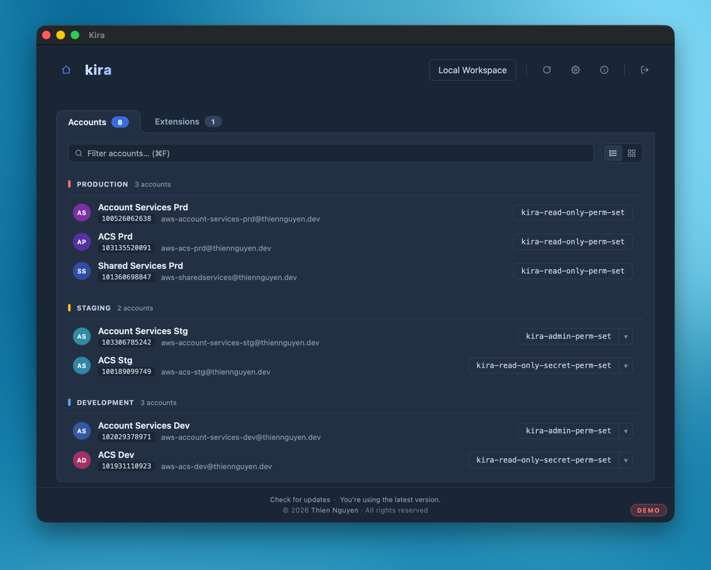
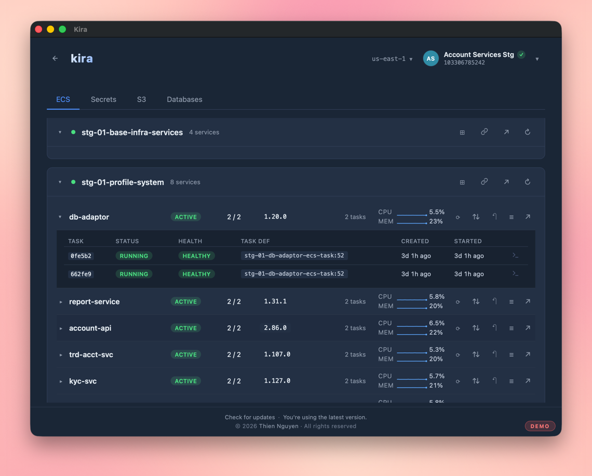
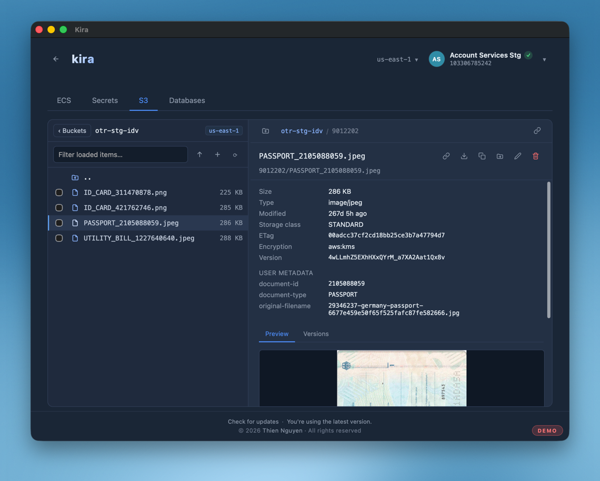

**[Kira](https://kira.thiennguyen.dev)** is a **native macOS desktop client for AWS** — *"AWS, without the friction"*. Built with **Go, Wails and React + TypeScript**, it consolidates AWS operations into a single, keyboard-driven app. Authenticate once via AWS SSO and manage infrastructure across many accounts without ever switching between the console, the CLI, and a pile of database tools.

It started as a personal itch: jumping between browser tabs, `aws` commands, and a separate SQL client just to ship a change felt slow. Kira pulls those workflows into one fast, native window — sign in, pick an account, and everything you reach for is a keystroke away.

## Key Highlights

- **Multi-account AWS SSO** - Sign in once, then switch between accounts and regions from one place
- **ECS** - Browse clusters, services, and tasks; redeploy, scale, and roll back services; view task definitions; monitor service metrics; and open an interactive shell via ECS Exec
- **Databases** - Run SQL against RDS, query and scan DynamoDB, and connect to PostgreSQL, MySQL, and Redshift — with secure SSH tunneling and credentials stored in the macOS Keychain
- **S3** - Navigate buckets and prefixes; preview, upload, download, copy, rename, and delete objects; and create folders
- **Secrets Manager** - List secrets and retrieve their values for the active account
- **CloudWatch Logs** - Tail and search log streams
- **Smart Query** - Optional AI-assisted SQL generation powered by the `claude` CLI
- **Extensions** - Install custom `.kext` bundles that add action buttons backed by small Go scripts
- **Fast navigation** - A global summon hotkey, a `Cmd+K` command palette, and `kira://` deep linking

## A closer look

Watch your ECS services live — task health, CPU and memory, deploy state — and redeploy, scale, or roll back without leaving the list.

Browse S3 like a file manager. Preview objects, inspect metadata and versions, and upload, download, rename, or delete inline.

Distributed as a signed, notarized `.dmg` for macOS.

[Visit Kira](https://kira.thiennguyen.dev) | [Read the docs](https://docs.kira.thiennguyen.dev)
