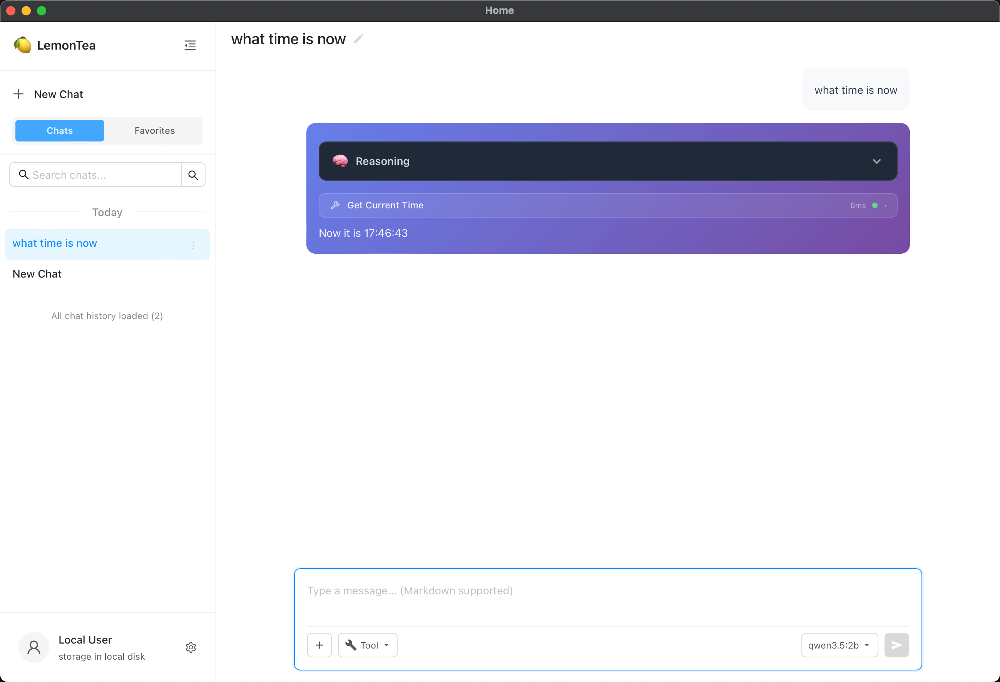

[lemontea](https://github.com/MikeLINGxZ/lemontea) - A cross-platform AI desktop client built with Wails v3, Go, React, and TypeScript. It focuses on chat, tool calling, multi-agent workflow execution, and local desktop integration.