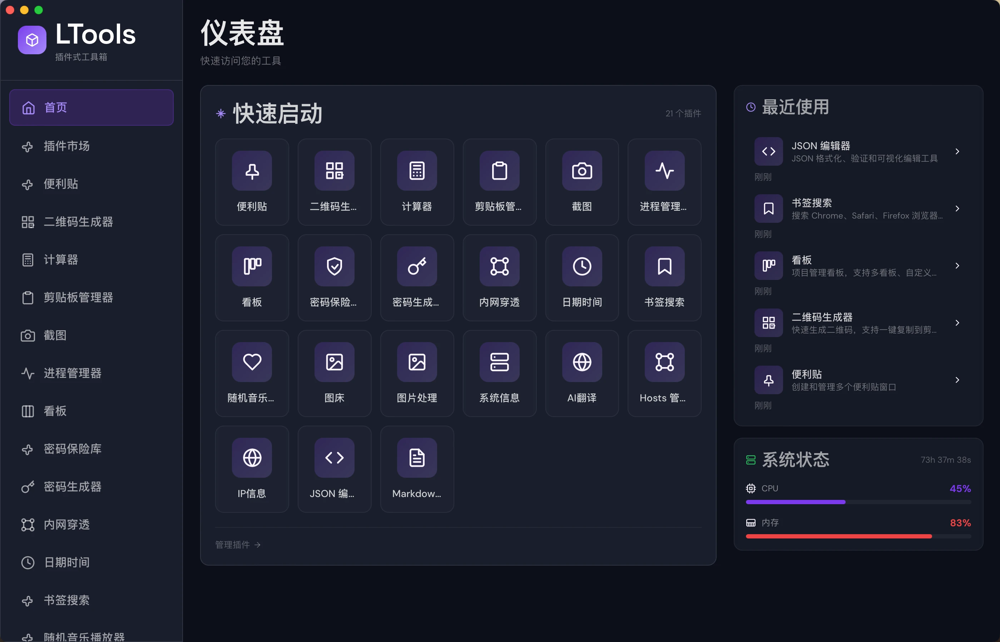

[LTools](https://github.com/lian-yang/ltools) is a plugin-based cross-platform desktop toolbox built with Wails v3, inspired by uTools. It provides a unified hub of developer utilities through a modular plugin architecture.

It features a global search bar (Spotlight-style), system tray integration, and built-in plugins including clipboard manager, screenshot tool with annotation, JSON editor, calculator, system monitor, and more. New tools can be added through its extensible plugin system.
