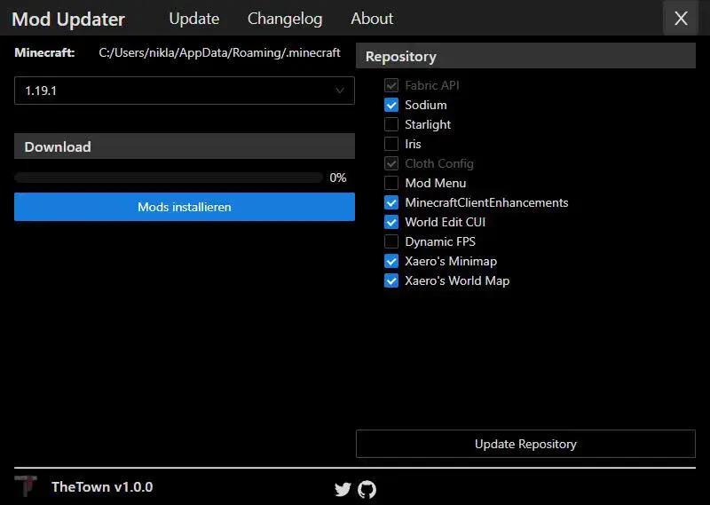

[Minecraft Updater](https://github.com/Gurkengewuerz/MinecraftModUpdater) is a
utility tool to update and synchronize Minecraft mods for your userbase. It’s
built using Wails2 and React with [antd](https://ant.design/) as frontend
framework.
