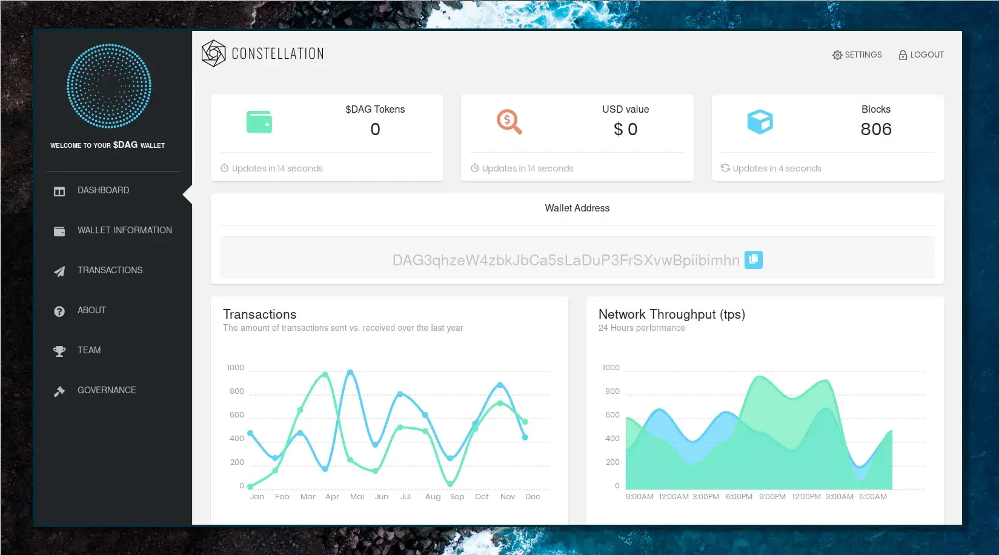

[Molly Wallet](https://github.com/grvlle/constellation_wallet/) the official
$DAG wallet of the Constellation Network. It'll let users interact with the
Hypergraph Network in various ways, not limited to producing $DAG transactions.
