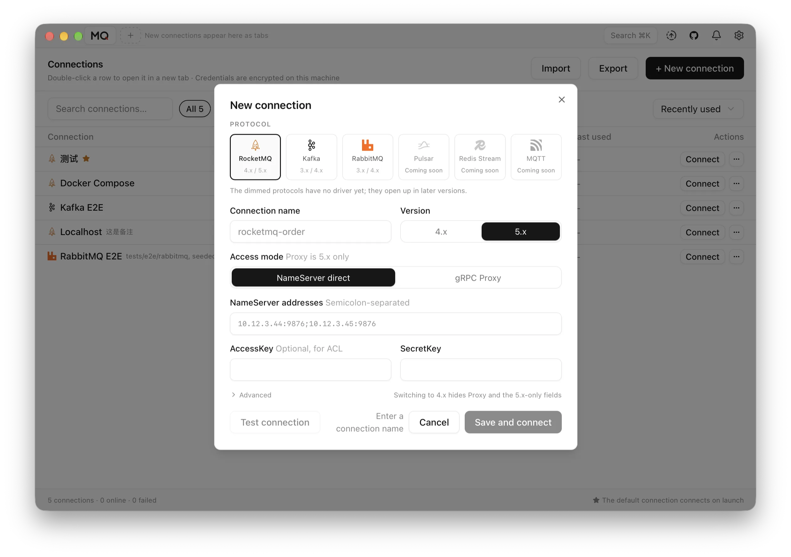

**[MQ Studio](https://mq-studio.amigoer.com)** is a **local-first desktop client
for message queues**, built with **Go, Wails and React**. Every broker arrives
with a console of its own — RocketMQ has one, Kafka has another, RabbitMQ ships
a management plugin. Different interfaces, different vocabulary, and every one
of them a service to deploy and keep alive. MQ Studio replaces all of them with
a single application: each broker is reached through a driver behind the same
interface, so the pages and the workflow stay the same whichever system you are
connected to.

## Key Highlights

- **One interface, every broker** — RocketMQ, RabbitMQ and Kafka today, with
  Pulsar, NATS, MQTT and SQS on the roadmap
- **Topics, queues and messages** — inspect topics, queues, exchanges and
  bindings; query and trace, follow a log, produce with keys and headers,
  resend, and work through dead letters
- **Consumers and lag** — groups, clients, subscriptions and per-partition lag,
  with offset resets and retry/DLQ handling
- **Cluster and alerts** — broker health, runtime metrics, throughput, disk
  usage, and native desktop notifications
- **Honest about what it connects to** — every driver declares what its endpoint
  can actually do, and the interface only offers operations the broker supports
- **Private by default** — configuration stays on your device and credentials
  are encrypted at rest

There is no server component to deploy, no web console to keep alive, and no
telemetry. Wails makes that possible: the admin clients for these brokers are Go
libraries, so the driver layer talks to them directly in-process while the
frontend stays a normal React app — one binary per platform instead of a service
someone has to operate.

Available for macOS, Windows and Linux, in English and Chinese.

[Website](https://mq-studio.amigoer.com) |
[GitHub](https://github.com/amigoer/mq-studio) |
[Download](https://github.com/amigoer/mq-studio/releases/latest)
