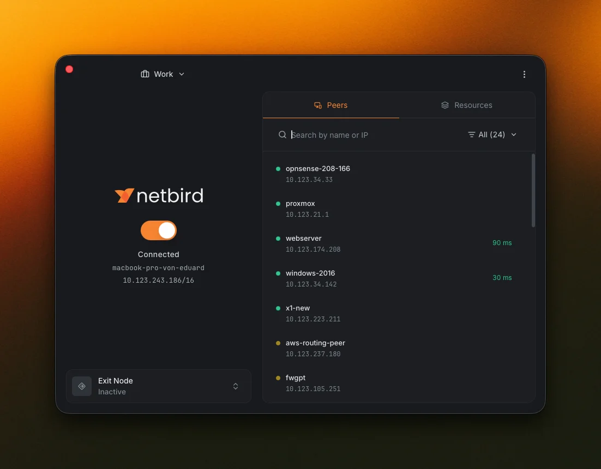
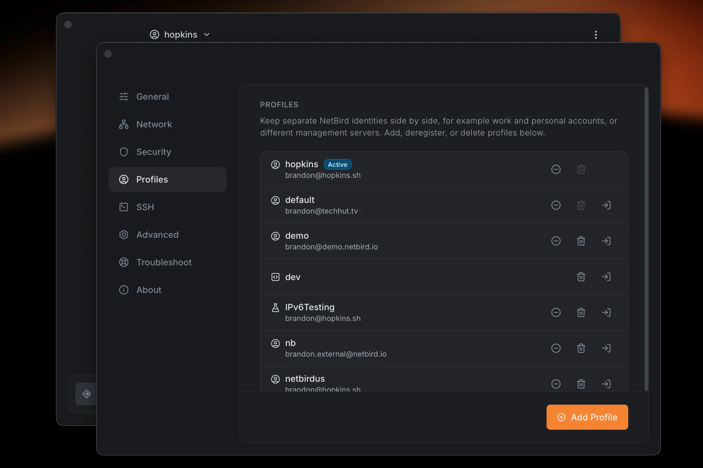
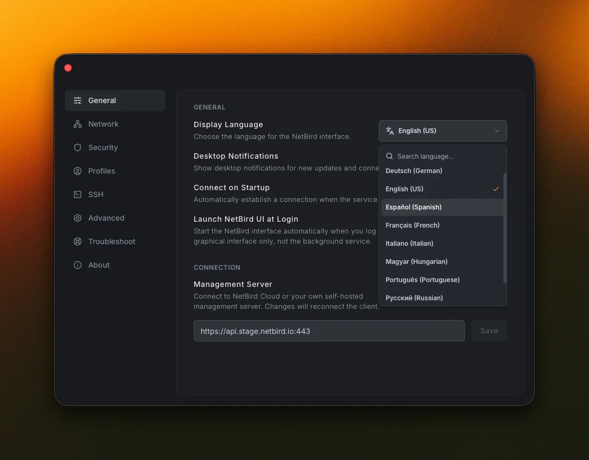

[NetBird](https://netbird.io/) combines a configuration-free, WireGuard-based
peer-to-peer private network with a centralized access control system, making it
easy to build secure private networks for your organization or home.

Its desktop app was rebuilt from scratch with Wails, offering a compact Default
view for the essentials and an expandable Advanced mode to
browse peers and resources, manage multiple profiles, and configure the client,
all natively across macOS, Windows, and Linux.

Read more about the GUI in the
[blog post](https://netbird.io/knowledge-hub/new-desktop-app-release-candidate)
or
[view the source code](https://github.com/netbirdio/netbird/tree/main/client/ui)
on GitHub.
