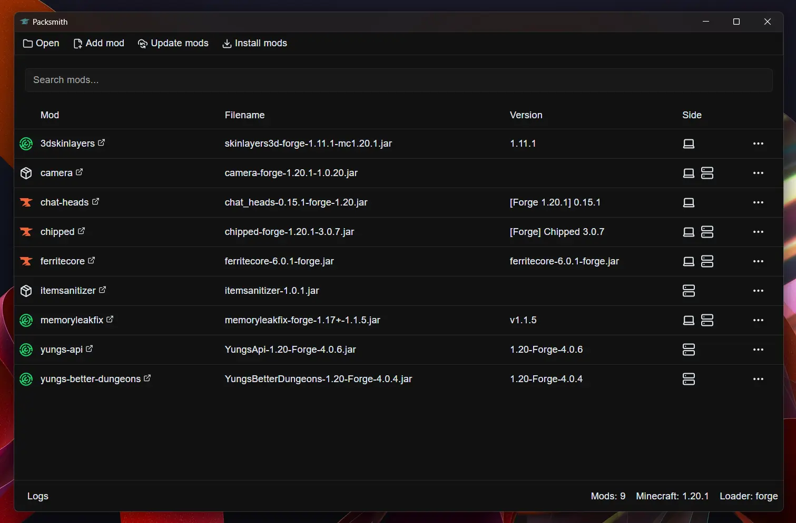

[Packsmith](https://github.com/sqot0/packsmith) is an open source application for managing Minecraft modpacks that allows you:

- Manage modpacks with Forge, Fabric, Neoforge, or Quilt mod loaders.
- Search and download mods from Modrinth and CurseForge.
- Separate mods for client and server.
- Update, change versions, or delete mods from your modpack.