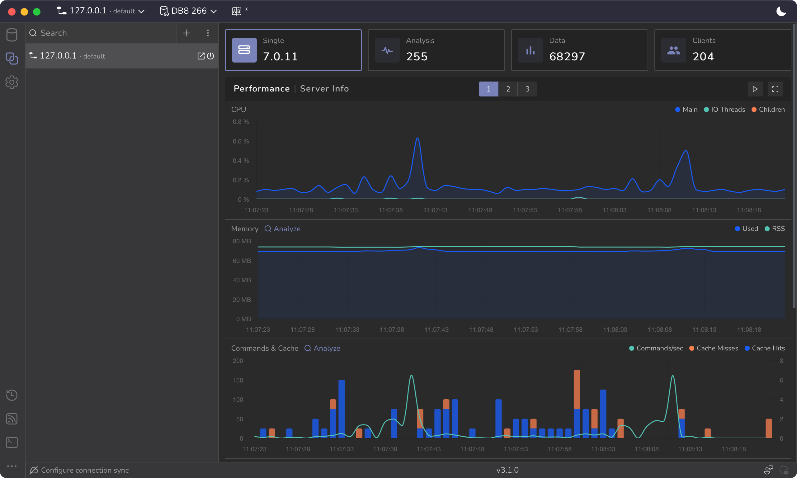
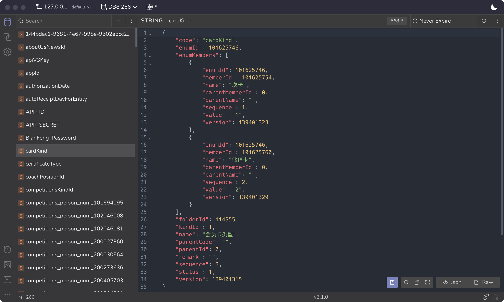

[RedisViewer](https://redisviewer.com/) is a modern Redis desktop GUI built with Wails. With thoughtful UI interactions, it helps developers browse large keyspaces, inspect complex values, run commands, and analyze Redis performance issues in a focused native desktop app.

[Visit Project Website](https://redisviewer.com/)
