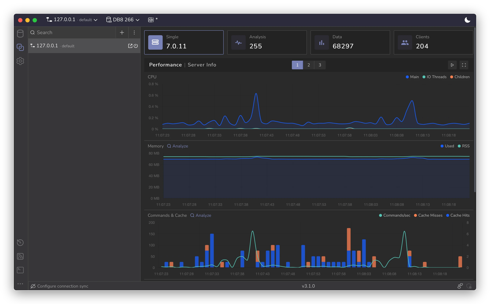
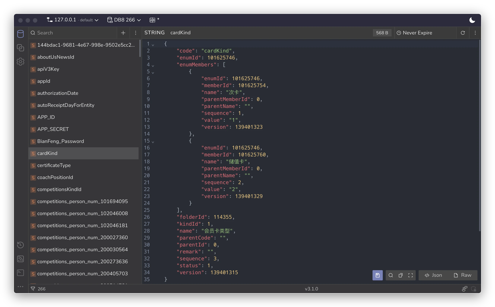

[RedisViewer](https://redisviewer.com/) is a modern Redis desktop GUI built with Wails. Use it to inspect complex values, run commands, and analyze Redis performance without giving up interaction quality.

Designed around Wails' WebView + Go architecture, it keeps large keyspaces and heavy payloads in the Go backend instead of shipping everything into the frontend—leveraging Go's memory model and avoiding the heap pressure and leak risks common in JS-heavy clients. The UI is tuned to render only what's on screen, so browsing massive datasets stays responsive and feels close to a native desktop app.

[Visit Project Website](https://redisviewer.com/)
