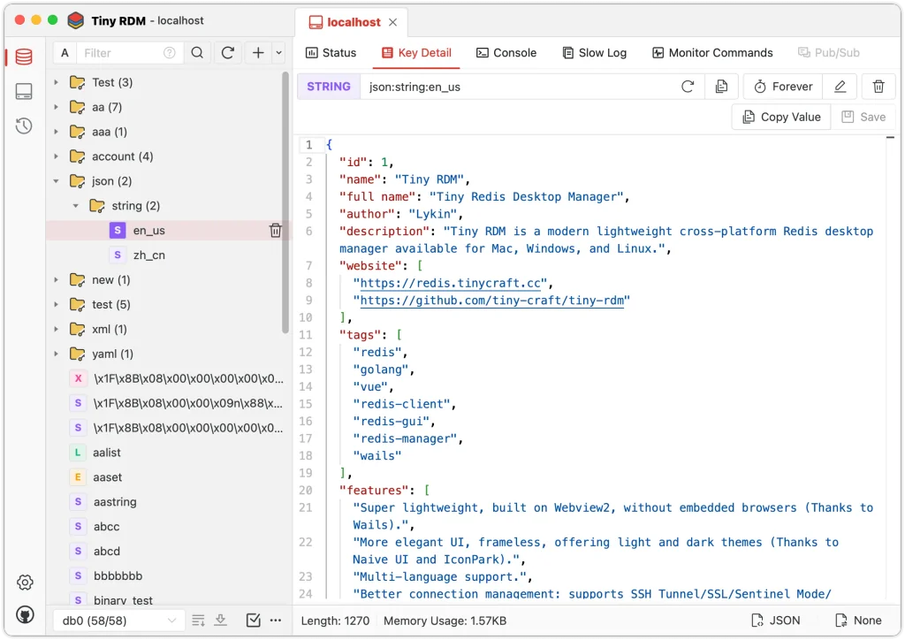
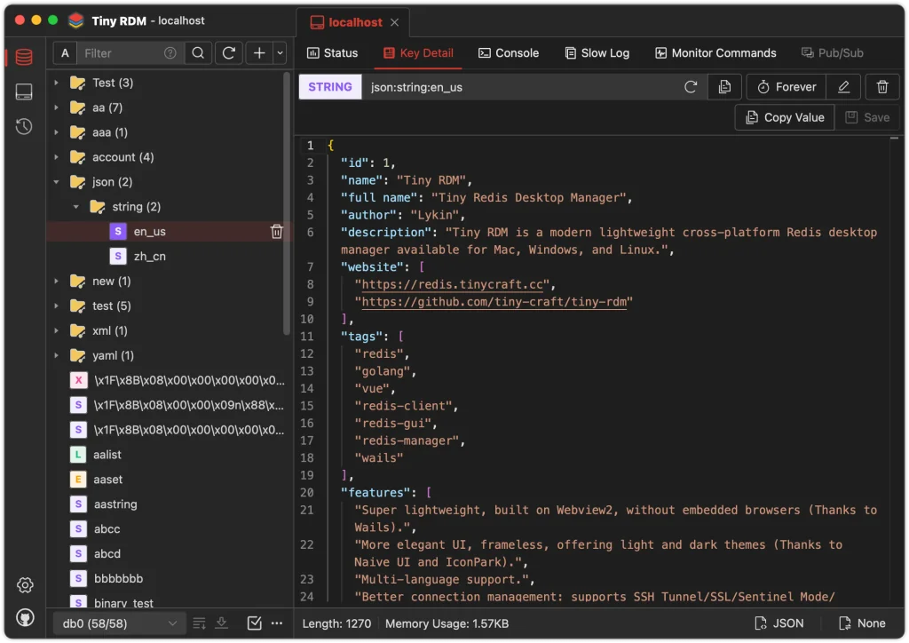

The [Tiny RDM](https://redis.tinycraft.cc/) application is an open-source,
modern lightweight Redis GUI. It has a beautful UI, intuitive Redis database
management, and compatible with Windows, Mac, and Linux. It provides visual
key-value data operations, supports various data decoding and viewing options,
built-in console for executing commands, slow log queries and more.
