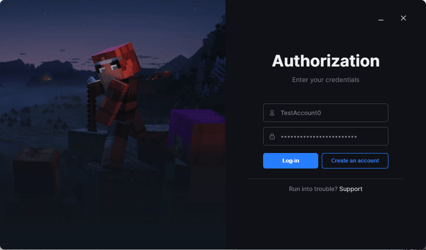
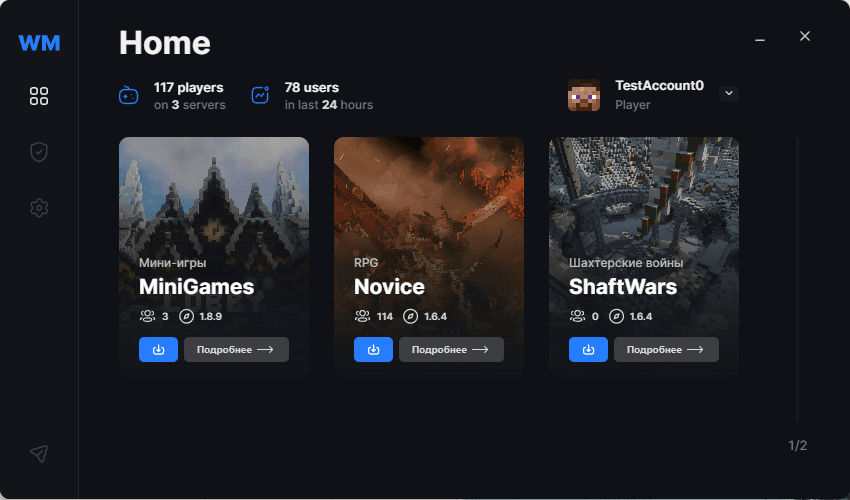

[Minecraft launcher for WarMine](https://warmine.ru/) is a Wails application,
that allows you to easily join modded game servers and manage your game
accounts.

The Launcher downloads the game files, checks their integrity and launches the
game with a wide range of customization options for the launch arguments from
the backend.

Frontend is written in Svelte, whole launcher fits in 9MB and supports Windows
7-11.
