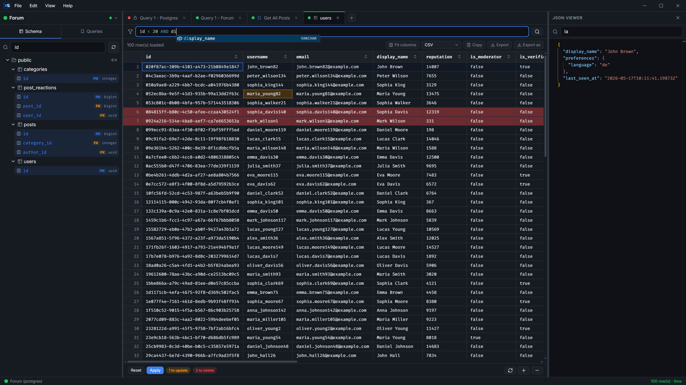
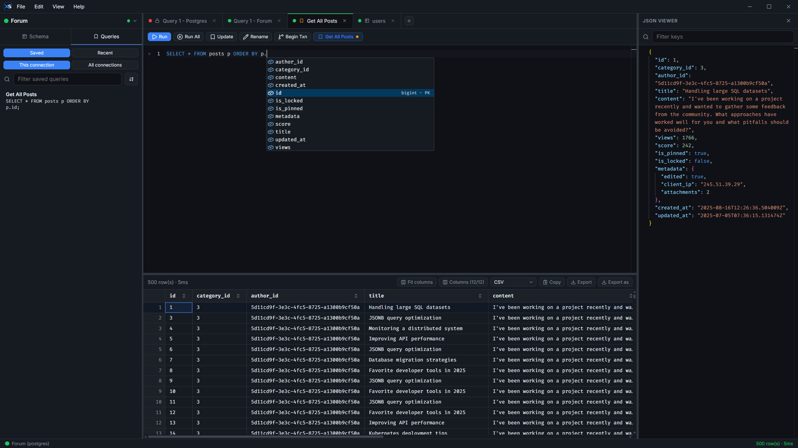
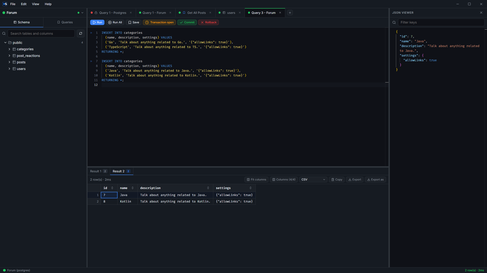

**[XenSQL](https://github.com/Bare7a/XenSQL)** is a **fast, local-first SQL desktop workbench** built with **Go, Wails and React**. It brings together PostgreSQL, MySQL/MariaDB, and SQLite in one clean, native-feeling interface - with zero cloud, zero telemetry, and zero accounts.

## Key Highlights

- **Powerful SQL Editor** - Monaco-based with smart schema-aware autocomplete, multi-statement execution, streaming results, and per-statement result tabs
- **Advanced Data Viewer** - Interactive JSON inspector, syntax-aware cell editor (JSON, XML, HTML, text), inline editing, and full record inspection
- **Seamless Data Editing** - Browse tables, stage changes inline, bulk operations, and safe `INSERT`/`UPDATE`/`DELETE` with `RETURNING` support
- **Productivity Features** - Schema explorer, saved queries, query history, quick search (`Ctrl+P`), and keyboard-first workflow
- **Export Options** - CSV, JSON, Markdown, SQL INSERTs

Fully offline and portable. Everything is stored locally in a single `XenSQL-data/` folder that travels with the app.

**Supported Databases**: PostgreSQL, MySQL, MariaDB, and SQLite (with read-only mode and secure transport options).

Designed for developers who want speed, clarity, and control without the bloat of traditional SQL tools.
