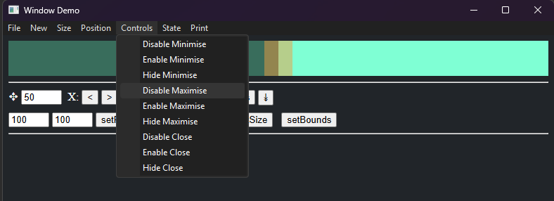

import {Badge} from '@astrojs/starlight/components';

Relevant Platforms: <Badge text="Windows" variant="note" /> <Badge text="macOS" variant="success" />
<br/>

Wails provides an API to control the appearance and functionality of the
controls of a window. This functionality is available on Windows and macOS, but
not on Linux.

## Setting the Window Button States

The button states are defined by the `ButtonState` enum:

```go
type ButtonState int

const (
    ButtonEnabled   ButtonState = 0
    ButtonDisabled  ButtonState = 1
    ButtonHidden    ButtonState = 2
)
```

- `ButtonEnabled`: The button is enabled and visible.
- `ButtonDisabled`: The button is visible but disabled (grayed out).
- `ButtonHidden`: The button is hidden from the titlebar.

The button states can be set during window creation or at runtime.

### Setting Button States During Window Creation

When creating a new window, you can set the initial state of the buttons using
the `WebviewWindowOptions` struct:

```go title="main.go"
package main

import (
    "github.com/wailsapp/wails/v3/pkg/application"
)

func main() {
    app := application.New(application.Options{
        Name:        "My Application",
    })

    app.NewWebviewWindowWithOptions(application.WebviewWindowOptions{
        MinimiseButtonState: application.ButtonHidden,
        MaximiseButtonState: application.ButtonDisabled,
        CloseButtonState:    application.ButtonEnabled,
    })

    app.Run()
}
```

In the example above, the minimise button is hidden, the maximise button is
inactive (grayed out), and the close button is active.

### Setting Button States at Runtime

You can also change the button states at runtime using the following methods on
the `Window` interface:

```go
window.SetMinimiseButtonState(wails.ButtonHidden)
window.SetMaximiseButtonState(wails.ButtonEnabled)
window.SetCloseButtonState(wails.ButtonDisabled)
```

### Platform Differences

The button state functionality behaves slightly differently on Windows and
macOS:

|                       | Windows                | Mac                    |
|-----------------------|------------------------|------------------------|
| Disable Min/Max/Close | Disables Min/Max/Close | Disables Min/Max/Close |
| Hide Min              | Disables Min           | Hides Min button       |
| Hide Max              | Disables Max           | Hides Max button       |
| Hide Close            | Hides all controls     | Hides Close            |

Note: On Windows, it is not possible to hide the Min/Max buttons individually.
However, disabling both will hide both of the controls and only show the close
button.

### Controlling Window Style (Windows)

To control the style of the titlebar on Windows, you can use the `ExStyle` field
in the `WebviewWindowOptions` struct:

Example:

```go title="main.go"
package main

import (
    "github.com/wailsapp/wails/v3/pkg/application"
    "github.com/wailsapp/wails/v3/pkg/w32"
)

func main() {
    app := application.New(application.Options{
        Name: "My Application",
    })

    app.NewWebviewWindowWithOptions(application.WebviewWindowOptions{
        Windows: application.WindowsWindow{
            ExStyle: w32.WS_EX_TOOLWINDOW | w32.WS_EX_NOREDIRECTIONBITMAP | w32.WS_EX_TOPMOST,
        },
    })

    app.Run()
}
```

Other options that affect the Extended Style of a window will be overridden by
this setting:

- HiddenOnTaskbar
- AlwaysOnTop
- IgnoreMouseEvents
- BackgroundType

## Custom Menu Bar Theming (Windows)

<Badge text="Windows" variant="note" />

Wails v3 supports custom theming for the menu bar on Windows, allowing you to customize colours for both dark and light modes. This feature is particularly useful for creating applications that match your brand colours or design system.



### Theme Structure

The menu bar theme is configured using the `MenuBarTheme` struct, which contains three states:

```go
type MenuBarTheme struct {
    // Default appearance when not interacting
    Default *TextTheme
    
    // Appearance when hovering over a menu item
    Hover *TextTheme
    
    // Appearance when a menu item is selected/clicked
    Selected *TextTheme
}

type TextTheme struct {
    // Background colour in 0x00BBGGRR format
    Background *uint32
    
    // Text colour in 0x00BBGGRR format
    Text *uint32
}
```

### Setting Custom Menu Bar Themes

You can set custom menu bar themes for both dark and light modes:

```go title="main.go"
package main

import (
    "github.com/wailsapp/wails/v3/pkg/application"
    "github.com/samber/lo"
)

func main() {
    app := application.New(application.Options{
        Name: "My Application",
    })

    app.NewWebviewWindowWithOptions(application.WebviewWindowOptions{
        Windows: application.WindowsWindow{
            Theme: application.SystemDefault, // Follow system theme
            CustomTheme: application.ThemeSettings{
                // Dark mode menu bar colours
                DarkModeMenuBar: &application.MenuBarTheme{
                    Default: &application.TextTheme{
                        Background: lo.ToPtr(uint32(0x00212121)), // Dark gray
                        Text:       lo.ToPtr(uint32(0x00DEDEDE)), // Light gray
                    },
                    Hover: &application.TextTheme{
                        Background: lo.ToPtr(uint32(0x00303030)), // Lighter gray
                        Text:       lo.ToPtr(uint32(0x00FFFFFF)), // White
                    },
                    Selected: &application.TextTheme{
                        Background: lo.ToPtr(uint32(0x00303030)), // Same as hover
                        Text:       lo.ToPtr(uint32(0x00FFFFFF)), // White
                    },
                },
                // Light mode menu bar colours
                LightModeMenuBar: &application.MenuBarTheme{
                    Default: &application.TextTheme{
                        Background: lo.ToPtr(uint32(0x00F0F0F0)), // Light gray
                        Text:       lo.ToPtr(uint32(0x00202020)), // Dark gray
                    },
                    Hover: &application.TextTheme{
                        Background: lo.ToPtr(uint32(0x00E0E0E0)), // Slightly darker
                        Text:       lo.ToPtr(uint32(0x00000000)), // Black
                    },
                    Selected: &application.TextTheme{
                        Background: lo.ToPtr(uint32(0x00D0D0D0)), // Even darker
                        Text:       lo.ToPtr(uint32(0x00000000)), // Black
                    },
                },
            },
        },
    })

    app.Run()
}
```

### Colour Format

Colours are specified in the `0x00BBGGRR` format (Blue, Green, Red), where:
- `BB` is the blue component (00-FF)
- `GG` is the green component (00-FF)
- `RR` is the red component (00-FF)

For example:
- `0x00FF0000` = Pure blue
- `0x0000FF00` = Pure green
- `0x000000FF` = Pure red
- `0x00FFFFFF` = White
- `0x00000000` = Black

### Theme Selection

The theme used depends on the `Theme` setting in `WindowsWindow`:
- `application.SystemDefault`: Automatically uses dark/light theme based on system settings
- `application.Dark`: Always uses dark mode theme
- `application.Light`: Always uses light mode theme

### Limitations

:::caution
Windows has several limitations regarding menu customization:
1. **Dropdown menu backgrounds**: The background colour of dropdown menus (popup menus) cannot be customized and will always use Windows system colours
2. **Menu borders and shadows**: These are controlled by Windows and cannot be customized
3. **Menu separators**: The appearance of menu separators cannot be customized
4. **Icon/checkbox margins**: The space reserved for icons and checkboxes in menu items is controlled by Windows

Only the menubar itself and individual menu item backgrounds (when hovered/selected) can be fully customized.
:::

### Example: Brand-coloured Menu Bar

Here's an example of creating a menu bar with custom brand colours:

```go
// Purple-themed menu bar for dark mode
DarkModeMenuBar: &application.MenuBarTheme{
    Default: &application.TextTheme{
        Background: lo.ToPtr(uint32(0x00400080)), // Dark purple
        Text:       lo.ToPtr(uint32(0x00FFFF00)), // Yellow
    },
    Hover: &application.TextTheme{
        Background: lo.ToPtr(uint32(0x00600090)), // Lighter purple
        Text:       lo.ToPtr(uint32(0x00FFFFFF)), // White
    },
    Selected: &application.TextTheme{
        Background: lo.ToPtr(uint32(0x008000A0)), // Even lighter purple
        Text:       lo.ToPtr(uint32(0x00FFFFFF)), // White
    },
},
```
