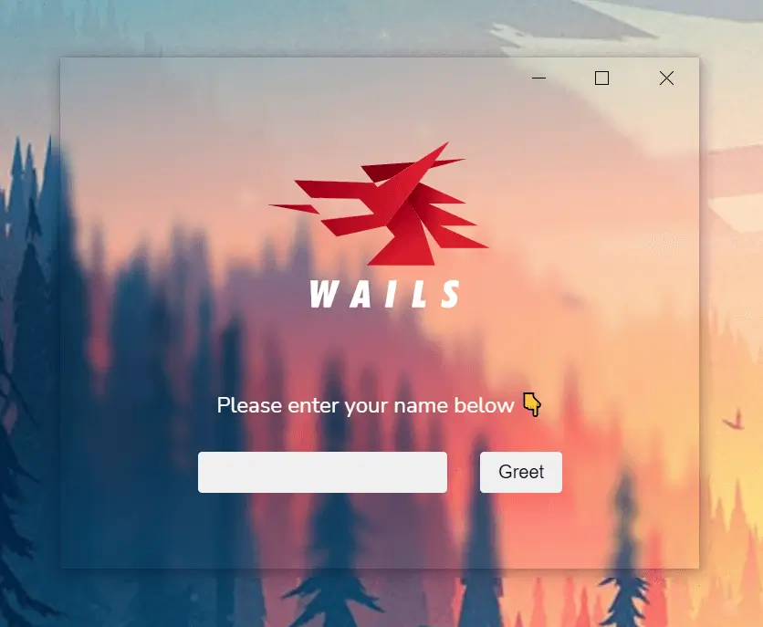
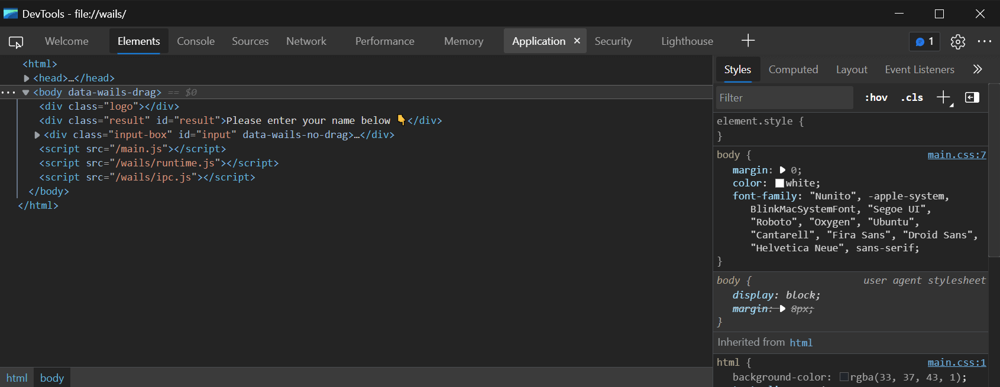
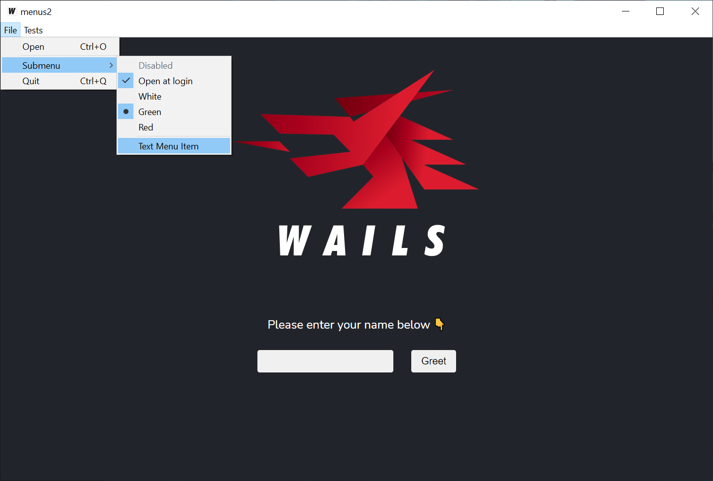
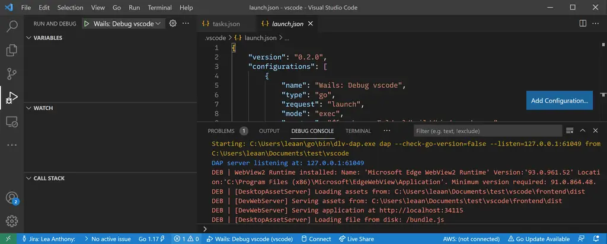
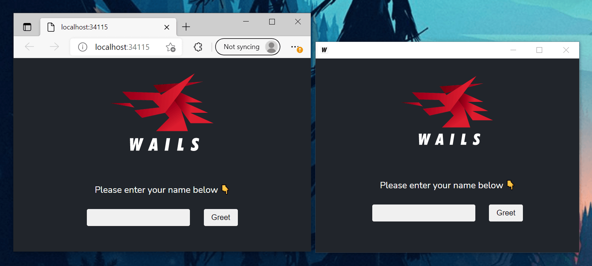
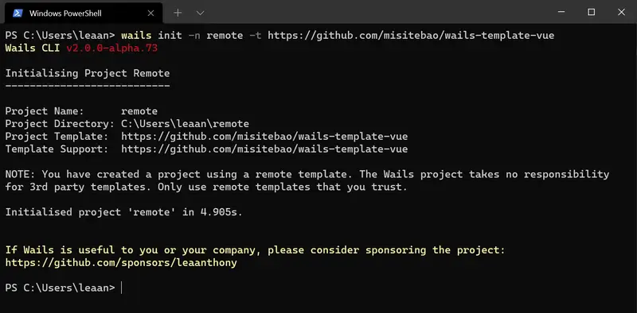

Ketika saya pertama kali mengumumkan Wails di Reddit, sedikit lebih dari 2 tahun lalu dari kereta di
Sydney, saya tidak menyangka proyek ini akan mendapat perhatian sebesar itu. Beberapa hari kemudian, seorang
vlogger teknologi yang produktif merilis video tutorial, memberikan ulasan positif dan sejak
saat itu, minat terhadap proyek ini meroket.

Jelas bahwa orang-orang antusias menambahkan frontend web ke proyek Go
mereka, dan hampir segera mendorong proyek melampaui proof of concept
yang telah saya buat. Saat itu, Wails menggunakan proyek
[webview](https://github.com/webview/webview) untuk menangani frontend,
dan satu-satunya opsi untuk Windows adalah renderer IE11. Banyak laporan bug
berakar pada keterbatasan ini: dukungan JavaScript/CSS yang buruk dan tidak ada dev tools untuk
mendebugnya. Ini adalah pengalaman pengembangan yang frustrasi, tetapi tidak banyak yang
dapat dilakukan untuk memperbaikinya.

Cukup lama, saya yakin bahwa Microsoft pada akhirnya harus
menyelesaikan situasi browser mereka. Dunia terus bergerak, pengembangan frontend
sedang booming dan IE tidak memadai. Ketika Microsoft mengumumkan langkah untuk menggunakan
Chromium sebagai dasar arah browser baru mereka, saya tahu hanya
soal waktu hingga Wails dapat menggunakannya, dan membawa pengalaman pengembang Windows
ke level berikutnya.

Hari ini, saya dengan senang hati mengumumkan: **Wails v2 Beta untuk Windows**! Ada banyak
hal yang perlu dibahas dalam rilis ini, jadi ambil minuman, duduk dan kita
mulai...

### Tanpa Ketergantungan CGO!

Tidak, saya tidak bercanda: _Tanpa_ _ketergantungan_ _CGO_ 🤯! Masalahnya dengan Windows adalah
berbeda dengan MacOS dan Linux, Windows tidak dilengkapi compiler bawaan. Selain itu,
CGO memerlukan compiler mingw dan ada banyak pilihan instalasi
yang berbeda. Menghapus persyaratan CGO telah sangat menyederhanakan setup, serta
membuat debugging jauh lebih mudah. Meskipun saya telah mengerahkan upaya cukup besar
untuk mewujudkannya, sebagian besar kredit harus diberikan kepada
[John Chadwick](https://github.com/jchv) yang tidak hanya memulai beberapa
proyek untuk membuat ini mungkin, tetapi juga terbuka terhadap seseorang mengambil proyek-proyek
tersebut dan membangun di atasnya. Kredit juga untuk
[Tad Vizbaras](https://github.com/tadvi) yang proyek
[winc](https://github.com/tadvi/winc)-nya memulai perjalanan saya menuju
Wails murni Go.

### Renderer Chromium WebView2

Akhirnya, pengembang Windows mendapatkan mesin rendering kelas satu untuk
aplikasi mereka! Masa-masa memaksakan kode frontend agar berfungsi di
Windows sudah berlalu. Di atas itu, Anda mendapatkan pengalaman developer tools kelas satu!

Komponen WebView2 memang memiliki persyaratan agar
`WebView2Loader.dll` berada di samping binary. Ini membuat distribusi sedikit
lebih rumit dari yang biasa kita gophers lakukan. Semua solusi dan
library (yang saya ketahui) yang menggunakan WebView2 memiliki ketergantungan ini.

Namun, saya sangat antusias mengumumkan bahwa aplikasi Wails _tidak memiliki
persyaratan semacam itu_! Berkat keahlian
[John Chadwick](https://github.com/jchv), kami dapat membundel dll ini di dalam
binary dan membuat Windows memuatnya seolah-olah ada di disk.

Gophers bersukacita! Impian single binary tetap hidup!

### Fitur Baru

Ada banyak permintaan untuk dukungan menu native. Wails akhirnya
mengcover kebutuhan Anda. Menu aplikasi sekarang tersedia dan mencakup dukungan untuk sebagian besar fitur menu
native. Ini termasuk item menu standar, checkbox, radio group,
submenu, dan separator.

Ada sejumlah besar permintaan di v1 untuk kemampuan memiliki kontrol
lebih besar terhadap window itu sendiri. Saya dengan senang hati mengumumkan bahwa ada API runtime
baru khusus untuk ini. Fitur-rich dan mendukung konfigurasi multi-monitor.
Ada juga API dialog yang ditingkatkan: Sekarang, Anda dapat memiliki dialog
native modern dengan konfigurasi kaya untuk memenuhi semua kebutuhan dialog Anda.

Sekarang ada opsi untuk menghasilkan konfigurasi IDE bersama proyek Anda.
Ini berarti jika Anda membuka proyek di IDE yang didukung, proyek sudah
dikonfigurasi untuk build dan debug aplikasi Anda. Saat ini VSCode
didukung tetapi kami berharap segera mendukung IDE lain seperti Goland.

### Tidak perlu membundel aset

Pain point besar v1 adalah kebutuhan untuk meringkas seluruh aplikasi menjadi
file JS & CSS tunggal. Saya dengan senang hati mengumumkan bahwa untuk v2, tidak ada
persyaratan untuk membundel aset, dalam bentuk apapun. Ingin memuat gambar
lokal? Gunakan tag `` dengan path src lokal. Ingin menggunakan font keren? Salin
dan tambahkan path-nya di CSS Anda.

> Wow, itu terdengar seperti webserver...

Ya, berfungsi seperti webserver, kecuali memang bukan webserver.

> Jadi bagaimana cara memasukkan aset saya?

Anda cukup meneruskan satu `embed.FS` yang berisi semua aset ke
konfigurasi aplikasi Anda. Mereka bahkan tidak perlu berada di direktori teratas -
Wails akan menanganinya untuk Anda.

### Pengalaman Pengembangan Baru

Sekarang aset tidak perlu dibundel, ini memungkinkan pengalaman pengembangan
baru sepenuhnya. Perintah `wails dev` yang baru akan build dan menjalankan aplikasi Anda, tetapi
alih-alih menggunakan aset di `embed.FS`, aset dimuat langsung dari disk.

Perintah ini juga menyediakan fitur tambahan:

- Hot reload - Perubahan apapun pada aset frontend akan memicu dan auto reload
  frontend aplikasi
- Auto rebuild - Perubahan apapun pada kode Go Anda akan rebuild dan meluncurkan ulang
  aplikasi Anda

Selain itu, webserver akan dimulai di port 34115. Ini akan melayani
aplikasi Anda ke browser apapun yang terhubung. Semua web browser yang terhubung akan
merespons event sistem seperti hot reload saat aset berubah.

Di Go, kita terbiasa menangani struct dalam aplikasi kita. Seringkali
berguna mengirim struct ke frontend kita dan menggunakannya sebagai state dalam aplikasi.
Di v1, ini adalah proses yang sangat manual dan sedikit membebani developer.
Saya dengan senang hati mengumumkan bahwa di v2, aplikasi apapun yang dijalankan dalam mode dev akan
secara otomatis menghasilkan model TypeScript untuk semua struct yang menjadi parameter input atau
output dari bound method. Ini memungkinkan pertukaran model data yang mulus
antara kedua dunia.

Selain itu, modul JS lain dihasilkan secara dinamis yang membungkus semua
bound method Anda. Ini menyediakan JSDoc untuk method Anda, memberikan code
completion dan hinting di IDE Anda. Sangat keren ketika Anda mendapatkan model data
auto-imported saat menekan tab di modul auto-generated yang membungkus kode Go
Anda!

### Remote Templates

Membuat aplikasi up and running dengan cepat selalu menjadi tujuan utama proyek
Wails. Ketika kami meluncurkan, kami mencoba mencakup banyak framework modern
saat itu: react, vue dan angular. Dunia pengembangan frontend
sangat opinionated, bergerak cepat dan sulit diikuti! Akibatnya,
kami menemukan template dasar kami menjadi outdated cukup cepat dan ini
menyebabkan headache maintenance. Ini juga berarti kami tidak memiliki template modern keren
untuk tech stack terbaru dan terhebat.

Dengan v2, saya ingin memberdayakan komunitas dengan memberi Anda kemampuan untuk membuat
dan hosting template sendiri, alih-alih bergantung pada proyek Wails. Jadi sekarang Anda
dapat membuat proyek menggunakan template yang didukung komunitas! Saya harap ini akan
menginspirasi developer untuk membuat ekosistem template proyek yang vibrant. Saya
benar-benar antusias dengan apa yang dapat diciptakan komunitas developer kami!

### Kesimpulan

Wails v2 mewakili fondasi baru untuk proyek ini. Tujuan rilis ini adalah
mendapatkan feedback tentang pendekatan baru, dan menghilangkan bug apapun sebelum rilis
penuh. Input Anda sangat welcome. Silakan arahkan feedback apapun ke
discussion board [v2 Beta](https://github.com/wailsapp/wails/discussions/828).

Ada banyak liku-liku, pivot dan u-turn untuk sampai ke titik ini. Ini
sebagian disebabkan oleh keputusan teknis awal yang perlu diubah, dan sebagian
karena beberapa masalah inti yang kami habiskan waktu membangun workaround-nya diperbaiki
di upstream: fitur embed Go adalah contoh yang baik. Untungnya, semuanya bersatu
pada waktu yang tepat, dan hari ini kami memiliki solusi terbaik yang dapat
kami miliki. Saya percaya menunggunya sepadan - ini tidak mungkin
terjadi bahkan 2 bulan yang lalu.

Saya juga perlu memberikan terima kasih yang besar :pray: kepada orang-orang berikut karena
tanpa mereka, rilis ini tidak akan ada:

- [Misite Bao](https://github.com/misitebao) - Workhorse absolut pada
  terjemahan Chinese dan bug finder yang luar biasa.
- [John Chadwick](https://github.com/jchv) - Pekerjaan luar biasa pada
  [go-webview2](https://github.com/jchv/go-webview2) dan
  [go-winloader](https://github.com/jchv/go-winloader) yang membuat versi Windows
  yang kami miliki hari ini mungkin.
- [Tad Vizbaras](https://github.com/tadvi) - Eksperimen dengan proyek
  [winc](https://github.com/tadvi/winc)-nya adalah langkah pertama menuju
  Wails murni Go.
- [Mat Ryer](https://github.com/matryer) - Dukungan, dorongan dan
  feedback-nya benar-benar membantu mendorong proyek maju.

Dan akhirnya, saya ingin memberikan terima kasih khusus kepada semua
[sponsor proyek](/id/credits#sponsors), termasuk
[JetBrains](https://www.jetbrains.com?from=Wails), yang dukungannya mendorong
proyek dalam banyak hal di balik layar.

Saya menantikan melihat apa yang dibangun orang dengan Wails dalam fase
proyek yang menarik ini!

Lea.

PS: Pengguna MacOS dan Linux tidak perlu merasa ketinggalan - porting ke fondasi
baru ini sedang aktif berlangsung dan sebagian besar pekerjaan berat sudah
selesai. Sabar ya!

PPS: Jika Anda atau perusahaan Anda merasa Wails berguna, pertimbangkan
[menyponsori proyek ini](https://github.com/sponsors/leaanthony). Terima kasih!
