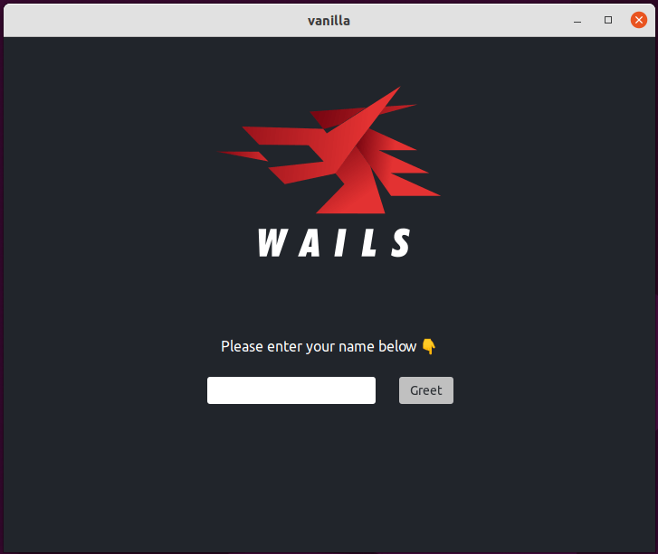
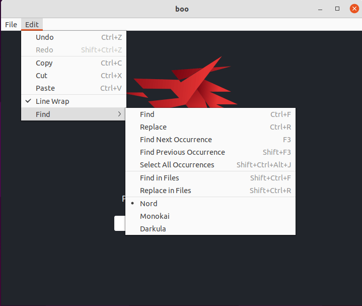
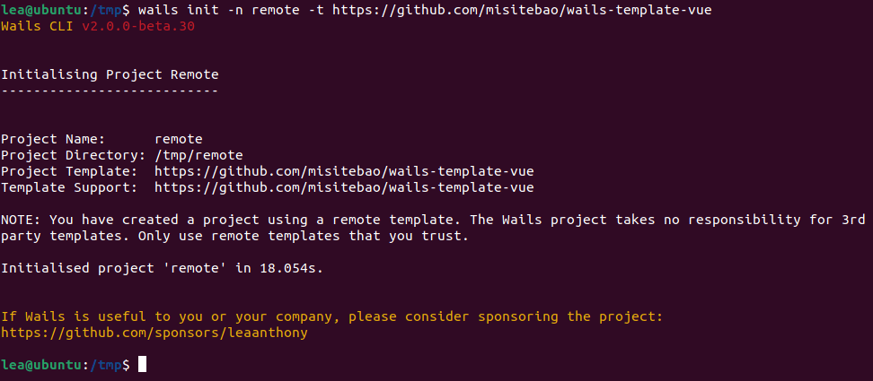
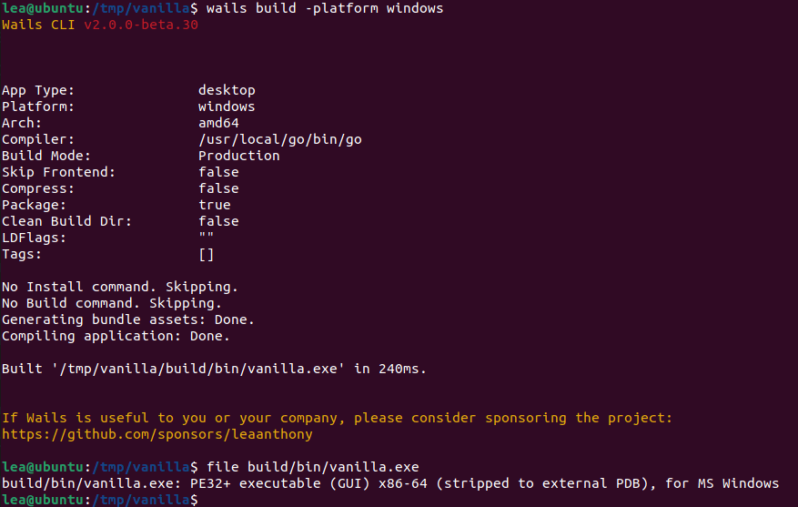

Saya dengan senang hati mengumumkan bahwa Wails v2 sekarang dalam beta untuk Linux! Agak
ironis bahwa eksperimen pertama dengan v2 dilakukan di Linux namun
berakhir sebagai rilis terakhir. Meskipun demikian, v2 yang kami miliki hari ini sangat
berbeda dari eksperimen pertama tersebut. Jadi tanpa basa-basi lagi, mari kita bahas
fitur-fitur barunya:

### Fitur Baru

Ada banyak permintaan untuk dukungan menu native. Wails akhirnya
mengcover kebutuhan Anda. Menu aplikasi sekarang tersedia dan mencakup dukungan untuk sebagian besar fitur menu
native. Ini termasuk item menu standar, checkbox, radio group,
submenu, dan separator.

Ada sejumlah besar permintaan di v1 untuk kemampuan memiliki kontrol
lebih besar terhadap window itu sendiri. Saya dengan senang hati mengumumkan bahwa ada API runtime
baru khusus untuk ini. Fitur-rich dan mendukung konfigurasi multi-monitor.
Ada juga API dialog yang ditingkatkan: Sekarang, Anda dapat memiliki dialog
native modern dengan konfigurasi kaya untuk memenuhi semua kebutuhan dialog Anda.

### Tidak perlu membundel aset

Pain point besar v1 adalah kebutuhan untuk meringkas seluruh aplikasi menjadi
file JS & CSS tunggal. Saya dengan senang hati mengumumkan bahwa untuk v2, tidak ada
persyaratan untuk membundel aset, dalam bentuk apapun. Ingin memuat gambar
lokal? Gunakan tag `` dengan path src lokal. Ingin menggunakan font keren? Salin
dan tambahkan path-nya di CSS Anda.

> Wow, itu terdengar seperti webserver...

Ya, berfungsi seperti webserver, kecuali memang bukan webserver.

> Jadi bagaimana cara memasukkan aset saya?

Anda cukup meneruskan satu `embed.FS` yang berisi semua aset ke
konfigurasi aplikasi Anda. Mereka bahkan tidak perlu berada di direktori teratas -
Wails akan menanganinya untuk Anda.

### Pengalaman Pengembangan Baru

Sekarang aset tidak perlu dibundel, ini memungkinkan pengalaman pengembangan
baru sepenuhnya. Perintah `wails dev` yang baru akan build dan menjalankan aplikasi Anda, tetapi
alih-alih menggunakan aset di `embed.FS`, aset dimuat langsung dari disk.

Perintah ini juga menyediakan fitur tambahan:

- Hot reload - Perubahan apapun pada aset frontend akan memicu auto reload
  frontend aplikasi
- Auto rebuild - Perubahan apapun pada kode Go Anda akan rebuild dan melancurkan ulang
  aplikasi Anda

Selain itu, webserver akan dimulai di port 34115. Ini akan melayani
aplikasi Anda ke browser apapun yang terhubung. Semua web browser yang terhubung akan
merespons event sistem seperti hot reload saat aset berubah.

Di Go, kita terbiasa menangani struct dalam aplikasi kita. Seringkali
berguna mengirim struct ke frontend kita dan menggunakannya sebagai state dalam aplikasi.
Di v1, ini adalah proses yang sangat manual dan sedikit membebani developer.
Saya dengan senang hati mengumumkan bahwa di v2, aplikasi apapun yang dijalankan dalam mode dev akan
secara otomatis menghasilkan model TypeScript untuk semua struct yang menjadi parameter input atau
output dari bound method. Ini memungkinkan pertukaran model data yang mulus
antara kedua dunia.

Selain itu, modul JS lain dihasilkan secara dinamis yang membungkus semua
bound method Anda. Ini menyediakan JSDoc untuk method Anda, memberikan code
completion dan hinting di IDE Anda. Sangat keren ketika Anda mendapatkan model data
auto-imported saat menekan tab di modul auto-generated yang membungkus kode Go
Anda!

### Remote Templates

Membuat aplikasi up and running dengan cepat selalu menjadi tujuan utama proyek
Wails. Ketika kami meluncurkan, kami mencoba mencakup banyak framework modern
saat itu: react, vue dan angular. Dunia pengembangan frontend
sangat opinionated, bergerak cepat dan sulit diikuti! Akibatnya,
kami menemukan template dasar kami menjadi outdated cukup cepat dan ini
menyebabkan headache maintenance. Ini juga berarti kami tidak memiliki template modern keren
untuk tech stack terbaru dan terhebat.

Dengan v2, saya ingin memberdayakan komunitas dengan memberi Anda kemampuan untuk membuat
dan hosting template sendiri, alih-alih bergantung pada proyek Wails. Jadi sekarang Anda
dapat membuat proyek menggunakan template yang didukung komunitas! Saya harap ini akan
menginspirasi developer untuk membuat ekosistem template proyek yang vibrant. Saya
benar-benar antusias dengan apa yang dapat diciptakan komunitas developer kami!

### Cross Compilation ke Windows

Karena Wails v2 untuk Windows murni Go, Anda dapat menargetkan build Windows tanpa
docker.

### Kesimpulan

Seperti yang saya katakan di catatan rilis Windows, Wails v2 mewakili fondasi baru
untuk proyek ini. Tujuan rilis ini adalah mendapatkan feedback tentang pendekatan baru,
dan menghilangkan bug apapun sebelum rilis penuh. Input Anda sangat
welcome! Silakan arahkan feedback apapun ke
discussion board [v2 Beta](https://github.com/wailsapp/wails/discussions/828).

Linux **sulit** untuk didukung. Kami mengharapkan ada sejumlah quirks dengan
beta. Tolong bantu kami membantu Anda dengan mengajukan laporan bug yang detail!

Akhirnya, saya ingin memberikan terima kasih khusus kepada semua
[sponsor proyek](/id/credits#sponsors) yang dukungannya mendorong proyek dalam banyak
cara di balik layar.

Saya menantikan melihat apa yang dibangun orang dengan Wails dalam fase
proyek yang menarik ini!

Lea.

PS: Rilis v2 tidak jauh lagi!

PPS: Jika Anda atau perusahaan Anda merasa Wails berguna, pertimbangkan
[menyponsori proyek ini](https://github.com/sponsors/leaanthony). Terima kasih!
