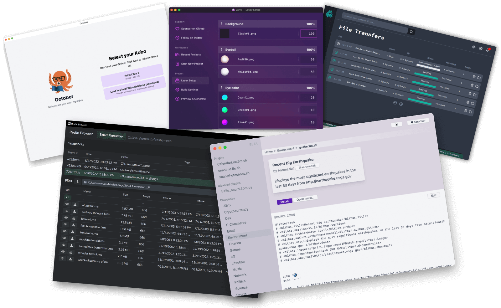

# Sudah tiba!

Hari ini menandai rilis [Wails](https://wails.io) v2. Sudah sekitar 18
bulan sejak alpha v2 pertama dan sekitar setahun sejak rilis beta pertama.
Saya benar-benar berterima kasih kepada semua yang terlibat dalam evolusi proyek ini.

Salah satu alasan prosesnya memakan waktu lama adalah karena ingin mencapai
definisi kelengkapan tertentu sebelum resmi menyebutnya v2. Kenyataannya,
tidak pernah ada waktu yang sempurna untuk menandai rilis - selalu ada masalah
yang belum terselesaikan atau "satu fitur lagi" yang ingin dimasukkan. Namun, menandai rilis major yang tidak sempurna
memberikan sedikit stabilitas bagi pengguna
proyek, serta reset bagi developer.

Rilis ini lebih dari yang pernah saya harapkan. Saya harap rilis ini memberi Anda
kesenangan sebanyak yang kami rasakan saat mengembangkannya.

# Apa _itu_ Wails?

Jika Anda belum familiar dengan Wails, ini adalah proyek yang memungkinkan programmer Go
menyediakan frontend kaya untuk program Go mereka menggunakan teknologi web yang familiar.
Ini adalah alternatif Go yang ringan untuk Electron. Informasi lebih lanjut dapat
ditemukan di [situs resmi](https://wails.io/docs/introduction).

# Apa yang baru?

Rilis v2 adalah lompatan besar untuk proyek ini, mengatasi banyak
pain point v1. Jika Anda belum membaca posting blog tentang rilis Beta
untuk [macOS](/id/blog/wails-v2-beta-for-mac),
[Windows](/id/blog/wails-v2-beta-for-windows) atau
[Linux](/id/blog/wails-v2-beta-for-linux), saya mendorong Anda untuk melakukannya karena
mencakup semua perubahan major secara lebih detail. Ringkasannya:

- Komponen Webview2 untuk Windows yang mendukung standar web modern dan
  kemampuan debugging.
- [Tema Gelap / Terang](https://wails.io/docs/reference/options#theme) +
  [custom theming](https://wails.io/docs/reference/options#customtheme) di Windows.
- Windows sekarang tidak memiliki persyaratan CGO.
- Dukungan out-of-the-box untuk template proyek Svelte, Vue, React, Preact, Lit & Vanilla.
- Integrasi [Vite](https://vitejs.dev/) menyediakan lingkungan pengembangan hot-reload
  untuk aplikasi Anda.
- [Menu](https://wails.io/docs/guides/application-development#application-menu) dan
  [dialog](https://wails.io/docs/reference/runtime/dialog) aplikasi native.
- Efek transparansi window native untuk
  [Windows](https://wails.io/docs/reference/options#windowistranslucent) dan
  [macOS](https://wails.io/docs/reference/options#windowistranslucent-1). Dukungan untuk backdrop Mica &
  Acrylic.
- Mudah menghasilkan [installer NSIS](https://wails.io/docs/guides/windows-installer) untuk
  deployment Windows.
- [Runtime library](https://wails.io/docs/reference/runtime/intro) yang kaya menyediakan utility
  method untuk manipulasi window, eventing, dialog, menu dan logging.
- Dukungan untuk [obfuscating](https://wails.io/docs/guides/obfuscated) aplikasi Anda menggunakan
  [garble](https://github.com/burrowers/garble).
- Dukungan untuk mengompresi aplikasi Anda menggunakan [UPX](https://upx.github.io/).
- Generasi TypeScript otomatis dari struct Go. Info lebih lanjut
  [di sini](https://wails.io/docs/howdoesitwork#calling-bound-go-methods).
- Tidak ada library atau DLL ekstra yang perlu dikirim dengan aplikasi Anda.
  Untuk platform apapun.
- Tidak perlu membundel aset frontend. Cukup kembangkan aplikasi Anda seperti
  aplikasi web lainnya.

# Kredit & Terima Kasih

Mencapai v2 membutuhkan upaya yang sangat besar. Ada ~2.2K commit oleh 89
kontributor antara alpha awal dan rilis hari ini, dan banyak
lagi yang telah menyediakan terjemahan, testing, feedback dan bantuan di
forum diskusi serta issue tracker. Saya sangat berterima kasih kepada
setiap orang. Saya juga ingin memberikan terima kasih ekstra khusus kepada semua
sponsor proyek yang telah memberikan bimbingan, saran dan feedback. Semua yang
Anda lakukan sangat dihargai.

Ada beberapa orang yang ingin saya sebutkan secara khusus:

Pertama, terima kasih **besar** kepada [@stffabi](https://github.com/stffabi) yang telah
memberikan begitu banyak kontribusi yang kita semua manfaatkan, serta memberikan
banyak dukungan pada banyak issue. Ia telah memberikan beberapa fitur kunci seperti
dukungan external dev server yang mentransformasi penawaran dev mode kami dengan memungkinkan
kami terhubung ke superpowers [Vite](https://vitejs.dev/). Adil untuk dikatakan bahwa
Wails v2 akan jauh kurang menarik tanpa
[kontribusi luar biasa](https://github.com/wailsapp/wails/commits?author=stffabi&since=2020-01-04)-nya.
Terima kasih banyak @stffabi!

Saya juga ingin memberikan shout-out besar kepada
[@misitebao](https://github.com/misitebao) yang tanpa lelah memelihara
website, serta menyediakan terjemahan Chinese, mengelola Crowdin dan
membantu translator baru up to speed. Ini adalah tugas yang sangat penting, dan
saya sangat berterima kasih atas semua waktu dan upaya yang dicurahkan! Anda hebat!

Terakhir, tapi tidak kalah penting, terima kasih besar kepada Mat Ryer yang telah memberikan saran dan
dukungan selama pengembangan v2. Menulis xBar bersama menggunakan Alpha awal
v2 sangat membantu membentuk arah v2, serta memberi saya
pemahaman tentang beberapa kelemahan desain di rilis awal. Saya dengan senang hati mengumumkan
bahwa mulai hari ini, kami akan mulai mem-port xBar ke Wails v2, dan xBar akan menjadi
aplikasi flagship untuk proyek ini. Cheers Mat!

# Pelajaran yang Dipetik

Ada sejumlah pelajaran yang dipetik dalam perjalanan menuju v2 yang akan membentuk
pengembangan ke depan.

## Rilis Lebih Kecil, Lebih Cepat, dan Fokus

Dalam pengembangan v2, ada banyak fitur dan perbaikan bug yang
dikembangkan secara ad-hoc. Ini menyebabkan siklus rilis lebih lama dan lebih sulit
didebug. Ke depan, kami akan membuat rilis lebih sering yang akan
mencakup jumlah fitur yang lebih sedikit. Rilis akan melibatkan pembaruan
dokumentasi serta testing menyeluruh. Semoga rilis yang lebih kecil, lebih cepat,
dan fokus ini akan menghasilkan lebih sedikit regresi dan dokumentasi
berkualitas lebih baik.

## Mendorong Keterlibatan

Ketika memulai proyek ini, saya ingin segera membantu semua orang yang memiliki
masalah. Issue terasa "personal" dan saya ingin masalah diselesaikan secepat
mungkin. Ini tidak sustainable dan pada akhirnya bekerja melawan longevity
proyek. Ke depan, saya akan memberikan lebih banyak ruang bagi orang untuk
terlibat dalam menjawab pertanyaan dan triaging issue. Akan bagus jika mendapat
beberapa tooling untuk membantu hal ini jadi jika Anda punya saran, silakan bergabung dalam
diskusi [di sini](https://github.com/wailsapp/wails/discussions/1855).

## Belajar Mengatakan Tidak

Semakin banyak orang yang terlibat dengan proyek Open Source, semakin banyak permintaan
untuk fitur tambahan yang mungkin atau mungkin tidak berguna bagi mayoritas
orang. Fitur-fitur ini akan membutuhkan waktu awal untuk dikembangkan dan didebug,
dan menimbulkan biaya maintenance berkelanjutan sejak saat itu. Saya sendiri yang paling
bersalah, sering ingin "memasak lautan" alih-alih menyediakan fitur
minimum viable. Ke depan, kami perlu lebih sering mengatakan "Tidak" untuk menambahkan
fitur inti dan fokus energi kami pada cara memberdayakan developer untuk menyediakan
fungsionalitas itu sendiri. Kami serius melihat plugin untuk
skenario ini. Ini akan memungkinkan siapapun memperluas proyek sesuai keinginan, serta
menyediakan cara mudah untuk berkontribusi pada proyek.

# Melihat ke Masa Depan

Ada begitu banyak fitur inti yang kami lihat untuk ditambahkan ke Wails dalam
siklus pengembangan major berikutnya. [Roadmap](https://github.com/wailsapp/wails/discussions/1484)
penuh dengan ide menarik, dan saya ingin segera mulai mengerjakannya. Salah satu permintaan besar
adalah dukungan multiple window. Ini tricky dan untuk melakukannya dengan benar,
kami mungkin perlu melihat menyediakan API alternatif, karena API saat ini tidak
dirancang dengan ini dalam pikiran. Berdasarkan beberapa ide awal dan feedback, saya
pikir Anda akan suka arah yang kami tuju.

Saya pribadi sangat antusias dengan prospek menjalankan aplikasi Wails di
mobile. Kami sudah memiliki proyek demo yang menunjukkan bahwa memungkinkan menjalankan
aplikasi Wails di Android, jadi saya sangat ingin mengeksplorasi kemana kami bisa pergi dengan ini!

Poin terakhir yang ingin saya angkat adalah feature parity. Sudah lama menjadi
prinsip inti bahwa kami tidak akan menambahkan apapun ke proyek tanpa ada
dukungan cross-platform penuh. Meskipun ini terbukti (sebagian besar)
tercapai sejauh ini, ini benar-benar menahan proyek dalam merilis fitur
baru. Ke depan, kami akan mengadopsi pendekatan sedikit berbeda: fitur
baru apapun yang tidak dapat segera dirilis untuk semua platform akan
dirilis di bawah konfigurasi atau API eksperimental. Ini memungkinkan early adopter
di platform tertentu mencoba fitur dan memberikan feedback yang akan masuk ke
desain final fitur. Ini, tentu saja, berarti tidak ada
jaminan stabilitas API hingga sepenuhnya didukung oleh semua platform yang dapat
didukung, tetapi setidaknya ini akan membuka blokade pengembangan.

# Kata Penutup

Saya benar-benar bangga dengan apa yang telah kami capai dengan rilis V2. Luar biasa
melihat apa yang sudah dapat dibangun orang menggunakan rilis beta
sejauh ini. Aplikasi berkualitas seperti [Varly](https://varly.app/),
[Surge](https://getsurge.io/) dan [October](https://october.utf9k.net/). Saya
mendorong Anda untuk melihatnya.

Rilis ini dicapai melalui kerja keras banyak kontributor. Meskipun
gratis untuk diunduh dan digunakan, rilis ini tidak terjadi tanpa biaya. Jangan
salah paham, proyek ini datang dengan biaya yang considerable. Ini bukan hanya
waktu saya dan waktu setiap kontributor, tetapi juga biaya absensi
dari teman dan keluarga masing-masing orang juga. Itulah mengapa saya sangat
berterima kasih untuk setiap detik yang didedikasikan untuk mewujudkan proyek ini.
Semakin banyak kontributor yang kita miliki, semakin upaya ini dapat
disebar dan semakin banyak yang dapat kita capai bersama. Saya ingin mendorong Anda semua untuk memilih satu hal
yang dapat Anda kontribusikan, apakah mengonfirmasi bug seseorang, menyarankan
perbaikan, membuat perubahan dokumentasi atau membantu seseorang yang membutuhkannya. Semua
hal kecil ini memiliki dampak yang sangat besar! Akan sangat keren jika Anda juga
menjadi bagian dari cerita dalam perjalanan menuju v3.

Selamat menikmati!

&dash; Lea

PS: Jika Anda atau perusahaan Anda merasa Wails berguna, pertimbangkan
[menyponsori proyek ini](https://github.com/sponsors/leaanthony). Terima kasih!
