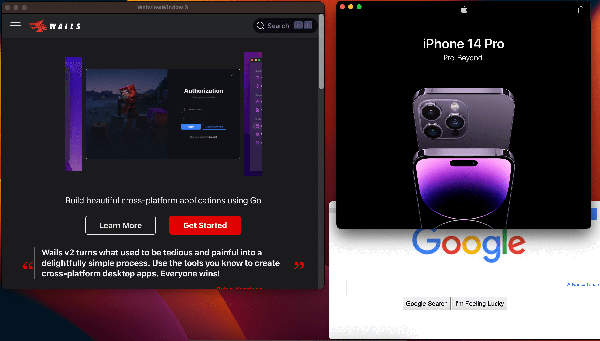

# Pendahuluan

Wails adalah proyek yang menyederhanakan kemampuan menulis aplikasi desktop cross-platform
menggunakan Go. Proyek ini menggunakan komponen webview native untuk frontend (bukan
embedded browser), membawa kekuatan sistem UI paling populer di dunia ke
Go, sambil tetap ringan.

Versi 2 dirilis pada 22 September 2022 dan membawa banyak
peningkatan termasuk:

- Live development, memanfaatkan proyek Vite yang populer
- Fungsionalitas kaya untuk mengelola window dan membuat menu
- Komponen WebView2 Microsoft
- Generasi model Typescript yang mirror struct Go Anda
- Pembuatan NSIS Installer
- Build terobfuscasi

Saat ini, Wails v2 menyediakan tooling yang powerful untuk membuat aplikasi desktop
cross-platform yang kaya.

Posting blog ini bertujuan melihat posisi proyek saat ini dan apa yang dapat
kita perbaiki ke depan.

# Di mana kita sekarang?

Luar biasa melihat popularitas Wails meningkat sejak rilis v2.
Saya terus kagum dengan kreativitas komunitas dan hal-hal
wonderful yang dibangun dengannya. Dengan popularitas lebih, datang lebih banyak mata pada
proyek. Dan dengan itu, lebih banyak permintaan fitur dan laporan bug.

Seiring waktu, saya dapat mengidentifikasi beberapa masalah paling mendesak yang dihadapi
proyek. Saya juga dapat mengidentifikasi beberapa hal yang menahan
proyek.

## Masalah saat ini

Saya telah mengidentifikasi area berikut yang menurut saya menahan proyek:

- API
- Generasi bindings
- Build System

### API

API untuk membangun aplikasi Wails saat ini terdiri dari 2 bagian:

- Application API
- Runtime API

Application API terkenal hanya memiliki 1 fungsi: `Run()` yang menerima banyak
opsi yang mengatur cara aplikasi bekerja. Meskipun ini sangat sederhana
digunakan, ini juga sangat membatasi. Ini adalah pendekatan "declarative" yang menyembunyikan
banyak kompleksitas underlying. Misalnya, tidak ada handle ke main
window, jadi Anda tidak dapat berinteraksi langsung dengannya. Untuk itu, Anda perlu menggunakan
Runtime API. Ini menjadi masalah ketika Anda mulai ingin melakukan hal lebih kompleks
seperti membuat multiple window.

Runtime API menyediakan banyak fungsi utility untuk developer. Ini
mencakup:

- Manajemen window
- Dialog
- Menu
- Event
- Log

Ada beberapa hal yang tidak saya sukai dengan Runtime API. Pertama adalah
bahwa API ini memerlukan "context" untuk dilewatkan. Ini frustrasi dan
membingungkan developer baru yang melewatkan context dan kemudian mendapat runtime error.

Masalah terbesar dengan Runtime API adalah API ini dirancang untuk aplikasi
yang hanya menggunakan single window. Seiring waktu, permintaan untuk multiple window
terus tumbuh dan API tidak cocok untuk ini.

### Pemikiran tentang API v3

Bukankah bagus jika kita bisa melakukan sesuatu seperti ini?

```go
func main() {
    app := wails.NewApplication(options.App{})
    myWindow := app.NewWindow(options.Window{})
    myWindow.SetTitle("My Window")
    myWindow.On(events.Window.Close, func() {
        app.Quit()
    })
    app.Run()
}
```

Pendekatan programmatic ini jauh lebih intuitif dan memungkinkan developer
berinteraksi langsung dengan elemen aplikasi. Semua method runtime saat ini untuk
window akan menjadi method pada objek window. Untuk method runtime
lainnya, kita bisa memindahkannya ke objek aplikasi seperti ini:

```go
app := wails.NewApplication(options.App{})
app.NewInfoDialog(options.InfoDialog{})
app.Log.Info("Hello World")
```

Ini adalah API yang jauh lebih powerful yang akan memungkinkan aplikasi lebih kompleks
dibangun. Ini juga memungkinkan pembuatan multiple window,
[fitur paling up-voted di GitHub](https://github.com/wailsapp/wails/issues/1480):

```go
func main() {
    app := wails.NewApplication(options.App{})
    myWindow := app.NewWindow(options.Window{})
    myWindow.SetTitle("My Window")
    myWindow.On(events.Window.Close, func() {
        app.Quit()
    })
    myWindow2 := app.NewWindow(options.Window{})
    myWindow2.SetTitle("My Window 2")
    myWindow2.On(events.Window.Close, func() {
        app.Quit()
    })
    app.Run()
}
```

### Generasi bindings

Salah satu fitur kunci Wails adalah menghasilkan bindings untuk method Go Anda sehingga
dapat dipanggil dari Javascript. Method saat ini untuk melakukan ini agak
hack. Ini melibatkan build aplikasi dengan flag khusus dan kemudian
menjalankan binary hasil yang menggunakan reflection untuk menentukan apa yang telah
di-bind. Ini menyebabkan situasi chicken and egg: Anda tidak dapat build
aplikasi tanpa bindings dan Anda tidak dapat generate bindings tanpa
build aplikasi. Ada banyak cara mengatasi ini tetapi yang terbaik adalah
tidak menggunakan pendekatan ini sama sekali.

Ada sejumlah upaya menulis static analyser untuk proyek Wails
tetapi tidak berjalan jauh. Dalam waktu lebih baru, menjadi sedikit
lebih mudah melakukan ini dengan lebih banyak materi tersedia tentang subjek.

Dibandingkan reflection, pendekatan AST jauh lebih cepat namun
signifikan lebih rumit. Untuk memulai, kita mungkin perlu menerapkan constraint tertentu
tentang cara menentukan bindings dalam kode. Tujuannya adalah mendukung
use case paling umum dan kemudian memperluasnya nanti.

### Build System

Seperti pendekatan declarative ke API, build system dibuat untuk menyembunyikan
kompleksitas build aplikasi desktop. Ketika Anda menjalankan `wails build`,
banyak hal terjadi di balik layar:

- Build backend binary untuk bindings dan generate bindings
- Install frontend dependencies
- Build aset frontend
- Tentukan apakah icon aplikasi ada dan jika ya, embed
- Build binary final
- Jika build untuk `darwin/universal` build 2 binary, satu untuk
  `darwin/amd64` dan satu untuk `darwin/arm64` lalu buat fat binary menggunakan
  `lipo`
- Jika kompresi diperlukan, kompres binary dengan UPX
- Tentukan apakah binary ini akan di-package dan jika ya:
  - Pastikan icon dan application manifest dikompilasi ke binary
    (Windows)
  - Build application bundle, generate icon bundle dan salin,
    binary dan Info.plist ke application bundle (Mac)
- Jika NSIS installer diperlukan, build

Seluruh proses ini, meskipun sangat powerful, juga sangat opaque. Sangat
sulit untuk mengkustomisasinya dan sangat sulit untuk debug.

Untuk mengatasi ini di v3, saya ingin pindah ke build system yang ada
di luar Wails. Setelah menggunakan [Task](https://taskfile.dev/) untuk sementara, saya
penggemar besar. Ini tool hebat untuk mengkonfigurasi build system dan seharusnya
cukup familiar bagi siapapun yang pernah menggunakan Makefiles.

Build system akan dikonfigurasi menggunakan file `Taskfile.yml` yang akan
dihasilkan secara default dengan template yang didukung. Ini akan memiliki semua
langkah yang diperlukan untuk melakukan semua task saat ini, seperti build atau packaging
aplikasi, memungkinkan kustomisasi mudah.

Tidak akan ada persyaratan eksternal untuk tooling ini karena akan menjadi bagian dari
Wails CLI. Ini berarti Anda masih dapat menggunakan `wails build` dan akan melakukan
semua hal yang dilakukannya hari ini. Namun, jika Anda ingin mengkustomisasi proses build,
Anda dapat melakukannya dengan mengedit file `Taskfile.yml`. Ini juga berarti Anda dapat
mudah memahami langkah build dan menggunakan build system sendiri jika diinginkan.

Bagian yang hilang dalam puzzle build adalah operasi atomik dalam proses build,
seperti generasi icon, kompresi dan packaging. Memerlukan banyak
tooling eksternal bukan pengalaman bagus untuk developer. Untuk
mengatasi ini, Wails CLI akan menyediakan semua kemampuan ini sebagai bagian dari
CLI. Ini berarti build tetap berfungsi seperti yang diharapkan, tanpa tooling eksternal
tambahan, namun Anda dapat mengganti langkah build apapun dengan tool apapun yang Anda suka.

Ini akan menjadi build system yang jauh lebih transparan yang memungkinkan kustomisasi
lebih mudah dan mengatasi banyak masalah yang telah diangkat seputarnya.

## Payoff

Perubahan positif ini akan menjadi manfaat besar untuk proyek:

- API baru akan jauh lebih intuitif dan memungkinkan aplikasi lebih kompleks
  dibangun.
- Menggunakan static analysis untuk generasi bindings akan jauh lebih cepat dan mengurangi
  banyak kompleksitas seputar proses saat ini.
- Menggunakan build system eksternal yang mapan akan membuat proses build
  sepenuhnya transparan, memungkinkan kustomisasi powerful.

Manfaat untuk maintainer proyek:

- API baru akan jauh lebih mudah di-maintain dan diadaptasi ke fitur dan
  platform baru.
- Build system baru akan jauh lebih mudah di-maintain dan diperluas. Saya harap ini
  akan mengarah ke ekosistem baru community driven build pipelines.
- Pemisahan concern yang lebih baik dalam proyek. Ini akan memudahkan
  menambahkan fitur dan platform baru.

## Rencana

Banyak eksperimen untuk ini sudah dilakukan dan terlihat
bagus. Tidak ada timeline saat ini untuk pekerjaan ini tetapi saya berharap pada akhir Q1
2023, akan ada rilis alpha untuk Mac agar komunitas dapat test,
eksperimen dan memberikan feedback.

## Ringkasan

- API v2 bersifat declarative, menyembunyikan banyak hal dari developer dan tidak cocok untuk
  fitur seperti multiple window. API baru akan dibuat yang akan
  lebih sederhana, intuitif dan lebih powerful.
- Build system opaque dan sulit dikustomisasi jadi kami akan pindah ke
  build system eksternal yang akan membuka semuanya.
- Generasi bindings lambat dan kompleks jadi kami akan pindah ke static analysis
  yang akan menghilangkan banyak kompleksitas method saat ini.

Banyak pekerjaan telah dilakukan pada inti v2 dan intinya solid. Sekarang
waktunya mengatasi layer di atasnya dan membuatnya pengalaman jauh lebih baik untuk
developer.

Saya harap Anda seantusias saya. Saya menantikan mendengar
pikiran dan feedback Anda.

Salam,

&dash; Lea

PS: Jika Anda atau perusahaan Anda merasa Wails berguna, pertimbangkan
[menyponsori proyek ini](https://github.com/sponsors/leaanthony). Terima kasih!

PPS: Ya, itu screenshot asli aplikasi multi-window yang dibangun dengan
Wails. Bukan mockup. Nyata. Keren. Segera hadir.
