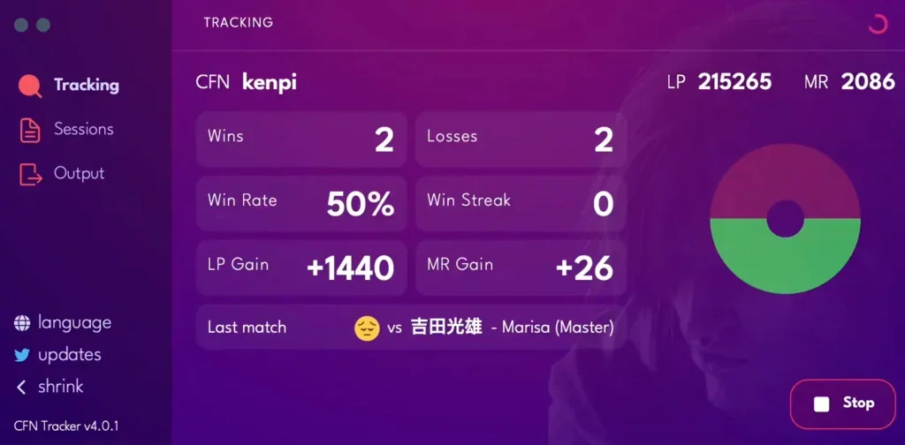

[CFN Tracker](https://github.com/williamsjokvist/cfn-tracker) - Lacak pertandingan live profil CFN Street
Fighter 6 atau V apapun. Kunjungi
[situs web](https://cfn.williamsjokvist.se/) untuk memulai.

## Fitur

- Pelacakan pertandingan real-time
- Menyimpan log pertandingan dan statistik
- Dukungan menampilkan stat live ke OBS via Browser Source
- Dukungan untuk SF6 dan SFV
- Kemampuan pengguna membuat tema OBS Browser sendiri dengan CSS

### Teknologi utama yang digunakan bersama Wails

- [Task](https://github.com/go-task/task) - membungkus Wails CLI agar
  perintah umum mudah digunakan
- [React](https://github.com/facebook/react) - dipilih karena ekosistemnya yang kaya
  (radix, framer-motion)
- [Bun](https://github.com/oven-sh/bun) - digunakan untuk resolusi dependency
  dan build-time yang cepat
- [Rod](https://github.com/go-rod/rod) - otomasi headless browser untuk
  autentikasi dan polling perubahan
- [SQLite](https://github.com/mattn/go-sqlite3) - digunakan untuk menyimpan pertandingan,
  sesi dan profil
- [Server-sent events](https://developer.mozilla.org/en-US/docs/Web/API/Server-sent_events) -
  http stream untuk mengirim pembaruan pelacakan ke OBS browser sources
- [i18next](https://github.com/i18next/) - dengan backend connector untuk melayani
  objek lokalisasi dari layer Go
- [xstate](https://github.com/statelyai/xstate) - state machine untuk proses auth
  dan pelacakan
