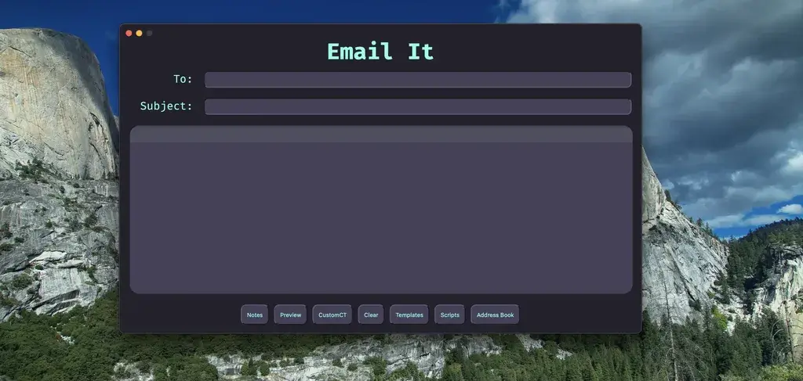

[EmailIt](https://github.com/raguay/EmailIt/) adalah program Wails 2 yang
merupakan pengirim email berbasis markdown dengan sembilan notepad, script untuk memanipulasi
teks, dan template. Juga memiliki terminal script untuk menjalankan script di EmailIt pada
file di sistem Anda. Script dan template dapat digunakan dari commandline
itu sendiri atau dengan ekstensi Alfred, Keyboard Maestro, Dropzone, atau PopClip. Juga
mendukung script dan tema yang diunduh dari GitHub. Dokumentasi belum
lengkap, tetapi program berfungsi. Dibangun menggunakan Wails2 dan Svelte, dan
download-nya adalah aplikasi macOS universal.
