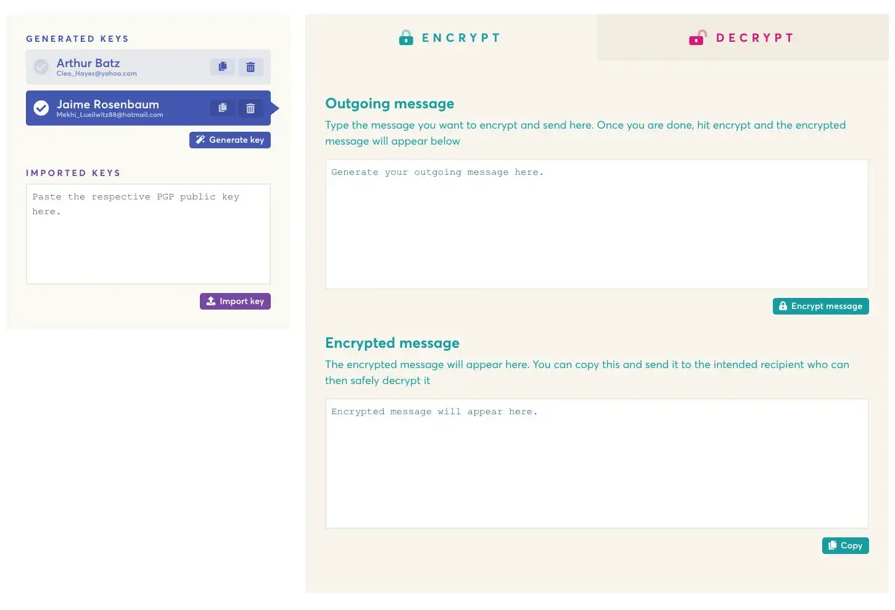

**[EncryptEasy](https://www.encrypteasy.app) adalah tool enkripsi PGP yang sederhana dan mudah digunakan, mengelola semua kunci Anda dan kontak. Enkripsi seharusnya sederhana. Dikembangkan dengan Wails.**

Mengenkripsi pesan menggunakan PGP adalah standar industri. Setiap orang memiliki kunci
private dan public. Kunci private Anda, ya, perlu dijaga private agar hanya Anda
yang dapat membaca pesan. Kunci public Anda didistribusikan ke siapapun yang ingin mengirim
pesan terenkripsi rahasia kepada Anda. Mengelola kunci, mengenkripsi pesan dan
mendekripsi pesan seharusnya menjadi pengalaman yang mulus. EncryptEasy semua tentang
membuatnya mudah.
