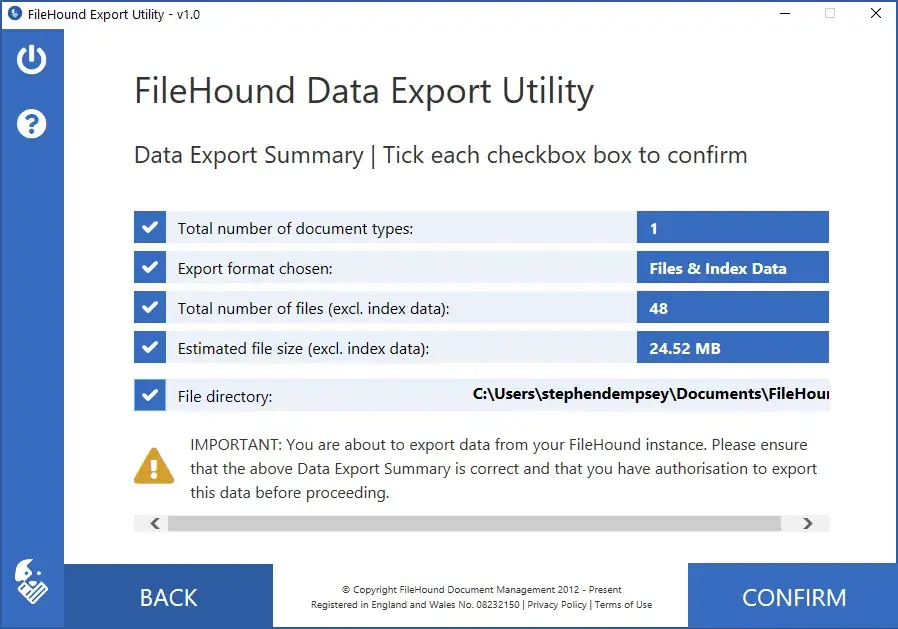

[FileHound Export Utility](https://www.filehound.co.uk/) FileHound adalah platform
manajemen dokumen cloud yang dibuat untuk retensi file yang aman, otomasi proses bisnis
dan kemampuan SmartCapture.

FileHound Export Utility memungkinkan Administrator FileHound menjalankan
tugas ekstraksi dokumen dan data yang aman untuk tujuan back-up dan recovery
alternatif. Aplikasi ini akan mengunduh semua dokumen dan/atau metadata yang disimpan di
FileHound berdasarkan filter yang Anda pilih. Metadata akan diekspor dalam format
JSON dan XML.

Backend dibangun dengan:

- Go 1.15
- Wails 1.11.0
- go-sqlite3 1.14.6
- go-linq 3.2

Frontend dengan:

- Vue 2.6.11
- Vuex 3.4.0
- TypeScript
- Tailwind 1.9.6
