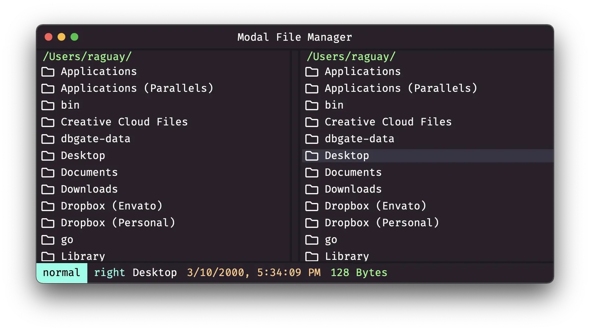

[Modal File Manager](https://github.com/raguay/ModalFileManager) adalah file manager
dual pane menggunakan teknologi web. Desain asli saya berbasis NW.js dan
dapat ditemukan [di sini](https://github.com/raguay/ModalFileManager-NWjs). Versi
ini menggunakan kode frontend berbasis Svelte yang sama (tetapi telah dimodifikasi
secara besar sejak kepergian dari NW.js), tetapi backend adalah
implementasi [Wails 2](https://wails.io/). Dengan implementasi ini, saya tidak
lagi menggunakan perintah command line `rm`, `cp`, dll., tetapi git install harus ada
di sistem untuk mengunduh tema dan ekstensi. Sepenuhnya dikodekan menggunakan Go dan
berjalan jauh lebih cepat dari versi sebelumnya.

File manager ini dirancang dengan prinsip yang sama seperti Vim: aksi keyboard
yang dikontrol state. Jumlah state tidak tetap, tetapi sangat
programmable. Oleh karena itu, konfigurasi keyboard tak terbatas dapat
dibuat dan digunakan. Ini perbedaan utama dari file manager lain. Ada
tema dan ekstensi tersedia untuk diunduh dari GitHub.
