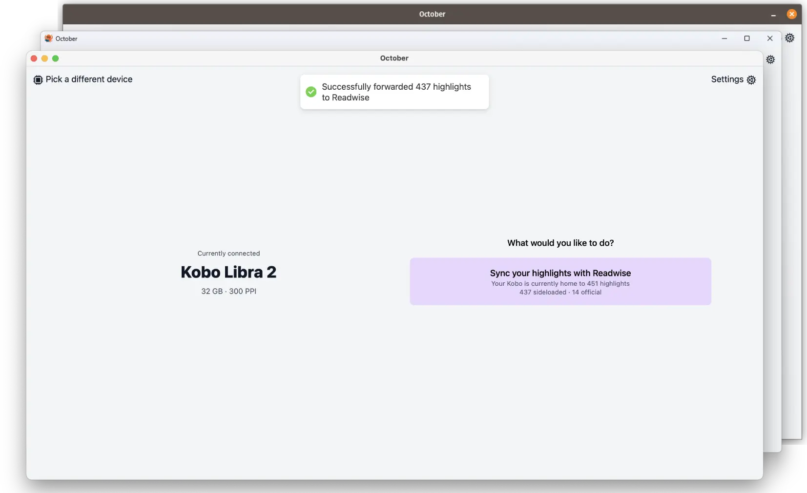

[October](https://october.utf9k.net) adalah aplikasi Wails kecil yang membuat
sangat mudah mengekstrak highlight dari
[Kobo eReaders](https://en.wikipedia.org/wiki/Kobo_eReader) lalu meneruskannya ke
[Readwise](https://readwise.io).

Memiliki scope relatif kecil dengan semua versi platform di bawah
10MB, dan itu tanpa mengaktifkan [kompresi UPX](https://upx.github.io/)!

Sebagai perbandingan, upaya sebelumnya penulis dengan Electron dengan cepat membengkak menjadi
beberapa ratus megabyte.
