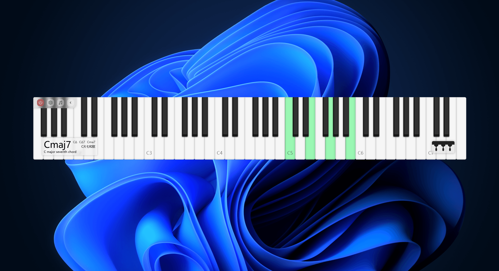
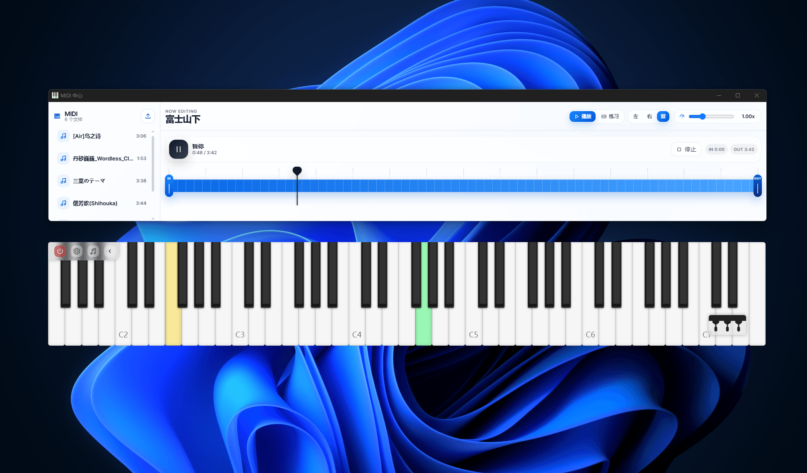

[Peirato's Piano Keyboard](https://github.com/Peiratooo/Peirato-s-Piano-Keyboard) adalah keyboard piano desktop ringan yang dibangun dengan Wails. Dirancang sebagai alat pertunjukan dan latihan yang ringkas yang dapat tetap di desktop Anda saat Anda bermain, belajar, merekam, streaming, atau mendemonstrasikan musik.

Aplikasi ini mendukung pertunjukan real-time menggunakan keyboard komputer, keyboard piano MIDI eksternal, atau input mouse. Nada langsung tercermin di keyboard virtual, menjadikannya berguna baik sebagai instrumen yang dapat dimainkan maupun sebagai tampilan keyboard visual.

Selain pemutaran sederhana, Peirato's Piano Keyboard juga mendukung SoundFont, memungkinkan pengguna mengimpor dan mengganti sumber suara `.sf2` kustom. Aplikasi ini juga dapat mengimpor file MIDI untuk pemutaran, preview, latihan berulang, dan latihan follow-along. Interaksi MIDI bersifat dua arah, sehingga aplikasi dapat merespons input MIDI eksternal sekaligus bekerja dengan alur kerja pemutaran dan output MIDI.

Fitur utama meliputi:

- Pertunjukan keyboard piano desktop real-time
- Input keyboard komputer, mouse, dan keyboard MIDI eksternal
- Dukungan input dan output MIDI
- Import dan manajemen SoundFont `.sf2` kustom
- Import file MIDI, pemutaran, preview, dan latihan
- Mode belajar MIDI follow-along
- Sorotan visual tombol untuk pertunjukan dan latihan
- Pengalaman desktop ringan berbasis Wails
