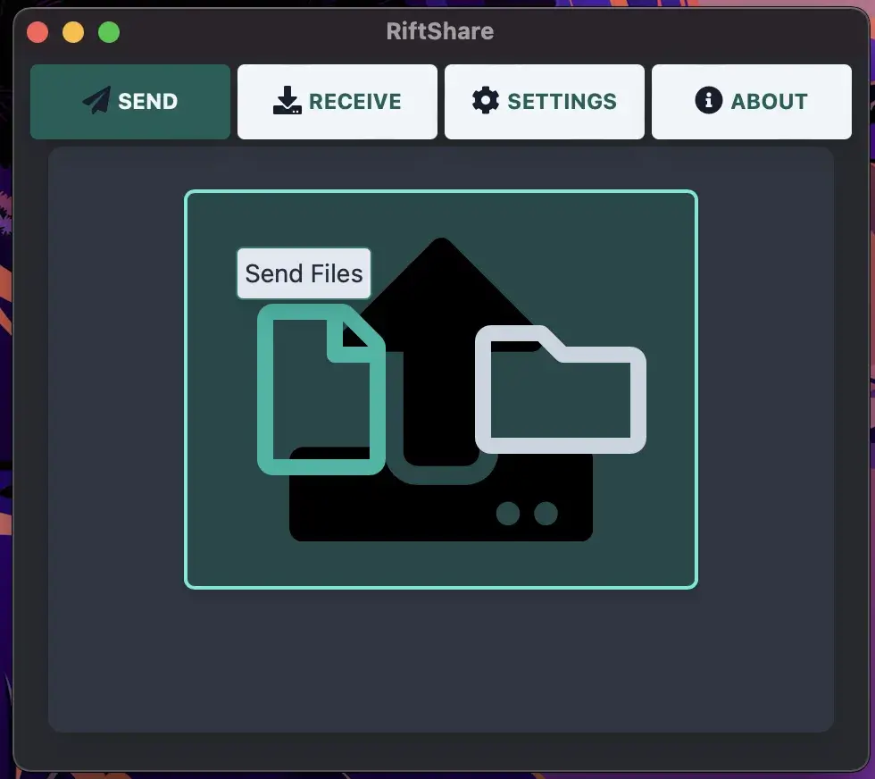

Berbagi file yang Mudah, Aman, dan Gratis untuk semua orang. Pelajari lebih lanjut di
[Riftshare.app](https://riftshare.app)

## Fitur

- Berbagi file aman yang mudah antar komputer baik di jaringan lokal maupun
  melalui internet
- Mendukung pengiriman file atau direktori secara aman melalui
  [magic wormhole protocol](https://magic-wormhole.readthedocs.io/en/latest/)
- Kompatibel dengan semua aplikasi lain yang menggunakan magic wormhole (magic-wormhole atau
  wormhole-william CLI, wormhole-gui, dll.)
- Zipping otomatis beberapa file yang dipilih untuk dikirim sekaligus
- Animasi penuh, progress bar, dan dukungan pembatalan untuk pengiriman dan
  penerimaan
- Pemilihan File OS Native
- Buka file dengan satu klik setelah diterima
- Auto Update - jangan khawatir tentang memiliki rilis terbaru!
