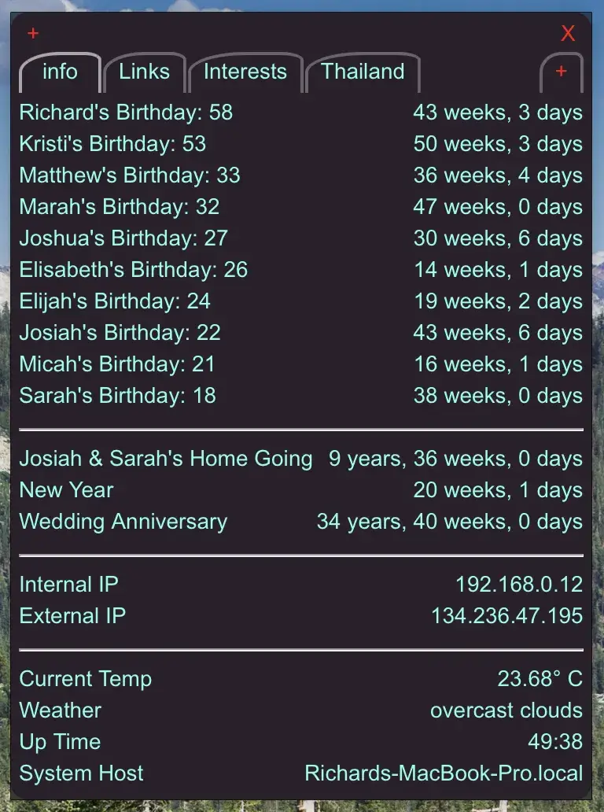

[ScriptBar](https://GitHub.com/raguay/ScriptBarApp) adalah program untuk menampilkan
output skrip atau server [Node-Red](https://nodered.org). Program ini menjalankan skrip
yang didefinisikan di program EmailIt dan menampilkan outputnya. Skrip dari xBar atau TextBar
dapat digunakan, tetapi saat ini skrip TextBar bekerja dengan baik. ScriptBar juga menampilkan
output skrip di sistem Anda. ScriptBar tidak menempatkannya di menubar,
melainkan menampilkan semuanya dalam satu jendela yang nyaman untuk dilihat dengan mudah. Anda dapat
memiliki beberapa tab untuk menampilkan banyak hal berbeda. Anda juga dapat menyimpan tautan ke
situs web yang paling sering Anda kunjungi.
