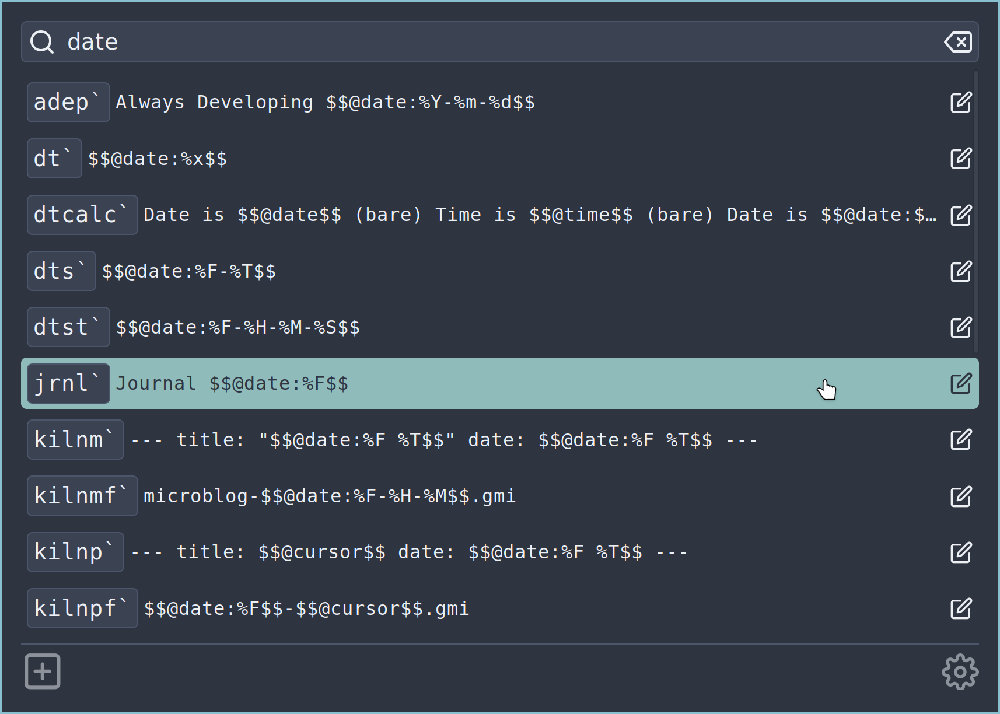
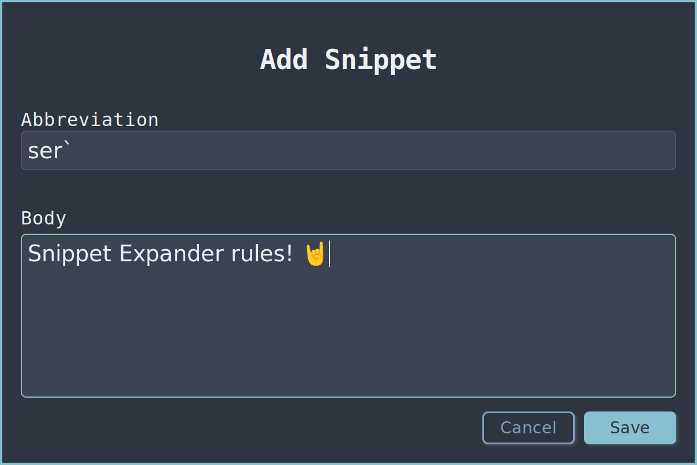
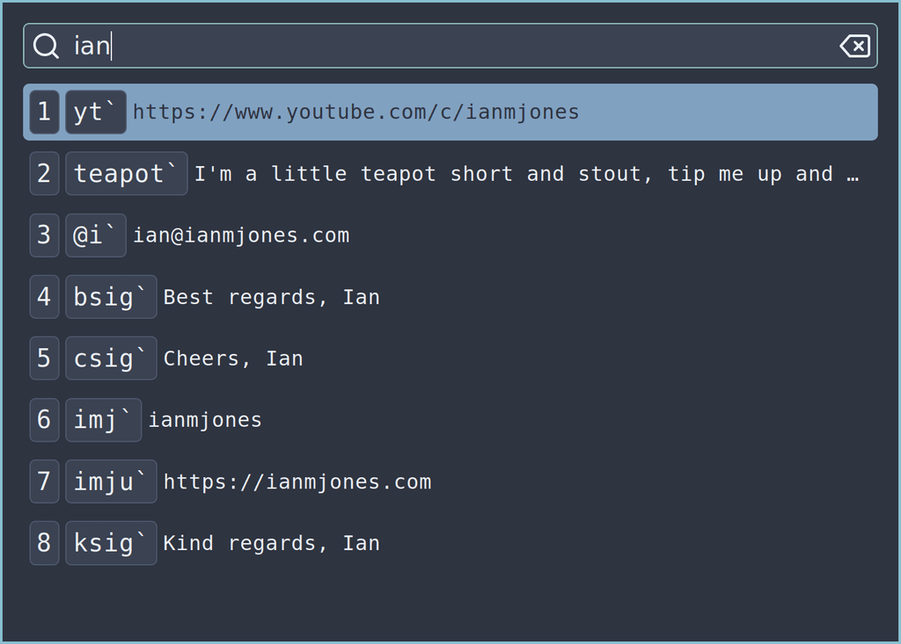

Screenshot jendela Select Snippet Snippet Expander

Screenshot layar Add Snippet Snippet Expander

Screenshot jendela Search & Paste Snippet Expander

[Snippet Expander](https://snippetexpander.org) adalah "Asisten teks snippet kecil yang dapat diperluas", untuk Linux.

Snippet Expander terdiri dari aplikasi GUI yang dibangun dengan Wails untuk mengelola
snippet dan pengaturan, dengan mode jendela Search & Paste untuk memilih dan
menempel snippet dengan cepat.

GUI berbasis Wails, CLI go-lang, dan daemon auto expander vala-lang semuanya
berkomunikasi dengan daemon go-lang melalui D-Bus. Daemon melakukan sebagian besar
pekerjaan, mengelola database snippet dan pengaturan umum, serta menyediakan
layanan untuk memperluas dan menempel snippet, dan lain-lain.

Lihat
[kode sumber](https://git.sr.ht/~ianmjones/snippetexpander/tree/trunk/item/cmd/snippetexpandergui/app.go#L38)
untuk melihat bagaimana aplikasi Wails mengirim pesan dari UI ke backend yang kemudian
dikirim ke daemon, dan berlangganan event D-Bus untuk memantau perubahan
snippet melalui instance aplikasi atau CLI lainnya dan menampilkannya secara instan di
UI melalui event Wails.
