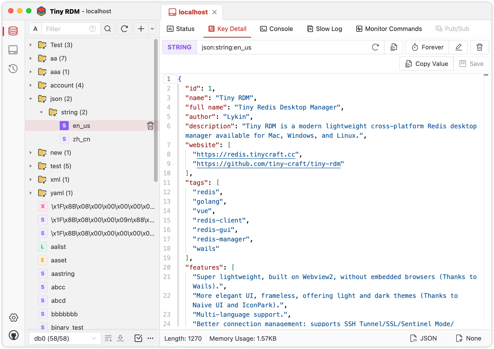
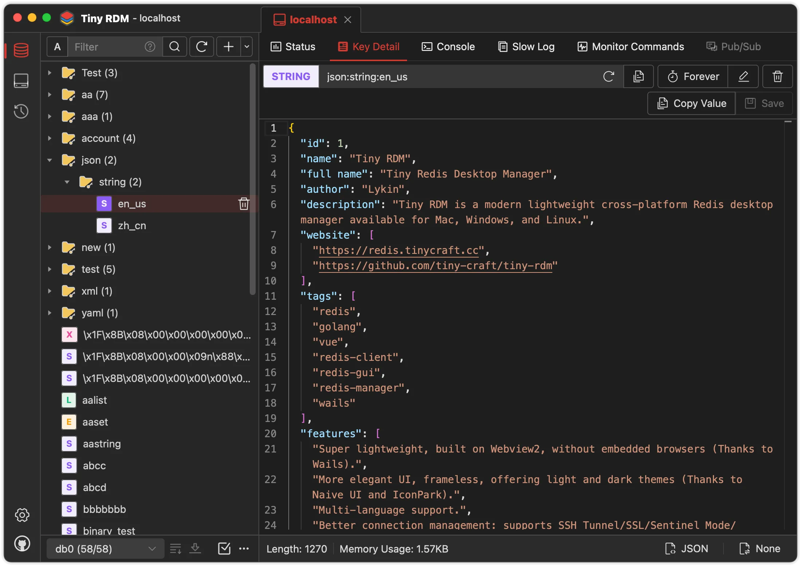

Aplikasi [Tiny RDM](https://redis.tinycraft.cc/) adalah GUI Redis open-source
modern yang ringan. Aplikasi ini memiliki UI yang indah, manajemen database Redis yang intuitif,
dan kompatibel dengan Windows, Mac, dan Linux. Aplikasi ini menyediakan operasi data key-value visual,
mendukung berbagai opsi decoding dan tampilan data, konsol bawaan untuk menjalankan perintah,
query slow log, dan lain-lain.
