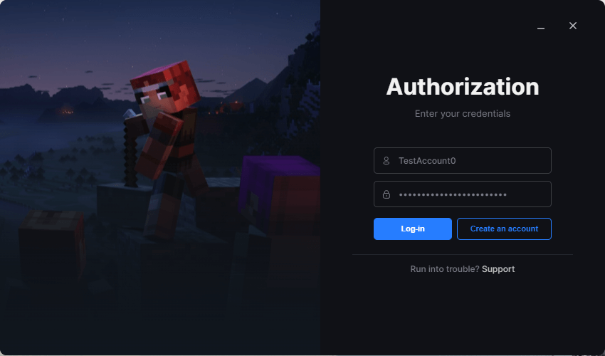
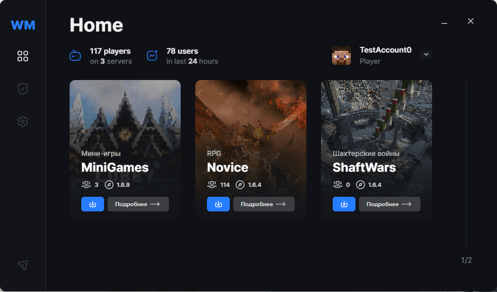

[Peluncur Minecraft untuk WarMine](https://warmine.ru/) adalah aplikasi Wails
yang memungkinkan Anda dengan mudah bergabung ke server game modded dan mengelola
akun game Anda.

Peluncur mengunduh file game, memeriksa integritasnya, dan meluncurkan
game dengan berbagai opsi kustomisasi untuk argumen peluncuran dari
backend.

Frontend ditulis dalam Svelte, seluruh peluncur hanya 9MB dan mendukung Windows
7-11.
