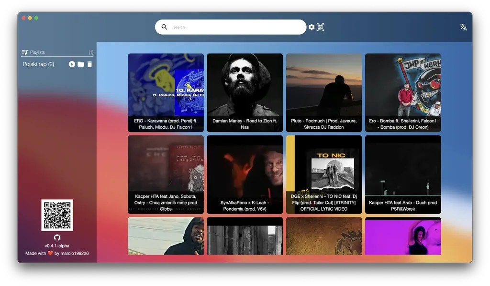

[Ytd](https://github.com/marcio199226/ytd/tree/v2-wails) adalah aplikasi untuk
mengunduh trek dari YouTube, membuat playlist offline, dan membagikannya dengan
teman Anda. Teman Anda dapat memutar playlist Anda atau mengunduhnya untuk mendengarkan offline.
Aplikasi ini memiliki pemutar bawaan.
