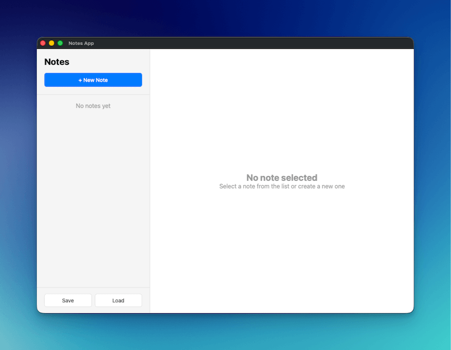

import { Steps } from "@astrojs/starlight/components";

In this tutorial, you'll build a notes application that demonstrates file operations, native dialogs, and modern desktop app patterns using Wails v3.



## What You'll Build

- A complete notes app with create, edit, and delete functionality
- Native file save/open dialogs for importing and exporting notes
- Auto-save on typing with debounce to reduce unnecessary updates
- Professional two-column layout (sidebar + editor) mimicking Apple Notes

## What You'll Learn

- Using native file dialogs in Wails (`SaveFileDialog`, `OpenFileDialog`, `InfoDialog`)
- Working with JSON files for data persistence
- Implementing debounced auto-save patterns
- Building professional desktop UIs with modern CSS
- Proper Go struct JSON serialization

## Project Setup

<Steps>

1. **Create a new Wails project**

   ```bash
   wails3 init -n notes-app -t vanilla
   cd notes-app
   ```

2. **Create the NotesService**

   Create a new file `notesservice.go` in the project root:

   ```go
   package main

   import (
   	"encoding/json"
   	"errors"
   	"os"
   	"time"

   	"github.com/wailsapp/wails/v3/pkg/application"
   )

   type Note struct {
   	ID        string    `json:"id"`
   	Title     string    `json:"title"`
   	Content   string    `json:"content"`
   	CreatedAt time.Time `json:"createdAt"`
   	UpdatedAt time.Time `json:"updatedAt"`
   }

   type NotesService struct {
   	notes []Note
   }

   func NewNotesService() *NotesService {
   	return &NotesService{
   		notes: make([]Note, 0),
   	}
   }

   // GetAll returns all notes
   func (n *NotesService) GetAll() []Note {
   	return n.notes
   }

   // Create creates a new note
   func (n *NotesService) Create(title, content string) Note {
   	note := Note{
   		ID:        generateID(),
   		Title:     title,
   		Content:   content,
   		CreatedAt: time.Now(),
   		UpdatedAt: time.Now(),
   	}
   	n.notes = append(n.notes, note)
   	return note
   }

   // Update updates an existing note
   func (n *NotesService) Update(id, title, content string) error {
   	for i := range n.notes {
   		if n.notes[i].ID == id {
   			n.notes[i].Title = title
   			n.notes[i].Content = content
   			n.notes[i].UpdatedAt = time.Now()
   			return nil
   		}
   	}
   	return errors.New("note not found")
   }

   // Delete deletes a note
   func (n *NotesService) Delete(id string) error {
   	for i := range n.notes {
   		if n.notes[i].ID == id {
   			n.notes = append(n.notes[:i], n.notes[i+1:]...)
   			return nil
   		}
   	}
   	return errors.New("note not found")
   }

   // SaveToFile saves notes to a file
   func (n *NotesService) SaveToFile() error {
   	path, err := application.Get().Dialog.SaveFile().
   		SetFilename("notes.json").
   		AddFilter("JSON Files", "*.json").
   		PromptForSingleSelection()

   	if err != nil {
   		return err
   	}

   	data, err := json.MarshalIndent(n.notes, "", "  ")
   	if err != nil {
   		return err
   	}

   	if err := os.WriteFile(path, data, 0644); err != nil {
   		return err
   	}

   	application.Get().Dialog.Info().
   		SetTitle("Success").
   		SetMessage("Notes saved successfully!").
   		Show()

   	return nil
   }

   // LoadFromFile loads notes from a file
   func (n *NotesService) LoadFromFile() error {
   	path, err := application.Get().Dialog.OpenFile().
   		AddFilter("JSON Files", "*.json").
   		PromptForSingleSelection()

   	if err != nil {
   		return err
   	}

   	data, err := os.ReadFile(path)
   	if err != nil {
   		return err
   	}

   	var notes []Note
   	if err := json.Unmarshal(data, &notes); err != nil {
   		return err
   	}

   	n.notes = notes

   	application.Get().Dialog.Info().
   		SetTitle("Success").
   		SetMessage("Notes loaded successfully!").
   		Show()

   	return nil
   }

   func generateID() string {
   	return time.Now().Format("20060102150405")
   }
   ```

   **What's happening here:**

   - **Note struct**: Defines the data structure with JSON tags (lowercase) for proper serialization
   - **CRUD operations**: GetAll, Create, Update, and Delete for managing notes in memory
   - **File dialogs**: Uses package-level functions `application.Get().Dialog.SaveFile()` and `application.Get().Dialog.OpenFile()`
   - **Info dialogs**: Shows success messages using `application.Get().Dialog.Info()`
   - **ID generation**: Simple timestamp-based ID generator

3. **Update main.go**

   Replace the contents of `main.go`:

   ```go
   package main

   import (
   	"embed"
   	_ "embed"
   	"log"

   	"github.com/wailsapp/wails/v3/pkg/application"
   )

   //go:embed all:frontend/dist
   var assets embed.FS

   func main() {
   	app := application.New(application.Options{
   		Name:        "Notes App",
   		Description: "A simple notes application",
   		Services: []application.Service{
   			application.NewService(NewNotesService()),
   		},
   		Assets: application.AssetOptions{
   			Handler: application.AssetFileServerFS(assets),
   		},
   		Mac: application.MacOptions{
   			ApplicationShouldTerminateAfterLastWindowClosed: true,
   		},
   	})

   	app.Window.NewWithOptions(application.WebviewWindowOptions{
   		Title:            "Notes App",
   		Width:            1000,
   		Height:           700,
   		BackgroundColour: application.NewRGB(255, 255, 255),
   		URL:              "/",
   	})

   	err := app.Run()
   	if err != nil {
   		log.Fatal(err)
   	}
   }
   ```

   **What's happening here:**

   - Registers `NotesService` with the application
   - Creates a window with dimensions (1000x700) mimicking Apple Notes
   - Sets up proper macOS behavior to quit when the last window closes

4. **Create the HTML structure**

   Replace `frontend/index.html`:

   ```html
   <!DOCTYPE html>
   <html lang="en">
   <head>
       <meta charset="UTF-8">
       <meta name="viewport" content="width=device-width, initial-scale=1.0">
       <title>Notes App</title>
       <link rel="stylesheet" href="./style.css">
   </head>
   <body>
       <div class="app">
           <!-- Sidebar -->
           <div class="sidebar">
               <div class="sidebar-header">
                   <h1>Notes</h1>
                   <button id="new-note-btn" class="btn-primary">+ New Note</button>
               </div>
               <div id="notes-list" class="notes-list"></div>
               <div class="sidebar-footer">
                   <button id="save-btn" class="btn-secondary">Save</button>
                   <button id="load-btn" class="btn-secondary">Load</button>
               </div>
           </div>

           <!-- Editor -->
           <div class="editor">
               <div id="empty-state" class="empty-state">
                   <h2>No note selected</h2>
                   <p>Select a note from the list or create a new one</p>
               </div>
               <div id="note-editor" class="note-editor" style="display: none;">
                   <input type="text" id="note-title" placeholder="Note title" class="title-input">
                   <textarea id="note-content" placeholder="Start typing..." class="content-input"></textarea>
                   <div class="editor-footer">
                       <button id="delete-btn" class="btn-danger">Delete</button>
                       <span id="last-updated" class="last-updated"></span>
                   </div>
               </div>
           </div>
       </div>

       <script src="/wails/runtime.js"></script>
       <script type="module" src="./src/main.js"></script>
   </body>
   </html>
   ```

   **What's happening here:**

   - **Two-column layout**: Sidebar for notes list, main area for editor
   - **Empty state**: Shows when no note is selected
   - **Wails runtime**: Must be loaded before the module script

5. **Add the CSS styling**

   Replace `frontend/public/style.css`:

   ```css
   * {
       margin: 0;
       padding: 0;
       box-sizing: border-box;
   }

   body {
       font-family: -apple-system, BlinkMacSystemFont, 'Segoe UI', Roboto, sans-serif;
       height: 100vh;
       overflow: hidden;
   }

   .app {
       display: flex;
       height: 100vh;
   }

   /* Sidebar */
   .sidebar {
       width: 300px;
       background: #f5f5f5;
       border-right: 1px solid #e0e0e0;
       display: flex;
       flex-direction: column;
   }

   .sidebar-header {
       padding: 20px;
       border-bottom: 1px solid #e0e0e0;
   }

   .sidebar-header h1 {
       font-size: 24px;
       margin-bottom: 16px;
   }

   .notes-list {
       flex: 1;
       overflow-y: auto;
   }

   .note-item {
       padding: 16px 20px;
       border-bottom: 1px solid #e0e0e0;
       cursor: pointer;
       transition: background 0.2s;
   }

   .note-item:hover {
       background: #e8e8e8;
   }

   .note-item.active {
       background: #007aff;
       color: white;
   }

   .note-item h3 {
       font-size: 16px;
       margin-bottom: 4px;
   }

   .note-item p {
       font-size: 14px;
       opacity: 0.7;
       white-space: nowrap;
       overflow: hidden;
       text-overflow: ellipsis;
   }

   .sidebar-footer {
       padding: 16px 20px;
       border-top: 1px solid #e0e0e0;
       display: flex;
       gap: 8px;
   }

   /* Editor */
   .editor {
       flex: 1;
       display: flex;
       flex-direction: column;
   }

   .empty-state {
       flex: 1;
       display: flex;
       flex-direction: column;
       align-items: center;
       justify-content: center;
       color: #999;
   }

   .note-editor {
       flex: 1;
       display: flex;
       flex-direction: column;
       padding: 20px;
   }

   .title-input {
       font-size: 32px;
       font-weight: bold;
       border: none;
       outline: none;
       margin-bottom: 16px;
       padding: 8px 0;
   }

   .content-input {
       flex: 1;
       font-size: 16px;
       border: none;
       outline: none;
       resize: none;
       font-family: inherit;
       line-height: 1.6;
   }

   .editor-footer {
       display: flex;
       justify-content: space-between;
       align-items: center;
       padding-top: 16px;
       border-top: 1px solid #e0e0e0;
   }

   .last-updated {
       font-size: 14px;
       color: #999;
   }

   /* Buttons */
   .btn-primary {
       background: #007aff;
       color: white;
       border: none;
       padding: 10px 20px;
       border-radius: 6px;
       cursor: pointer;
       font-size: 14px;
       font-weight: 500;
       width: 100%;
   }

   .btn-primary:hover {
       background: #0056b3;
   }

   .btn-secondary {
       background: white;
       color: #333;
       border: 1px solid #e0e0e0;
       padding: 8px 16px;
       border-radius: 6px;
       cursor: pointer;
       font-size: 14px;
       flex: 1;
   }

   .btn-secondary:hover {
       background: #f5f5f5;
   }

   .btn-danger {
       background: #ff3b30;
       color: white;
       border: none;
       padding: 8px 16px;
       border-radius: 6px;
       cursor: pointer;
       font-size: 14px;
   }

   .btn-danger:hover {
       background: #cc0000;
   }
   ```

   **What's happening here:**

   - Apple-style design with clean typography and colors
   - Flexbox layout for responsive sidebar and editor
   - Active note highlighting with blue background
   - Smooth hover transitions

6. **Implement the JavaScript logic**

   Replace `frontend/src/main.js`:

   ```javascript
   import { NotesService } from '../bindings/changeme'

   let notes = []
   let currentNote = null

   // Load notes on startup
   async function loadNotes() {
       notes = await NotesService.GetAll()
       renderNotesList()
   }

   // Render notes list
   function renderNotesList() {
       const notesList = document.getElementById('notes-list')

       if (notes.length === 0) {
           notesList.innerHTML = '<div style="padding: 20px; text-align: center; color: #999;">No notes yet</div>'
           return
       }

       notesList.innerHTML = notes.map(note => `
           <div class="note-item ${currentNote?.id === note.id ? 'active' : ''}" data-id="${note.id}">
               <h3>${note.title || 'Untitled'}</h3>
               <p>${note.content || 'No content'}</p>
           </div>
       `).join('')

       // Add click handlers
       document.querySelectorAll('.note-item').forEach(item => {
           item.addEventListener('click', () => {
               const id = item.dataset.id
               selectNote(id)
           })
       })
   }

   // Select a note
   function selectNote(id) {
       currentNote = notes.find(n => n.id === id)
       if (currentNote) {
           document.getElementById('empty-state').style.display = 'none'
           document.getElementById('note-editor').style.display = 'flex'
           document.getElementById('note-title').value = currentNote.title
           document.getElementById('note-content').value = currentNote.content
           document.getElementById('last-updated').textContent =
               `Last updated: ${new Date(currentNote.updatedAt).toLocaleString()}`
           renderNotesList()
       }
   }

   // Create new note
   document.getElementById('new-note-btn').addEventListener('click', async () => {
       const note = await NotesService.Create('Untitled', '')
       notes.push(note)
       selectNote(note.id)
       // Focus the title input and select all text so user can immediately type
       const titleInput = document.getElementById('note-title')
       titleInput.focus()
       titleInput.select()
   })

   // Update note on input
   let updateTimeout
   function scheduleUpdate() {
       clearTimeout(updateTimeout)
       updateTimeout = setTimeout(async () => {
           if (currentNote) {
               const title = document.getElementById('note-title').value
               const content = document.getElementById('note-content').value

               await NotesService.Update(currentNote.id, title, content)

               // Update local copy
               const note = notes.find(n => n.id === currentNote.id)
               if (note) {
                   note.title = title
                   note.content = content
                   note.updatedAt = new Date().toISOString()
               }

               renderNotesList()
               document.getElementById('last-updated').textContent =
                   `Last updated: ${new Date().toLocaleString()}`
           }
       }, 500)
   }

   document.getElementById('note-title').addEventListener('input', scheduleUpdate)
   document.getElementById('note-content').addEventListener('input', scheduleUpdate)

   // Delete note
   document.getElementById('delete-btn').addEventListener('click', async () => {
       if (!currentNote) return

       try {
           await NotesService.Delete(currentNote.id)
           notes = notes.filter(n => n.id !== currentNote.id)
           currentNote = null
           document.getElementById('empty-state').style.display = 'flex'
           document.getElementById('note-editor').style.display = 'none'
           renderNotesList()
       } catch (error) {
           console.error('Delete failed:', error)
       }
   })

   // Save to file
   document.getElementById('save-btn').addEventListener('click', async () => {
       try {
           await NotesService.SaveToFile()
       } catch (error) {
           if (error) console.error('Save failed:', error)
       }
   })

   // Load from file
   document.getElementById('load-btn').addEventListener('click', async () => {
       try {
           await NotesService.LoadFromFile()
           notes = await NotesService.GetAll()
           currentNote = null
           document.getElementById('empty-state').style.display = 'flex'
           document.getElementById('note-editor').style.display = 'none'
           renderNotesList()
       } catch (error) {
           if (error) console.error('Load failed:', error)
       }
   })

   // Initialize
   loadNotes()
   ```

   **What's happening here:**

   - **Auto-save**: 500ms debounce prevents excessive backend calls while typing
   - **Property access**: Uses lowercase property names (`.id`, `.title`) matching Go JSON tags
   - **Focus management**: Auto-focuses and selects title when creating new notes
   - **Delete without confirm**: Browser's `confirm()` doesn't work in Wails webviews
   - **File operations**: Native dialogs handle save/load with proper error handling

7. **Run the application**

   ```bash
   wails3 dev
   ```

   The app will start and you can:
   - Click "+ New Note" to create notes
   - Edit title and content (auto-saves after 500ms)
   - Click notes in the sidebar to switch between them
   - Click "Delete" to remove the current note
   - Click "Save" to export notes as JSON
   - Click "Load" to import previously saved notes

</Steps>

## Key Concepts

### Package-Level Dialog Functions

In Wails v3, file and message dialogs are package-level functions, not methods on the app instance:

```go
// Correct - package-level function
path, err := application.SaveFileDialog().
    SetFilename("notes.json").
    AddFilter("JSON Files", "*.json").
    PromptForSingleSelection()

// Wrong - not available
path, err := app.Dialog.SaveFile() // This doesn't exist
```

### JSON Tag Mapping

Go struct JSON tags must be lowercase to match JavaScript property access:

```go
type Note struct {
    ID string `json:"id"` // Must be lowercase
}
```

```javascript
// JavaScript accesses with lowercase
const noteId = note.id // Correct
const noteId = note.ID // Would be undefined
```

### Debounced Auto-Save

The 500ms debounce reduces unnecessary backend calls:

```javascript
let updateTimeout
function scheduleUpdate() {
    clearTimeout(updateTimeout) // Cancel previous timer
    updateTimeout = setTimeout(async () => {
        // Only saves if user stops typing for 500ms
        await NotesService.Update(currentNote.id, title, content)
    }, 500)
}
```

## Next Steps

- Add categories or tags to organize notes
- Implement search and filtering
- Add rich text editing with a WYSIWYG editor
- Sync notes to cloud storage
- Add keyboard shortcuts for common operations
