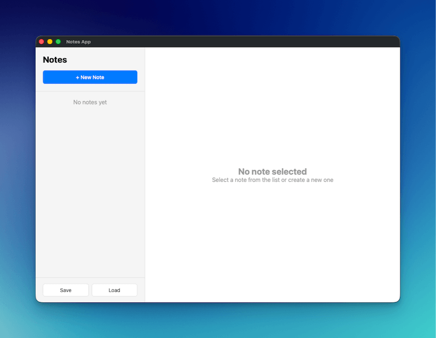

import { Steps } from "@astrojs/starlight/components";

在本教學中，您將使用 Wails v3 建構一個筆記應用，展示檔案操作、原生對話框以及現代桌面應用模式。



## 您將建構的內容

- 具備建立、編輯與刪除功能的完整筆記應用
- 用於匯入和匯出筆記的原生檔案儲存/開啟對話框
- 使用防抖（debounce）技術的輸入自動儲存，以減少不必要的更新
- 模仿 Apple Notes 的專業雙欄佈局（側邊欄 + 編輯器）

## 您將學到的內容

- 在 Wails 中使用原生檔案對話框（`SaveFileDialog`、`OpenFileDialog`、`InfoDialog`）
- 使用 JSON 檔案進行資料持久化
- 實作防抖自動儲存模式
- 使用現代 CSS 建構專業桌面 UI
- 正確的 Go 結構體 JSON 序列化

## 專案設定

<Steps>

1. **建立新的 Wails 專案**

   ```bash
   wails3 init -n notes-app -t vanilla
   cd notes-app
   ```

2. **建立 NotesService**

   在專案根目錄建立新檔案 `notesservice.go`：

   ```go
   package main

   import (
   	"encoding/json"
   	"errors"
   	"os"
   	"time"

   	"github.com/wailsapp/wails/v3/pkg/application"
   )

   type Note struct {
   	ID        string    `json:"id"`
   	Title     string    `json:"title"`
   	Content   string    `json:"content"`
   	CreatedAt time.Time `json:"createdAt"`
   	UpdatedAt time.Time `json:"updatedAt"`
   }

   type NotesService struct {
   	notes []Note
   }

   func NewNotesService() *NotesService {
   	return &NotesService{
   		notes: make([]Note, 0),
   	}
   }

   // GetAll 回傳所有筆記
   func (n *NotesService) GetAll() []Note {
   	return n.notes
   }

   // Create 建立新筆記
   func (n *NotesService) Create(title, content string) Note {
   	note := Note{
   		ID:        generateID(),
   		Title:     title,
   		Content:   content,
   		CreatedAt: time.Now(),
   		UpdatedAt: time.Now(),
   	}
   	n.notes = append(n.notes, note)
   	return note
   }

   // Update 更新現有筆記
   func (n *NotesService) Update(id, title, content string) error {
   	for i := range n.notes {
   		if n.notes[i].ID == id {
   			n.notes[i].Title = title
   			n.notes[i].Content = content
   			n.notes[i].UpdatedAt = time.Now()
   			return nil
   		}
   	}
   	return errors.New("note not found")
   }

   // Delete 刪除筆記
   func (n *NotesService) Delete(id string) error {
   	for i := range n.notes {
   		if n.notes[i].ID == id {
   			n.notes = append(n.notes[:i], n.notes[i+1:]...)
   			return nil
   		}
   	}
   	return errors.New("note not found")
   }

   // SaveToFile 將筆記儲存至檔案
   func (n *NotesService) SaveToFile() error {
   	path, err := application.Get().Dialog.SaveFile().
   		SetFilename("notes.json").
   		AddFilter("JSON Files", "*.json").
   		PromptForSingleSelection()

   	if err != nil {
   		return err
   	}

   	data, err := json.MarshalIndent(n.notes, "", "  ")
   	if err != nil {
   		return err
   	}

   	if err := os.WriteFile(path, data, 0644); err != nil {
   		return err
   	}

   	application.Get().Dialog.Info().
   		SetTitle("Success").
   		SetMessage("Notes saved successfully!").
   		Show()

   	return nil
   }

   // LoadFromFile 從檔案載入筆記
   func (n *NotesService) LoadFromFile() error {
   	path, err := application.Get().Dialog.OpenFile().
   		AddFilter("JSON Files", "*.json").
   		PromptForSingleSelection()

   	if err != nil {
   		return err
   	}

   	data, err := os.ReadFile(path)
   	if err != nil {
   		return err
   	}

   	var notes []Note
   	if err := json.Unmarshal(data, &notes); err != nil {
   		return err
   	}

   	n.notes = notes

   	application.Get().Dialog.Info().
   		SetTitle("Success").
   		SetMessage("Notes loaded successfully!").
   		Show()

   	return nil
   }

   func generateID() string {
   	return time.Now().Format("20060102150405")
   }
   ```

   **這裡發生了什麼：**

   - **Note 結構體**：定義帶有 JSON 標籤（小寫）的資料結構，以便正確序列化
   - **CRUD 操作**：GetAll、Create、Update 和 Delete，用於管理記憶體中的筆記
   - **檔案對話框**：使用 `application.Get().Dialog.SaveFile()` 和 `application.Get().Dialog.OpenFile()` 存取原生對話框
   - **資訊對話框**：使用 `application.Get().Dialog.Info()` 顯示成功訊息
   - **ID 產生**：簡單的基於時間戳記的 ID 產生器

3. **更新 main.go**

   取代 `main.go` 的內容：

   ```go
   package main

   import (
   	"embed"
   	_ "embed"
   	"log"

   	"github.com/wailsapp/wails/v3/pkg/application"
   )

   //go:embed all:frontend/dist
   var assets embed.FS

   func main() {
   	app := application.New(application.Options{
   		Name:        "Notes App",
   		Description: "A simple notes application",
   		Services: []application.Service{
   			application.NewService(NewNotesService()),
   		},
   		Assets: application.AssetOptions{
   			Handler: application.AssetFileServerFS(assets),
   		},
   		Mac: application.MacOptions{
   			ApplicationShouldTerminateAfterLastWindowClosed: true,
   		},
   	})

   	app.Window.NewWithOptions(application.WebviewWindowOptions{
   		Title:            "Notes App",
   		Width:            1000,
   		Height:           700,
   		BackgroundColour: application.NewRGB(255, 255, 255),
   		URL:              "/",
   	})

   	err := app.Run()
   	if err != nil {
   		log.Fatal(err)
   	}
   }
   ```

   **這裡發生了什麼：**

   - 將 `NotesService` 註冊至應用程式
   - 建立尺寸為 1000x700 的視窗，模仿 Apple Notes
   - 設定正確的 macOS 行為，以便在最後一個視窗關閉時退出

4. **建立 HTML 結構**

   取代 `frontend/index.html`：

   ```html
   <!DOCTYPE html>
   <html lang="en">
   <head>
       <meta charset="UTF-8">
       <meta name="viewport" content="width=device-width, initial-scale=1.0">
       <title>Notes App</title>
       <link rel="stylesheet" href="./style.css">
   </head>
   <body>
       <div class="app">
           <!-- Sidebar -->
           <div class="sidebar">
               <div class="sidebar-header">
                   <h1>Notes</h1>
                   <button id="new-note-btn" class="btn-primary">+ New Note</button>
               </div>
               <div id="notes-list" class="notes-list"></div>
               <div class="sidebar-footer">
                   <button id="save-btn" class="btn-secondary">Save</button>
                   <button id="load-btn" class="btn-secondary">Load</button>
               </div>
           </div>

           <!-- Editor -->
           <div class="editor">
               <div id="empty-state" class="empty-state">
                   <h2>No note selected</h2>
                   <p>Select a note from the list or create a new one</p>
               </div>
               <div id="note-editor" class="note-editor" style="display: none;">
                   <input type="text" id="note-title" placeholder="Note title" class="title-input">
                   <textarea id="note-content" placeholder="Start typing..." class="content-input"></textarea>
                   <div class="editor-footer">
                       <button id="delete-btn" class="btn-danger">Delete</button>
                       <span id="last-updated" class="last-updated"></span>
                   </div>
               </div>
           </div>
       </div>

       <script src="/wails/runtime.js"></script>
       <script type="module" src="./src/main.js"></script>
   </body>
   </html>
   ```

   **這裡發生了什麼：**

   - **雙欄佈局**：側邊欄用於筆記列表，主區域用於編輯器
   - **空狀態**：當未選取筆記時顯示
   - **Wails 執行階段**：必須在模組腳本之前載入

5. **新增 CSS 樣式**替換 `frontend/public/style.css`：

   ```css
   * {
       margin: 0;
       padding: 0;
       box-sizing: border-box;
   }

   body {
       font-family: -apple-system, BlinkMacSystemFont, 'Segoe UI', Roboto, sans-serif;
       height: 100vh;
       overflow: hidden;
   }

   .app {
       display: flex;
       height: 100vh;
   }

   /* Sidebar */
   .sidebar {
       width: 300px;
       background: #f5f5f5;
       border-right: 1px solid #e0e0e0;
       display: flex;
       flex-direction: column;
   }

   .sidebar-header {
       padding: 20px;
       border-bottom: 1px solid #e0e0e0;
   }

   .sidebar-header h1 {
       font-size: 24px;
       margin-bottom: 16px;
   }

   .notes-list {
       flex: 1;
       overflow-y: auto;
   }

   .note-item {
       padding: 16px 20px;
       border-bottom: 1px solid #e0e0e0;
       cursor: pointer;
       transition: background 0.2s;
   }

   .note-item:hover {
       background: #e8e8e8;
   }

   .note-item.active {
       background: #007aff;
       color: white;
   }

   .note-item h3 {
       font-size: 16px;
       margin-bottom: 4px;
   }

   .note-item p {
       font-size: 14px;
       opacity: 0.7;
       white-space: nowrap;
       overflow: hidden;
       text-overflow: ellipsis;
   }

   .sidebar-footer {
       padding: 16px 20px;
       border-top: 1px solid #e0e0e0;
       display: flex;
       gap: 8px;
   }

   /* Editor */
   .editor {
       flex: 1;
       display: flex;
       flex-direction: column;
   }

   .empty-state {
       flex: 1;
       display: flex;
       flex-direction: column;
       align-items: center;
       justify-content: center;
       color: #999;
   }

   .note-editor {
       flex: 1;
       display: flex;
       flex-direction: column;
       padding: 20px;
   }

   .title-input {
       font-size: 32px;
       font-weight: bold;
       border: none;
       outline: none;
       margin-bottom: 16px;
       padding: 8px 0;
   }

   .content-input {
       flex: 1;
       font-size: 16px;
       border: none;
       outline: none;
       resize: none;
       font-family: inherit;
       line-height: 1.6;
   }

   .editor-footer {
       display: flex;
       justify-content: space-between;
       align-items: center;
       padding-top: 16px;
       border-top: 1px solid #e0e0e0;
   }

   .last-updated {
       font-size: 14px;
       color: #999;
   }

   /* Buttons */
   .btn-primary {
       background: #007aff;
       color: white;
       border: none;
       padding: 10px 20px;
       border-radius: 6px;
       cursor: pointer;
       font-size: 14px;
       font-weight: 500;
       width: 100%;
   }

   .btn-primary:hover {
       background: #0056b3;
   }

   .btn-secondary {
       background: white;
       color: #333;
       border: 1px solid #e0e0e0;
       padding: 8px 16px;
       border-radius: 6px;
       cursor: pointer;
       font-size: 14px;
       flex: 1;
   }

   .btn-secondary:hover {
       background: #f5f5f5;
   }

   .btn-danger {
       background: #ff3b30;
       color: white;
       border: none;
       padding: 8px 16px;
       border-radius: 6px;
       cursor: pointer;
       font-size: 14px;
   }

   .btn-danger:hover {
       background: #cc0000;
   }
   ```

   **這裡發生了什麼：**

   - 採用 Apple 風格的設計，搭配簡潔的排版與色彩
   - 使用 Flexbox 佈局實現響應式的側邊欄與編輯器
   - 使用藍色背景高亮顯示選中的筆記
   - 平滑的懸停過渡效果

6. **實作 JavaScript 邏輯**

   替換 `frontend/src/main.js`：

   ```javascript
   import { NotesService } from '../bindings/changeme'

   let notes = []
   let currentNote = null

   // Load notes on startup
   async function loadNotes() {
       notes = await NotesService.GetAll()
       renderNotesList()
   }

   // Render notes list
   function renderNotesList() {
       const notesList = document.getElementById('notes-list')

       if (notes.length === 0) {
           notesList.innerHTML = '<div style="padding: 20px; text-align: center; color: #999;">No notes yet</div>'
           return
       }

       notesList.innerHTML = notes.map(note => `
           <div class="note-item ${currentNote?.id === note.id ? 'active' : ''}" data-id="${note.id}">
               <h3>${note.title || 'Untitled'}</h3>
               <p>${note.content || 'No content'}</p>
           </div>
       `).join('')

       // Add click handlers
       document.querySelectorAll('.note-item').forEach(item => {
           item.addEventListener('click', () => {
               const id = item.dataset.id
               selectNote(id)
           })
       })
   }

   // Select a note
   function selectNote(id) {
       currentNote = notes.find(n => n.id === id)
       if (currentNote) {
           document.getElementById('empty-state').style.display = 'none'
           document.getElementById('note-editor').style.display = 'flex'
           document.getElementById('note-title').value = currentNote.title
           document.getElementById('note-content').value = currentNote.content
           document.getElementById('last-updated').textContent =
               `Last updated: ${new Date(currentNote.updatedAt).toLocaleString()}`
           renderNotesList()
       }
   }

   // Create new note
   document.getElementById('new-note-btn').addEventListener('click', async () => {
       const note = await NotesService.Create('Untitled', '')
       notes.push(note)
       selectNote(note.id)
       // Focus the title input and select all text so user can immediately type
       const titleInput = document.getElementById('note-title')
       titleInput.focus()
       titleInput.select()
   })

   // Update note on input
   let updateTimeout
   function scheduleUpdate() {
       clearTimeout(updateTimeout)
       updateTimeout = setTimeout(async () => {
           if (currentNote) {
               const title = document.getElementById('note-title').value
               const content = document.getElementById('note-content').value

               await NotesService.Update(currentNote.id, title, content)

               // Update local copy
               const note = notes.find(n => n.id === currentNote.id)
               if (note) {
                   note.title = title
                   note.content = content
                   note.updatedAt = new Date().toISOString()
               }

               renderNotesList()
               document.getElementById('last-updated').textContent =
                   `Last updated: ${new Date().toLocaleString()}`
           }
       }, 500)
   }

   document.getElementById('note-title').addEventListener('input', scheduleUpdate)
   document.getElementById('note-content').addEventListener('input', scheduleUpdate)

   // Delete note
   document.getElementById('delete-btn').addEventListener('click', async () => {
       if (!currentNote) return

       try {
           await NotesService.Delete(currentNote.id)
           notes = notes.filter(n => n.id !== currentNote.id)
           currentNote = null
           document.getElementById('empty-state').style.display = 'flex'
           document.getElementById('note-editor').style.display = 'none'
           renderNotesList()
       } catch (error) {
           console.error('Delete failed:', error)
       }
   })

   // Save to file
   document.getElementById('save-btn').addEventListener('click', async () => {
       try {
           await NotesService.SaveToFile()
       } catch (error) {
           if (error) console.error('Save failed:', error)
       }
   })```go
   // 從檔案載入
   document.getElementById('load-btn').addEventListener('click', async () => {
       try {
           await NotesService.LoadFromFile()
           notes = await NotesService.GetAll()
           currentNote = null
           document.getElementById('empty-state').style.display = 'flex'
           document.getElementById('note-editor').style.display = 'none'
           renderNotesList()
       } catch (error) {
           if (error) console.error('載入失敗:', error)
       }
   })

   // 初始化
   loadNotes()
   ```

   **這裡發生了什麼：**

   - **自動儲存**：500ms 的防抖動（debounce）可防止在輸入時產生過多後端呼叫
   - **屬性存取**：使用小寫屬性名稱（`.id`、`.title`）以符合 Go JSON 標籤
   - **焦點管理**：建立新筆記時自動聚焦並選取標題
   - **無確認刪除**：瀏覽器的 `confirm()` 在 Wails WebView 中無法運作
   - **檔案操作**：原生對話框處理儲存/載入，並具備適當的錯誤處理

7. **執行應用程式**

   ```bash
   wails3 dev
   ```

   應用程式將啟動，您可以：
   - 點擊「+ 新增筆記」來建立筆記
   - 編輯標題和內容（500ms 後自動儲存）
   - 點擊側邊欄中的筆記以在它們之間切換
   - 點擊「刪除」以移除目前筆記
   - 點擊「儲存」以將筆記匯出為 JSON
   - 點擊「載入」以匯入之前儲存的筆記

</Steps>

## 關鍵概念

### 套件層級的對話框函式

在 Wails v3 中，檔案和訊息對話框是套件層級的函式，而非應用程式實例上的方法：

```go
// 正確 - 套件層級函式
path, err := application.SaveFileDialog().
    SetFilename("notes.json").
    AddFilter("JSON 檔案", "*.json").
    PromptForSingleSelection()

// 錯誤 - 不可用
path, err := app.Dialog.SaveFile() // 此方法不存在
```

### JSON 標籤對應

Go 結構的 JSON 標籤必須為小寫，以符合 JavaScript 的屬性存取：

```go
type Note struct {
    ID string `json:"id"` // 必須為小寫
}
```

```javascript
// JavaScript 使用小寫進行存取
const noteId = note.id // 正確
const noteId = note.ID // 將為 undefined
```

### 防抖動自動儲存

500ms 的防抖動可减少不必要的後端呼叫：

```javascript
let updateTimeout
function scheduleUpdate() {
    clearTimeout(updateTimeout) // 取消先前的計時器
    updateTimeout = setTimeout(async () => {
        // 僅當使用者停止輸入 500ms 後才儲存
        await NotesService.Update(currentNote.id, title, content)
    }, 500)
}
```

## 下一步

- 新增分類或標籤以組織筆記
- 實作搜尋和篩選功能
- 使用 WYSIWYG 編輯器新增富文字編輯
- 將筆記同步至雲端儲存
- 為常見操作新增鍵盤快捷鍵