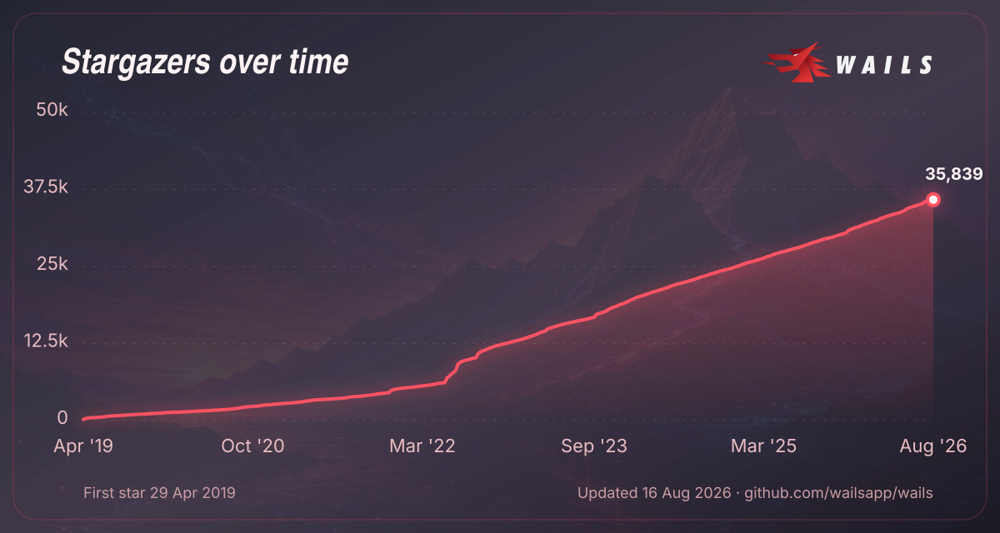

# Wails v3 Beta

Thanks for wanting to help out with testing/developing Wails v3! This guide will help you get started.

## Getting Started

Installation, migration, platform support, and feature documentation are in
[`docs/`](../docs/) and published at [v3.wails.io](https://v3.wails.io/).

## Stargazers over time

