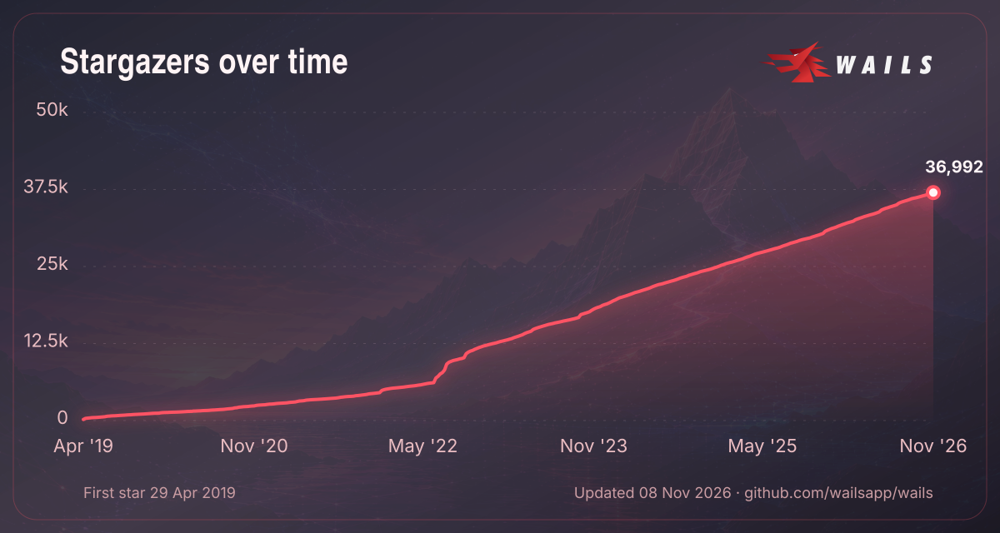

# Wails v3.0.0

Wails v3.0.0 is the stable release for desktop applications on Windows, macOS and Linux.

```sh
go install github.com/wailsapp/wails/v3/cmd/wails3@v3.0.0
```

Android and iOS support remains experimental and is outside the stable desktop compatibility contract.

## Getting Started

Installation, migration, platform support, and feature documentation are in
[`docs/`](../docs/) and published at [v3.wails.io](https://v3.wails.io/).

## Server event delivery

Builds using the `server` tag deliver events through the server's WebSocket
broadcaster, without installing the native IPC fallback. Creating a
`WebviewWindow` in server mode does not queue native JavaScript or park native
event payloads. Native builds retain pre-runtime event delivery and flush queued
JavaScript when the window runtime becomes ready.

## Stargazers over time

<a href="https://github.com/wailsapp/wails/stargazers">
  
</a>
