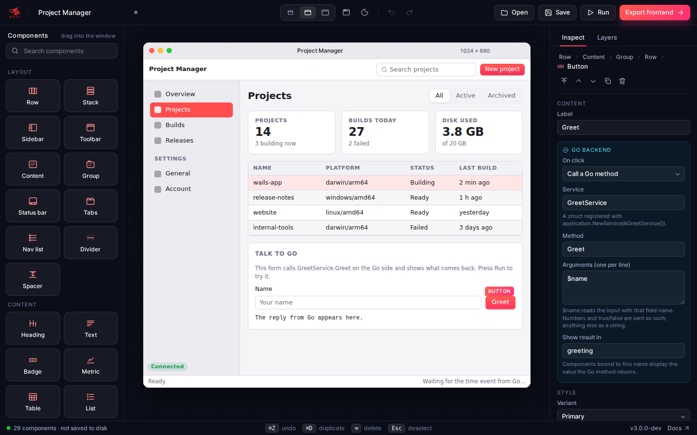

# UI Builder

A drag & drop builder for Wails application UIs, generated from the built-in
`ui-builder` template. Compose a window from desktop building blocks, wire the
controls to Go, press **Run** to use the design against this app's own backend,
and export it as a drop-in Wails frontend.



## Running

```
cd v3/examples/ui-builder
wails3 dev        # live reload
wails3 build      # production binary in bin/
```

The frontend build output (`frontend/dist`) and the generated bindings
(`frontend/bindings`) are committed, so `go run .` also works straight away.

## Try it

- The starter design is a small project manager. Press **Run**, type a name and
  click **Greet**: the button calls `GreetService.Greet` in Go and the reply
  appears in the bound text below it. The status bar shows the `time` event
  that `main.go` emits every second.
- Select the **Greet** button and look at the *Go backend* group in the
  inspector: switch *On click* between calling a method, emitting an event,
  a window action (minimise, fullscreen, …) and opening a URL.
- Drag **Toolbar**, **Sidebar**, **Content** and **Status bar** into an empty
  window to build the classic app shell; **Row**, **Stack** and **Group** nest
  inside. Turn on *Fill available space* to make a pane take the remaining room.
- Switch the artboard between compact, default and wide windows, macOS or
  Windows frames, and light or dark themes from the top bar.
- **Open** one of the sample layouts in [`layouts/`](layouts/):
  `preferences.uib.json` (a settings window) or `build-monitor.uib.json`
  (a dark dashboard with a bound progress bar and console).
- **Export frontend** writes `index.html`, `public/style.css`, `src/main.js`
  and a README into a folder you choose — the files a `wails3 init -t
  vanilla-js` project has under `frontend/`.
- Press `?` for the full list of keyboard shortcuts.

## How it works

| Path | Purpose |
| --- | --- |
| `main.go` | Creates the Wails app, registers the services and emits the `time` event |
| `layoutservice.go` | `LayoutService` — save / open layouts and export frontends via native dialogs |
| `greetservice.go` | `GreetService.Greet`, the method the starter design calls |
| `frontend/src/components.ts` | The component registry: defaults, inspector fields and renderers |
| `frontend/src/theme.ts` | Stylesheet for the app UI you build (shared with the export) |
| `frontend/src/runtime.ts` | Run mode: wires buttons and bindings to the Go backend |
| `frontend/src/exporter.ts` | Generates the exported frontend files |
| `frontend/src/store.ts` | Document state, selection and undo/redo history |
| `frontend/src/canvas.ts` | Artboard rendering, selection and drag & drop |
| `frontend/src/palette.ts` · `inspector.ts` · `layers.ts` | The three panels |
| `frontend/public/style.css` | The builder's own chrome (panels, toolbar, window frame) |

Layouts are plain JSON. The builder also autosaves the current design to the
browser's local storage, so closing the app never loses work.

To scaffold your own copy of this app run `wails3 init -t ui-builder`.
